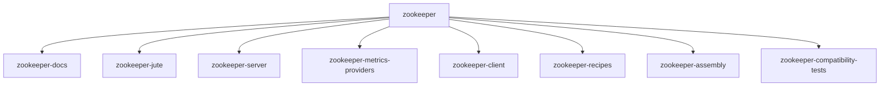

# 基础信息

|      |      |
|------|------|
| 名称 | zookeeper |
| 编码语言 | .java |
| 代码路径 | zookeeper |
| 包名 | zookeeper.docs |
| 概述说明 | ZooKeeper Jute是跨语言序列化框架，处理二进制编解码，支持分布式通信。ZooKeeper Server是核心实现，管理连接、安全与集群协调。PrometheusMetricsProvider集成Prometheus监控，提供指标暴露。ZooKeeper Recipes实现选举、锁和队列功能，依赖ZooKeeper机制。 |

# 说明

## 概述  
1. 该工程是Apache ZooKeeper生态的核心组件集合，定位为分布式系统协调服务的"中枢神经系统"，包含序列化框架、服务端实现、监控集成和高级功能模块。  
2. 主要用途是为分布式应用提供集群选举、配置同步、分布式锁等关键能力，典型场景包括微服务协调、大数据组件控制（如HBase/Kafka）和云原生环境管理。  
3. 架构采用分层设计：底层Jute序列化框架类似"翻译官"处理跨语言数据编码，服务端核心通过类似议会投票的仲裁机制保证一致性，监控模块像"健康手环"实时暴露指标，而Recipes模块则提供开箱即用的分布式工具包。配套资源包括Java API、CLI和Prometheus集成。  

## 什么是ZooKeeper生态组件?  
1. **核心模块交互**：Jute序列化框架（类似快递打包箱）负责服务端与客户端的高效数据编解码；服务端核心实现类似交通指挥台的集群协调；Recipes模块（如工具箱）提供领导者选举等现成方案；Metrics模块则像仪表盘监控系统运行状态。各模块通过ZooKeeper的ZNode数据树和Watcher机制联动。  

2. **关键技术原理**：  
   - Jute采用二进制归档设计（类似Protobuf），通过动态缓冲区和安全阈值防止内存溢出  
   - 服务端使用类似数据库WAL的FileTxnSnapLog保证事务持久化，QuorumVerifier实现"少数服从多数"的选举算法  
   - Recipes模块利用临时顺序节点特性（类似排队叫号）实现公平锁竞争  
   - Metrics通过Servlet暴露指标，支持JVM深度监控和SSL安全传输  

3. **典型应用模式**：  
   - **基础设施层**：作为HDFS NameNode的故障切换控制器，通过LeaderElection实现主备切换  
   - **配置中心**：利用ZNode的持久化特性存储集群配置，Watcher机制实现"推送式"更新  
   - **分布式锁**：电商秒杀场景下通过WriteLock实现库存操作的互斥访问  
   - **监控集成**：Prometheus定时抓取线程池、会话数等指标，形成资源水位预警

### 包内部结构视图

该流程图展示了Zookeeper项目的模块化结构，根节点为zookeeper，其下包含8个子模块，分别涉及文档、核心服务、客户端、测试等不同功能组件，体现了项目的分层架构设计。每个子模块名称均取自路径最后一级，清晰展示了项目组成关系。

# 文件列表 File List

| 名称   | 类型  | 说明 |
|-------|------|-------------|
| [zookeeper-metrics-providers](zookeeper-metrics-providers/zookeeper-prometheus-metrics/src/main/java/org/_module.md) | module | PrometheusMetricsProvider实现MetricsProvider接口，提供Prometheus监控功能。支持HTTP/HTTPS端口配置，JVM信息导出，SSL安全设置，多线程任务队列处理，以及多种指标类型（计数器、仪表盘、摘要）的收集与上报。通过Jetty服务器暴露/metrics端点供Prometheus抓取。 |
| [zookeeper-recipes](zookeeper-recipes/zookeeper-recipes-queue/src/main/java/org/_module.md) | module | 基于ZooKeeper的分布式工具集：1.领导者选举模块通过临时节点竞争主节点，支持事件回调。2.写锁工具利用顺序节点实现公平锁，含异步监听和重试机制。3.分布式队列提供线程安全操作，支持阻塞获取和持久节点存储。 |
| [zookeeper-server](zookeeper-server/src/main/java/org/_module.md) | module | ZooKeeper核心模块提供分布式协调服务，含节点管理、安全认证和集群选举功能，支持Java/CLI/JMX接口。版本管理模块处理版本元数据，含三级版本号和Git提交哈希，用于构建验证和依赖分析。 |
| [zookeeper-jute](zookeeper-jute/src/main/java/org/_module.md) | module | ZooKeeper Jute是跨语言代码生成器，将数据结构转为Java/C++/C#等类型安全代码，含序列化/比较逻辑。支持基本/复合类型，用于分布式通信协议开发，类似Protocol Buffers。含输入/输出归档接口及二进制/字符串实现。 |

