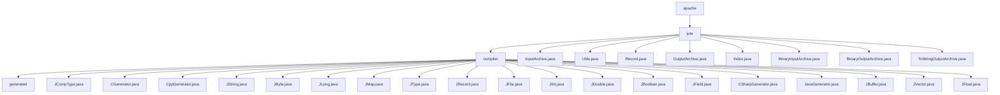

# 基础信息

|      |      |
|------|------|
| 名称 | apache |
| 编码语言 | .java |
| 代码路径 | zookeeper/zookeeper-jute/src/main/java/org/apache |
| 包名 | zookeeper.docs.zookeeper-jute.src.main.java.org.apache |
| 概述说明 | ZooKeeper Jute是跨语言代码生成器，将数据结构转为Java/C++/C#等类型安全代码，含序列化/比较逻辑。支持基本/复合类型，用于分布式通信协议开发，类似Protocol Buffers。含输入/输出归档接口及二进制/字符串实现。 |

# 说明

## 概述  
1. 该模块是ZooKeeper Jute的跨语言序列化框架，核心职责是实现分布式系统通信数据的二进制编解码。例如通过InputArchive/OutputArchive接口处理基本类型和复杂结构的序列化。  
2. 主要接口规范包括Record的序列化契约（如serialize/deserialize方法）和归档格式（如BinaryInputArchive的二进制协议），类似Protobuf的编解码体系。  
3. 关键数据结构涵盖Index状态追踪器、字节数组比较工具（Utils.compareBytes）以及BinaryOutputArchive的动态缓冲区。  
4. 外部依赖仅需标准IO库，例如Java的DataInput/DataOutput接口实现底层字节操作。  
5. 通过"例如"说明：BinaryInputArchive使用jute.maxbuffer系统参数控制反序列化安全阈值，防止内存溢出攻击。  

## 主要业务场景  
1. 支持ZooKeeper服务端-客户端的网络通信流程，例如将Record对象序列化为二进制流传输。  
2. 采用双工归档设计（InputArchive/OutputArchive），同步处理请求响应数据流，类似TCP协议的字节流封装。  
3. 功能覆盖基础类型序列化、结构化数据标记（如startRecord/v{}）和安全性校验（如缓冲区长度检查）。  
4. 主要用于分布式协调服务的数据交换场景，类似RPC框架中的消息编解码层。  
5. 提供可扩展的归档实现API，例如ToStringOutputArchive支持调试用的文本格式输出。  
6. 与ZooKeeper核心深度集成，例如BinaryOutputArchive直接用于服务端的网络包构造。

### 包内部结构视图

该流程图展示了Zookeeper Jute模块的Java源代码结构，从org.apache包开始，分为jute主目录和compiler子目录。jute目录包含核心序列化相关的类和接口，而compiler目录则包含代码生成器及其支持类，体现了模块化的编译器实现结构。所有节点均使用最后一级名称表示，层级关系清晰。

# 文件列表 File List

| 名称   | 类型  | 说明 |
|-------|------|-------------|
| [jute](jute/_module.md) | package | ZooKeeper Jute是跨语言代码生成器，将数据结构转为Java/C++/C#等类型安全代码，含序列化/比较逻辑。支持基本/复合类型，用于分布式通信协议开发，类似Protocol Buffers。含输入/输出归档接口及二进制/字符串实现。 |

