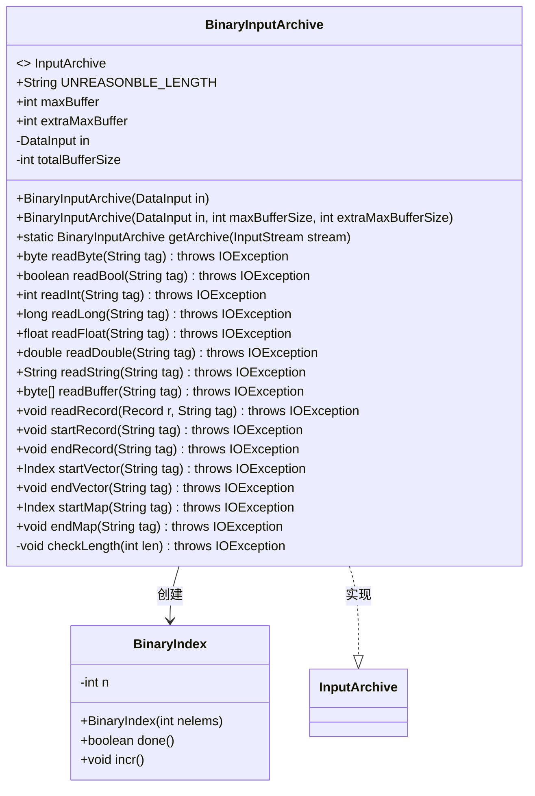
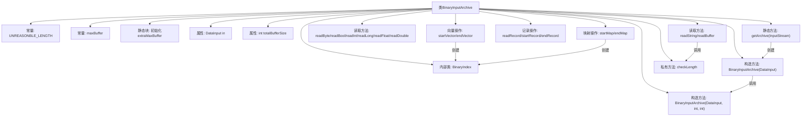

# 基础信息

|      |      |
|------|------|
| 名称 | BinaryInputArchive |
| 编码语言 | .java |
| 代码路径 | zookeeper/zookeeper-jute/src/main/java/org/apache/jute/BinaryInputArchive.java |
| 包名 | org.apache.jute |
| 依赖项 | ['java.io.DataInput', 'java.io.DataInputStream', 'java.io.IOException', 'java.io.InputStream', 'java.nio.charset.StandardCharsets'] |
| 概述说明 | BinaryInputArchive是用于二进制数据反序列化的类，支持读取基本类型、字符串、缓冲区和记录，包含缓冲区大小检查和索引管理功能。 |

# 说明

BinaryInputArchive是一个实现InputArchive接口的类，用于二进制数据的输入归档。它包含静态配置参数maxBuffer和extraMaxBuffer，分别通过系统属性jute.maxbuffer和zookeeper.jute.maxbuffer.extrasize设置，默认值分别为0xfffff和1024。类中定义了多种读取方法，如readByte、readBool、readInt等，用于处理不同类型的数据。读取字符串和缓冲区时会检查长度是否合理，避免不合理长度导致的异常。类还包含内部类BinaryIndex用于管理索引，以及startRecord、endRecord等方法用于处理记录的序列化。通过DataInput进行数据输入，支持从InputStream创建实例。

# 类列表 Class Summary

| 名称   | 类型  | 说明 |
|-------|------|-------------|
| BinaryInputArchive | class | BinaryInputArchive是处理二进制数据的输入归档类，支持读取基本类型、字符串、缓冲区和记录，包含长度检查和缓冲区大小限制。 |

## 类 BinaryInputArchive

|      |      |
|------|------|
| 访问范围 | public |
| 类型 | class |
| 名称 | BinaryInputArchive |
| 说明 | BinaryInputArchive是处理二进制数据的输入归档类，支持读取基本类型、字符串、缓冲区和记录，包含长度检查和缓冲区大小限制。 |

### UML类图

这段代码展示了一个二进制输入归档类`BinaryInputArchive`，它实现了`InputArchive`接口，主要用于从二进制流中读取各种数据类型。类中包含静态配置参数`maxBuffer`和`extraMaxBuffer`，通过构造函数初始化输入流和缓冲区大小限制。核心功能包括读取基本类型、字符串、缓冲区以及处理记录、向量和映射结构。内部类`BinaryIndex`用于跟踪集合元素的索引位置。安全性检查方法`checkLength`确保读取的数据长度在合理范围内。

### 内部方法调用关系图

该流程图展示了BinaryInputArchive类的完整结构，包含常量定义、静态初始化块、属性、构造方法、数据读取方法（基本类型和复杂类型）、记录/向量/映射操作以及长度校验方法。核心是通过DataInput实现二进制数据反序列化，其中BinaryIndex内部类用于迭代控制，checkLength方法确保数据安全。类设计注重缓冲区大小控制和类型安全校验。

### 字段列表 Field List

| 名称  | 类型  | 说明 |
|-------|-------|------|
| UNREASONBLE_LENGTH = "Unreasonable length = " | String | 静态常量字符串，表示"不合理的长度 = "。 |
| maxBuffer = Integer.getInteger("jute.maxbuffer", 0xfffff) | int | 定义静态常量maxBuffer，默认值0xfffff，可通过系统属性jute.maxbuffer配置。 |
| totalBufferSize | int | 私有整型常量，表示缓冲区总大小。 |
| extraMaxBuffer | int | 私有静态常量整型变量extraMaxBuffer |
| in | DataInput | 私有数据输入流对象。 |

### 方法列表 Method List

| 名称  | 类型  | 说明 |
|-------|-------|------|
| startVector | Index | 方法`startVector`根据输入标签读取整数`len`，若`len`为-1返回空，否则创建并返回长度为`len`的`BinaryIndex`对象。 |
| readBool | boolean | 读取布尔值的方法，参数为字符串tag，可能抛出IOException异常，直接返回输入流的布尔值。 |
| readString | String | 方法readString从输入流读取字符串：先读长度len，若为-1返回null；否则检查长度合法性，读取字节数组并转为UTF-8字符串返回。 |
| readInt | int | 方法readInt读取整数输入，参数tag未使用，可能抛出IOException异常。 |
| getArchive | BinaryInputArchive | 静态方法`getArchive`接收`InputStream`参数，返回基于`DataInputStream`包装的`BinaryInputArchive`实例。 |
| startMap | Index | 方法startMap接收字符串tag，返回BinaryIndex实例，可能抛出IOException。内部调用readInt处理tag参数。 |
| readRecord | void | 方法readRecord读取记录r，使用标签tag反序列化，可能抛出IOException异常。 |
| readLong | long | 读取长整型数据的方法，参数为字符串标签，可能抛出IO异常。 |
| readByte | byte | 读取字节数据，无标记处理，直接返回输入流的字节值。 |
| readFloat | float | 读取指定标签的浮点数，可能抛出IO异常。 |
| readDouble | double | 读取双精度浮点数的方法，参数为字符串标签，可能抛出IO异常。 |
| endVector | void | 方法endVector接收字符串参数tag，可能抛出IOException异常，无返回值。 |
| startRecord | void | 方法startRecord以字符串tag为参数，可能抛出IOException异常，无返回值。 |
| readBuffer | byte[] | 读取指定标签的字节数组，先读长度，若为-1返回null，否则创建数组并完全读取内容后返回。 |
| endRecord | void | 方法`endRecord`用于结束记录，接收字符串参数`tag`，可能抛出`IOException`异常。 |
| endMap | void | 方法endMap接收字符串参数tag，可能抛出IOException异常，无返回值。 |
| checkLength | void | 检查长度是否合法，非法则抛出异常。 |

