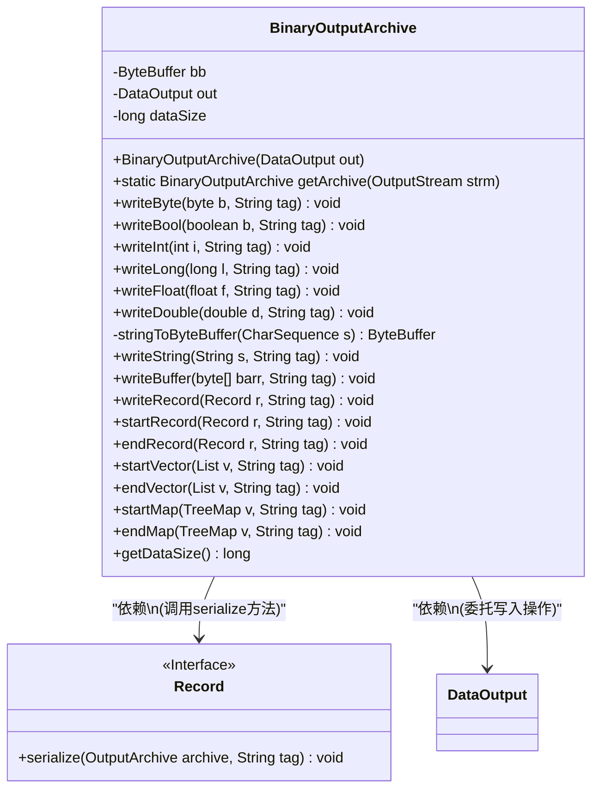
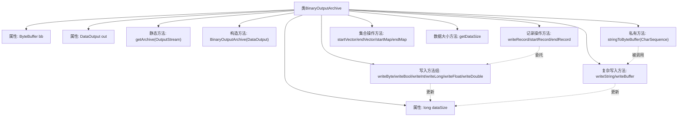

# 基础信息

|      |      |
|------|------|
| 名称 | BinaryOutputArchive |
| 编码语言 | .java |
| 代码路径 | zookeeper/zookeeper-jute/src/main/java/org/apache/jute/BinaryOutputArchive.java |
| 包名 | org.apache.jute |
| 依赖项 | ['java.io.DataOutput', 'java.io.DataOutputStream', 'java.io.IOException', 'java.io.OutputStream', 'java.nio.ByteBuffer', 'java.util.List', 'java.util.TreeMap'] |
| 概述说明 | BinaryOutputArchive实现二进制数据输出，支持基本类型、字符串、缓冲区和记录的序列化，自动计算数据大小并优化UTF8编码。 |

# 说明

BinaryOutputArchive是一个实现OutputArchive接口的类，用于将数据以二进制格式输出。它通过DataOutput接口进行底层写入操作，并跟踪写入的数据总大小。类初始化时分配1024字节的缓冲区，并提供静态方法getArchive从输出流创建实例。主要功能包括写入基本类型（byte、bool、int、long、float、double）和复杂类型（String、byte数组、Record、List、TreeMap）。其中字符串通过优化的UTF-8编码方法处理，自动扩展缓冲区大小。对于空值会写入-1标记。类还提供start/end方法支持结构化数据的序列化，并通过getDataSize方法返回累计写入数据量。

# 类列表 Class Summary

| 名称   | 类型  | 说明 |
|-------|------|-------------|
| BinaryOutputArchive | class | BinaryOutputArchive实现二进制数据序列化，支持基本类型、字符串、缓冲区和自定义记录的写入，自动统计数据大小并优化UTF8编码。 |

## 类 BinaryOutputArchive

|      |      |
|------|------|
| 访问范围 | public |
| 类型 | class |
| 名称 | BinaryOutputArchive |
| 说明 | BinaryOutputArchive实现二进制数据序列化，支持基本类型、字符串、缓冲区和自定义记录的写入，自动统计数据大小并优化UTF8编码。 |

### UML类图

类图描述：BinaryOutputArchive是一个二进制输出归档类，实现了多种数据类型的序列化写入功能。它内部使用ByteBuffer进行字符串编码优化，并通过DataOutput委托实际写入操作。该类支持基础类型、字符串、字节数组、记录(Record接口)、集合和映射的序列化，并统计总数据量。Record接口定义了可序列化对象的契约，BinaryOutputArchive通过调用其serialize方法实现复杂对象的写入。

### 内部方法调用关系图

该流程图展示了BinaryOutputArchive类的完整结构，重点突出了数据序列化的核心功能。类包含三种属性(字节缓冲区、数据输出流和数据大小计数器)，通过静态工厂方法和构造函数初始化。主要功能分为基本类型写入方法、字符串/缓冲区处理、记录操作和集合操作四大模块，其中字符串处理依赖内部UTF-8编码方法。所有写入操作都会同步更新数据大小计数器，体现了数据序列化过程中严格的大小跟踪机制。

### 字段列表 Field List

| 名称  | 类型  | 说明 |
|-------|-------|------|
| bb = ByteBuffer.allocate(1024) | ByteBuffer | 分配1024字节的ByteBuffer私有变量bb。 |
| dataSize | long | 私有长整型变量dataSize，用于存储数据大小。 |
| out | DataOutput | 私有数据输出变量out。 |

### 方法列表 Method List

| 名称  | 类型  | 说明 |
|-------|-------|------|
| endMap | void | 方法endMap接受TreeMap和字符串tag参数，可能抛出IOException。无具体实现。 |
| writeBool | void | 方法writeBool写入布尔值b到输出流，标签为tag，数据大小增加1字节，可能抛出IOException。 |
| writeRecord | void | 该方法将记录对象r序列化并写入，使用指定标签tag，可能抛出IOException异常。 |
| stringToByteBuffer | ByteBuffer | 将字符序列转为字节缓冲，动态扩容处理UTF-8编码，支持ASCII及多字节字符。 |
| writeLong | void | 该方法将长整型数值写入输出流，并增加数据大小计数8字节。若写入失败则抛出IO异常。 |
| getDataSize | long | 重写getDataSize方法，返回dataSize变量值。 |
| writeFloat | void | Java方法：写入浮点数到输出流，数据大小增加4字节。 |
| writeInt | void | 方法writeInt写入整数i到输出流，增加数据大小4字节，可能抛出IOException。 |
| startMap | void | 该方法用于启动一个TreeMap的序列化，首先写入Map的大小，参数包括TreeMap对象和标签字符串，可能抛出IOException异常。 |
| startVector | void | 该方法检查列表是否为空，为空则写入-1，否则写入列表大小。参数为列表和标签，可能抛出IO异常。 |
| startRecord | void | 开始记录方法，接收记录对象和标签参数，可能抛出IO异常。 |
| getArchive | BinaryOutputArchive | 静态方法`getArchive`接收`OutputStream`参数，返回包装了`DataOutputStream`的`BinaryOutputArchive`实例。 |
| writeBuffer | void | 方法writeBuffer写入字节数组到输出流。若数组为空，写入-1；否则写入数组长度和内容，并累加数据大小。 |
| endRecord | void | 结束记录操作，参数为记录对象和标签，可能抛出IO异常。 |
| endVector | void | 方法`endVector`接收列表`v`和字符串`tag`，可能抛出`IOException`，无返回值。 |
| writeDouble | void | 该方法将双精度浮点数d写入输出流，并增加数据大小8字节。若出错则抛出IOException。 |
| writeString | void | 方法writeString将字符串s写入输出流，若s为空则写入-1，否则转为字节缓冲区后写入长度及字节数据，并更新数据大小。 |
| writeByte | void | Java方法writeByte写入一个字节到输出流，并增加数据大小计数。参数为字节b和标签tag，可能抛出IOException。 |

