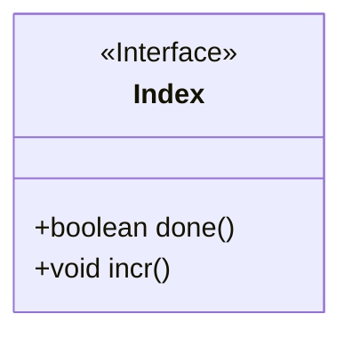
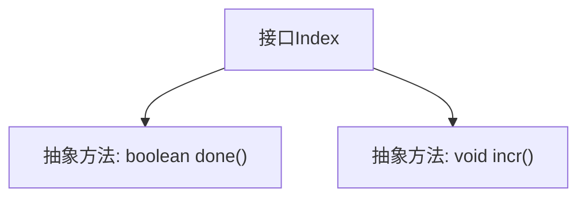

# 基础信息

|      |      |
|------|------|
| 名称 | Index |
| 编码语言 | .java |
| 代码路径 | zookeeper/zookeeper-jute/src/main/java/org/apache/jute/Index.java |
| 包名 | org.apache.jute |
| 依赖项 | [] |
| 概述说明 | 接口Index定义了两个方法：done()返回布尔值表示是否完成，incr()用于递增操作。 |

# 说明

该内容定义了一个名为Index的公共接口，包含两个方法：done()返回布尔值用于检查状态是否完成，incr()无返回值用于执行递增操作。接口简洁明确，适用于需要状态检查和递增功能的场景。

# 类列表 Class Summary

| 名称   | 类型  | 说明 |
|-------|------|-------------|
| Index | interface | 接口Index定义了两个方法：done()返回布尔值表示是否完成，incr()用于递增操作。 |

## 类 Index

|      |      |
|------|------|
| 访问范围 | public |
| 类型 | interface |
| 名称 | Index |
| 说明 | 接口Index定义了两个方法：done()返回布尔值表示是否完成，incr()用于递增操作。 |

### UML类图

这段代码定义了一个名为Index的接口，该接口包含两个方法：done()用于检查是否完成操作（返回布尔值），incr()用于执行递增操作（无返回值）。作为接口，它只声明方法签名而不包含实现，需要由具体类来实现这些方法。这种设计常用于定义可扩展的行为规范，允许不同的实现类以各自的方式完成索引操作。

### 内部方法调用关系图

这段代码定义了一个名为Index的接口，包含两个抽象方法：done()用于检查状态是否完成（返回布尔值），incr()用于递增操作（无返回值）。流程图清晰地展示了接口与方法的层级关系，符合接口定义的基本结构。该接口可能用于迭代器或计数器等场景，由实现类具体定义功能逻辑。

### 字段列表 Field List

| 名称  | 类型  | 说明 |
|-------|-------|------|

### 方法列表 Method List

| 名称  | 类型  | 说明 |
|-------|-------|------|
| incr | void | 函数incr()用于递增操作，无参数和返回值。 |
| done | boolean | 检查任务是否完成，返回布尔值。 |

