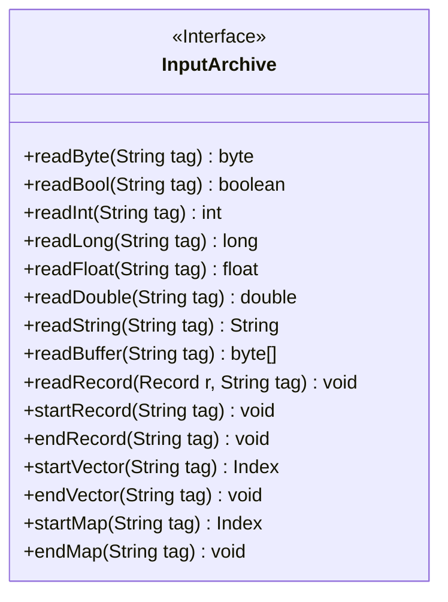

# 基础信息

|      |      |
|------|------|
| 名称 | InputArchive |
| 编码语言 | .java |
| 代码路径 | zookeeper/zookeeper-jute/src/main/java/org/apache/jute/InputArchive.java |
| 包名 | org.apache.jute |
| 依赖项 | ['java.io.IOException'] |
| 概述说明 | InputArchive接口定义了读取各种数据类型的方法，包括基本类型、字符串、缓冲区和复杂结构如记录、向量和映射，所有方法都可能抛出IOException。 |

# 说明

InputArchive是一个接口，定义了读取各种数据类型的方法，包括基本类型（byte、bool、int、long、float、double）、字符串、缓冲区以及复杂结构（记录、向量、映射）。每个方法都接收一个标签参数并可能抛出IOException。接口支持结构化数据的开始和结束操作（如记录、向量、映射），并提供了Index类型用于处理集合。

# 类列表 Class Summary

| 名称   | 类型  | 说明 |
|-------|------|-------------|
| InputArchive | interface | InputArchive接口定义了读取各种数据类型的方法，包括基本类型、字符串、缓冲区和复杂结构（记录、向量、映射），所有方法均可能抛出IOException。 |

## 类 InputArchive

|      |      |
|------|------|
| 访问范围 | public |
| 类型 | interface |
| 名称 | InputArchive |
| 说明 | InputArchive接口定义了读取各种数据类型的方法，包括基本类型、字符串、缓冲区和复杂结构（记录、向量、映射），所有方法均可能抛出IOException。 |

### UML类图

该图展示了一个名为InputArchive的接口，定义了多种数据读取方法，包括基本类型(byte, bool, int等)、字符串、缓冲区和复杂数据结构(记录、向量、映射)的读取操作。所有方法都接收一个String类型的tag参数，并可能抛出IOException异常。接口特别提供了对结构化数据(start/end Record/Vector/Map)的处理能力，其中startVector和startMap返回Index对象用于导航。这个接口设计用于序列化数据的反序列化操作，适合需要处理多种数据类型的输入场景。

### 内部方法调用关系图

```mermaid
graph TD
    A["接口InputArchive"]
    B["方法: readByte(String tag)"]
    C["方法: readBool(String tag)"]
    D["方法: readInt(String tag)"]
    E["方法: readLong(String tag)"]
    F["方法: readFloat(String tag)"]
    G["方法: readDouble(String tag)"]
    H["方法: readString(String tag)"]
    I["方法: readBuffer(String tag)"]
    J["方法: readRecord(Record r, String tag)"]
    K["方法: startRecord(String tag)"]
    L["方法: endRecord(String tag)"]
    M["方法: startVector(String tag)"]
    N["方法: endVector(String tag)"]
    O["方法: startMap(String tag)"]
    P["方法: endMap(String tag)"]

    A --> B
    A --> C
    A --> D
    A --> E
    A --> F
    A --> G
    A --> H
    A --> I
    A --> J
    A --> K
    A --> L
    A --> M
    A --> N
    A --> O
    A --> P
```

这段流程图展示了InputArchive接口的所有方法定义。该接口定义了序列化输入操作的规范，包含基本类型读取（如readByte、readBool）、复杂类型处理（如readRecord）、以及结构化数据控制（如startVector/endVector）。所有方法均声明抛出IOException，表明涉及I/O操作。接口设计支持分层数据解析，通过start/end方法对实现嵌套结构的标记化处理。

### 字段列表 Field List

| 名称  | 类型  | 说明 |
|-------|-------|------|

### 方法列表 Method List

| 名称  | 类型  | 说明 |
|-------|-------|------|
| readRecord | void | 读取记录方法，参数为记录对象和标签字符串，可能抛出IO异常。 |
| startVector | Index | 方法`startVector`以字符串`tag`为参数，可能抛出`IOException`异常。 |
| startMap | Index | 方法startMap接收字符串参数tag，可能抛出IOException异常，返回Index类型结果。 |
| startRecord | void | 开始记录指定标签的数据，可能抛出IO异常。 |
| endRecord | void | 结束记录指定标签，可能抛出IO异常。 |
| readDouble | double | 方法声明：读取指定标签的double值，可能抛出IO异常。 |
| readFloat | float | 从输入流读取浮点数，参数为标签，可能抛出IO异常。 |
| readBuffer | byte[] | 读取指定标签的数据到字节数组，可能抛出IO异常。 |
| readString | String | 读取字符串方法，参数为标签，可能抛出IO异常。 |
| readLong | long | 方法`readLong`读取字符串`tag`对应的长整型数据，可能抛出`IOException`异常。 |
| readInt | int | 读取字符串标签对应的整数值，可能抛出IO异常。 |
| endVector | void | 方法`endVector`用于结束向量标记，可能抛出`IOException`异常。参数`tag`为标记名称。 |
| readBool | boolean | 读取指定标签的布尔值，可能抛出IO异常。 |
| readByte | byte | 读取指定标签的字节数据，可能抛出IO异常。 |
| endMap | void | 方法`endMap`用于结束标记为`tag`的映射，可能抛出`IOException`异常。 |

