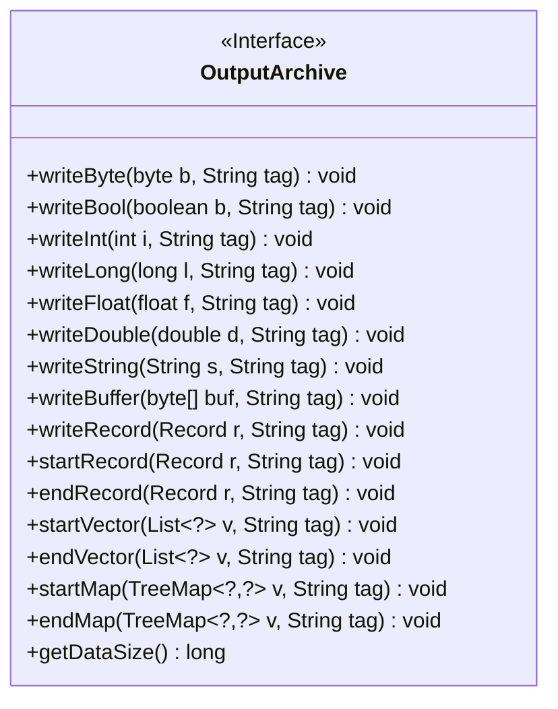

# 基础信息

|      |      |
|------|------|
| 名称 | OutputArchive |
| 编码语言 | .java |
| 代码路径 | zookeeper/zookeeper-jute/src/main/java/org/apache/jute/OutputArchive.java |
| 包名 | org.apache.jute |
| 依赖项 | ['java.io.IOException', 'java.util.List', 'java.util.TreeMap'] |
| 概述说明 | OutputArchive接口定义了数据序列化方法，包括写入基本类型、字符串、缓冲区、记录、向量和映射，支持开始/结束标记，并提供数据大小查询功能。 |

# 说明

OutputArchive是一个公开接口，定义了序列化数据的多种方法。包括写入基本类型如byte、bool、int、long、float、double和String，以及处理缓冲区byte数组和Record对象。支持开始和结束Record、Vector（列表）和Map（树形图）的结构化操作，每个方法都接受一个标签参数并可能抛出IOException。还提供了获取数据大小的getDataSize方法。

# 类列表 Class Summary

| 名称   | 类型  | 说明 |
|-------|------|-------------|
| OutputArchive | interface | OutputArchive接口定义了数据序列化方法，支持基本类型、字符串、缓冲区和复杂结构（记录、向量、映射）的写入操作，并包含获取数据大小的方法。 |

## 类 OutputArchive

|      |      |
|------|------|
| 访问范围 | public |
| 类型 | interface |
| 名称 | OutputArchive |
| 说明 | OutputArchive接口定义了数据序列化方法，支持基本类型、字符串、缓冲区和复杂结构（记录、向量、映射）的写入操作，并包含获取数据大小的方法。 |

### UML类图

这段代码定义了一个名为`OutputArchive`的接口，该接口提供了一系列用于序列化数据的方法，包括写入基本数据类型（如byte、boolean、int等）、字符串、缓冲区、记录（Record）、向量（List）和映射（TreeMap）的方法。接口中的每个方法都接受一个`String`类型的`tag`参数，并可能抛出`IOException`。接口还提供了一个`getDataSize`方法用于获取数据大小。这个接口的设计目的是为了提供一个统一的序列化输出机制，适用于多种数据类型的序列化操作。

### 内部方法调用关系图

```mermaid
graph TD
    A["接口OutputArchive"]
    B["方法: writeByte(byte b, String tag)"]
    C["方法: writeBool(boolean b, String tag)"]
    D["方法: writeInt(int i, String tag)"]
    E["方法: writeLong(long l, String tag)"]
    F["方法: writeFloat(float f, String tag)"]
    G["方法: writeDouble(double d, String tag)"]
    H["方法: writeString(String s, String tag)"]
    I["方法: writeBuffer(byte[] buf, String tag)"]
    J["方法: writeRecord(Record r, String tag)"]
    K["方法: startRecord(Record r, String tag)"]
    L["方法: endRecord(Record r, String tag)"]
    M["方法: startVector(List<?> v, String tag)"]
    N["方法: endVector(List<?> v, String tag)"]
    O["方法: startMap(TreeMap<?, ?> v, String tag)"]
    P["方法: endMap(TreeMap<?, ?> v, String tag)"]
    Q["方法: getDataSize()"]

    A --> B
    A --> C
    A --> D
    A --> E
    A --> F
    A --> G
    A --> H
    A --> I
    A --> J
    A --> K
    A --> L
    A --> M
    A --> N
    A --> O
    A --> P
    A --> Q
```

这段流程图展示了OutputArchive接口的结构及其所有方法。OutputArchive是一个数据序列化接口，定义了多种写入不同类型数据的方法，包括基本类型（如byte、int、long等）、字符串、缓冲区、记录（Record）、向量（List）和映射（TreeMap）。每个方法都接受一个tag参数用于标记数据，并可能抛出IOException。接口还提供了getDataSize()方法用于获取数据大小。这些方法共同构成了一个完整的数据序列化框架，适用于复杂数据结构的持久化或网络传输。

### 字段列表 Field List

| 名称  | 类型  | 说明 |
|-------|-------|------|

### 方法列表 Method List

| 名称  | 类型  | 说明 |
|-------|-------|------|
| writeDouble | void | 方法writeDouble将双精度浮点数d和字符串标签tag写入输出流，可能抛出IOException异常。 |
| writeFloat | void | 写入浮点数f到标签tag，可能抛出IO异常。 |
| endMap | void | 结束TreeMap处理，接收泛型键值对和标签，可能抛出IO异常。 |
| getDataSize | long | 获取数据大小的长整型方法。 |
| startVector | void | 方法startVector启动列表序列化，参数为列表v和标签tag，可能抛出IOException异常。 |
| endRecord | void | 结束记录并标记，可能抛出IO异常。 |
| writeByte | void | 写入字节数据，带标签，可能抛出IO异常。 |
| endVector | void | 方法`endVector`用于结束列表处理，接收列表`v`和标签`tag`，可能抛出`IOException`异常。 |
| writeInt | void | 方法writeInt将整数i和字符串tag写入输出流，可能抛出IOException异常。 |
| startMap | void | 方法startMap启动TreeMap，接收泛型键值对和标签参数，可能抛出IOException。 |
| writeBool | void | 写入布尔值b到标签tag，可能抛出IO异常。 |
| startRecord | void | 开始记录指定标签的数据，可能抛出IO异常。 |
| writeLong | void | 方法writeLong写入长整型数据l，附带标签tag，可能抛出IOException异常。 |
| writeString | void | 方法writeString将字符串s和标签tag写入，可能抛出IOException异常。 |
| writeBuffer | void | 写入缓冲区数据，参数为字节数组和标签，可能抛出IO异常。 |
| writeRecord | void | 写入记录r并标记为tag，可能抛出IOException异常。 |

