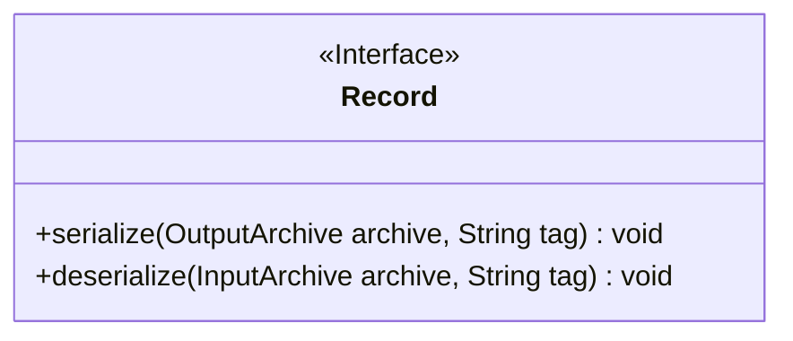
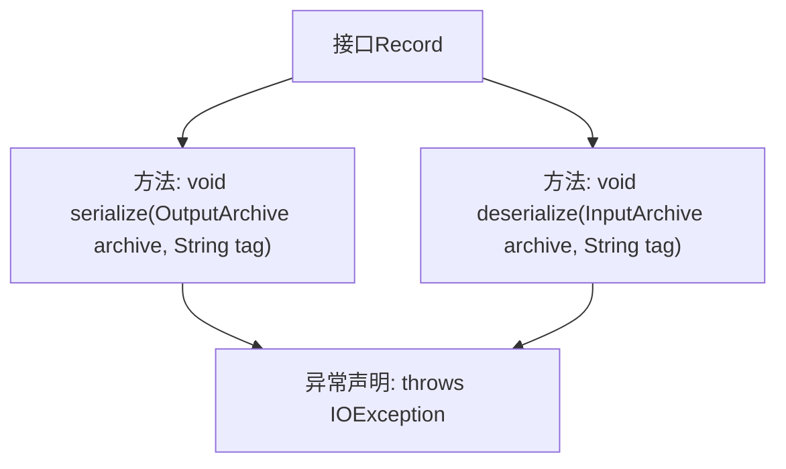

# 基础信息

|      |      |
|------|------|
| 名称 | Record |
| 编码语言 | .java |
| 代码路径 | zookeeper/zookeeper-jute/src/main/java/org/apache/jute/Record.java |
| 包名 | org.apache.jute |
| 依赖项 | ['java.io.IOException', 'org.apache.yetus.audience.InterfaceAudience'] |
| 概述说明 | 公开接口Record定义序列化方法serialize和反序列化方法deserialize，均可能抛出IOException异常。 |

# 说明

这是一个公开接口Record，定义了两个核心方法：serialize用于将对象序列化到输出存档中，deserialize用于从输入存档反序列化对象。两个方法均接受存档对象和标签字符串作为参数，并可能抛出IO异常。接口标注为公共API，表明可供外部开发者使用。

# 类列表 Class Summary

| 名称   | 类型  | 说明 |
|-------|------|-------------|
| Record | interface | 公开接口Record提供序列化方法serialize和反序列化方法deserialize，支持OutputArchive和InputArchive操作，可能抛出IOException。 |

## 类 Record

|      |      |
|------|------|
| 访问范围 | @InterfaceAudience.Public;public |
| 类型 | interface |
| 名称 | Record |
| 说明 | 公开接口Record提供序列化方法serialize和反序列化方法deserialize，支持OutputArchive和InputArchive操作，可能抛出IOException。 |

### UML类图

这段类图描述了一个名为Record的公共接口，该接口定义了数据序列化和反序列化的标准方法。接口包含两个核心方法：serialize用于将对象数据写入输出归档（OutputArchive），deserialize用于从输入归档（InputArchive）读取数据。两个方法均可能抛出IOException异常，且都需要通过tag参数标识数据条目。该接口作为数据持久化的抽象层，可被不同实现类具体化，适用于需要跨网络传输或本地存储的场景。

### 内部方法调用关系图

该流程图展示了Record接口的结构，包含两个核心方法：serialize和deserialize，均接受归档对象和标签参数，并可能抛出IOException异常。接口标注为@Public表示对外公开，体现了数据序列化/反序列化的契约设计，箭头清晰地反映了方法与异常声明的关联关系。

### 字段列表 Field List

| 名称  | 类型  | 说明 |
|-------|-------|------|

### 方法列表 Method List

| 名称  | 类型  | 说明 |
|-------|-------|------|
| deserialize | void | 反序列化方法：从输入存档读取数据，处理指定标签，可能抛出IO异常。 |
| serialize | void | 序列化方法，将对象写入输出存档，带标签，可能抛出IO异常。 |

