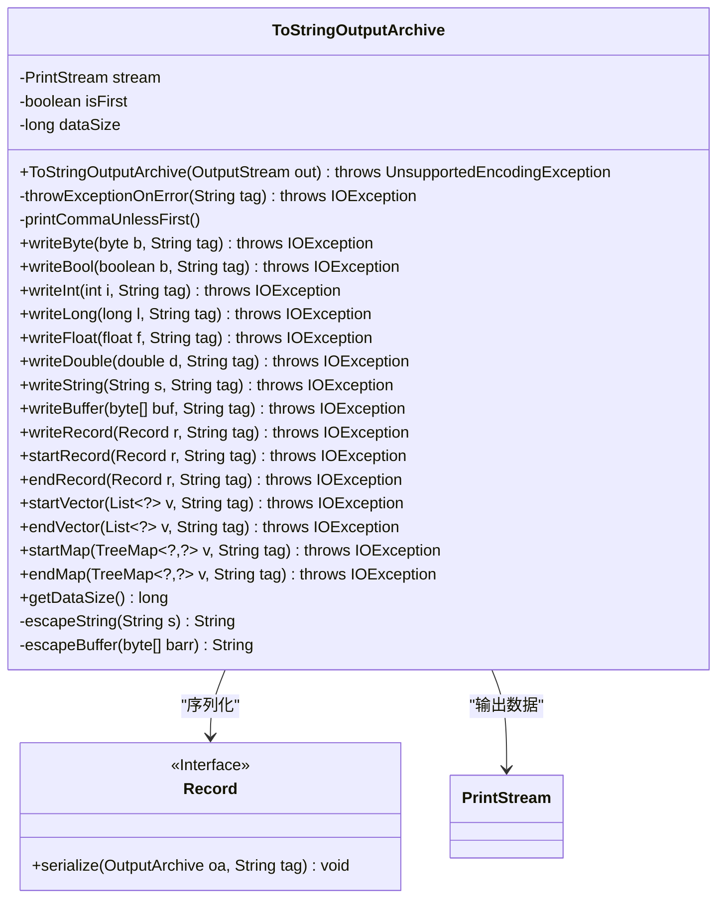

# 基础信息

|      |      |
|------|------|
| 名称 | ToStringOutputArchive |
| 编码语言 | .java |
| 代码路径 | zookeeper/zookeeper-jute/src/main/java/org/apache/jute/ToStringOutputArchive.java |
| 包名 | org.apache.jute |
| 依赖项 | ['java.io.IOException', 'java.io.OutputStream', 'java.io.PrintStream', 'java.io.UnsupportedEncodingException', 'java.util.List', 'java.util.TreeMap'] |
| 概述说明 | ToStringOutputArchive类实现OutputArchive接口，用于将数据序列化为字符串输出。主要功能包括写入基本类型、字符串、缓冲区和记录，支持向量和映射的序列化，自动添加逗号分隔，统计数据大小，并处理转义字符。 |

# 说明

ToStringOutputArchive是一个实现OutputArchive接口的类，用于将数据序列化为字符串格式输出到指定流。它通过PrintStream以UTF-8编码输出数据，并跟踪已写入数据的大小。主要功能包括处理基本类型（如byte、bool、int、long、float、double）、字符串、字节数组以及复杂结构（Record、List、TreeMap）的序列化。在输出时，使用逗号分隔非首个元素，并对字符串和字节数组进行转义处理。对于Record、List和TreeMap，使用特定标记（如"s{}"、"v{}"、"m{}"）标识开始和结束。异常处理确保在输出错误时抛出IOException。转义方法处理特殊字符和字节数组的十六进制表示。

# 类列表 Class Summary

| 名称   | 类型  | 说明 |
|-------|------|-------------|
| ToStringOutputArchive | class | ToStringOutputArchive类实现OutputArchive接口，用于将数据序列化为字符串输出流。主要功能包括写入基本类型、字符串、缓冲区和记录，支持向量和映射的起始/结束标记，自动处理逗号分隔和转义字符，并跟踪数据大小。 |

## 类 ToStringOutputArchive

|      |      |
|------|------|
| 访问范围 | public |
| 类型 | class |
| 名称 | ToStringOutputArchive |
| 说明 | ToStringOutputArchive类实现OutputArchive接口，用于将数据序列化为字符串输出流。主要功能包括写入基本类型、字符串、缓冲区和记录，支持向量和映射的起始/结束标记，自动处理逗号分隔和转义字符，并跟踪数据大小。 |

### UML类图

这段代码定义了一个`ToStringOutputArchive`类，用于将各种数据类型序列化为字符串格式并输出到流中。该类包含多个写入方法（如writeBool、writeInt等），处理基本类型和复杂类型（如Record、List、Map）的序列化，同时维护数据大小统计和错误检查功能。通过PrintStream进行实际输出，并实现了对Record接口的支持。私有方法处理字符串和缓冲区的转义逻辑，确保特殊字符的正确处理。

### 内部方法调用关系图

```mermaid
graph TD
    A["类ToStringOutputArchive"]
    B["属性: PrintStream stream"]
    C["属性: boolean isFirst"]
    D["属性: long dataSize"]
    E["私有方法: throwExceptionOnError(String tag)"]
    F["私有方法: printCommaUnlessFirst()"]
    G["构造方法: ToStringOutputArchive(OutputStream out)"]
    H["方法: writeByte(byte b, String tag)"]
    I["方法: writeBool(boolean b, String tag)"]
    J["方法: writeInt(int i, String tag)"]
    K["方法: writeLong(long l, String tag)"]
    L["方法: writeFloat(float f, String tag)"]
    M["方法: writeDouble(double d, String tag)"]
    N["方法: writeString(String s, String tag)"]
    O["方法: writeBuffer(byte[] buf, String tag)"]
    P["方法: writeRecord(Record r, String tag)"]
    Q["方法: startRecord(Record r, String tag)"]
    R["方法: endRecord(Record r, String tag)"]
    S["方法: startVector(List<?> v, String tag)"]
    T["方法: endVector(List<?> v, String tag)"]
    U["方法: startMap(TreeMap<?, ?> v, String tag)"]
    V["方法: endMap(TreeMap<?, ?> v, String tag)"]
    W["方法: getDataSize()"]
    X["私有静态方法: escapeString(String s)"]
    Y["私有静态方法: escapeBuffer(byte[] barr)"]

    A --> B
    A --> C
    A --> D
    A --> E
    A --> F
    A --> G
    A --> H
    A --> I
    A --> J
    A --> K
    A --> L
    A --> M
    A --> N
    A --> O
    A --> P
    A --> Q
    A --> R
    A --> S
    A --> T
    A --> U
    A --> V
    A --> W
    A --> X
    A --> Y
```

这段代码定义了一个名为ToStringOutputArchive的类，主要用于将各种数据类型序列化为字符串格式并输出到指定的输出流中。类中包含多个写入方法（如writeBool、writeInt等），用于处理不同类型的数据，并确保输出的格式正确。此外，类还提供了处理记录、向量和映射的开始与结束标记的方法，以及转义字符串和缓冲区的辅助方法。流程图清晰地展示了类的结构及其方法之间的调用关系。

### 字段列表 Field List

| 名称  | 类型  | 说明 |
|-------|-------|------|
| stream | PrintStream | 私有PrintStream类型变量stream。 |
| dataSize | long | 私有长整型变量dataSize，用于存储数据大小。 |
| isFirst = true | boolean | 变量isFirst初始化为true，表示首次状态。 |

### 方法列表 Method List

| 名称  | 类型  | 说明 |
|-------|-------|------|
| writeRecord | void | 该方法将记录对象序列化并写入，若记录为空则直接返回。可能抛出IO异常。 |
| writeByte | void | 该方法将字节b转换为长整型后调用writeLong方法写入，附带标签tag，可能抛出IOException异常。 |
| startMap | void | Java方法startMap：初始化TreeMap序列化，输出"m{"，重置isFirst标志，数据大小增加2字节。 |
| writeLong | void | 方法writeLong将长整型l转为字符串写入流，更新数据大小并检查错误。参数tag用于异常标识。 |
| startVector | void | 该方法`startVector`初始化向量输出：打印起始标记"v{"，增加数据大小，重置首项标志。可能抛出IO异常。 |
| printCommaUnlessFirst | void | 方法`printCommaUnlessFirst`在非首次调用时输出逗号并增加数据大小计数，同时标记首次调用结束。 |
| endMap | void | 方法endMap结束TreeMap处理，输出右大括号，增加dataSize计数，重置isFirst标志。 |
| getDataSize | long | 重写getDataSize方法，返回dataSize值。 |
| writeBuffer | void | 方法writeBuffer将字节数组buf转为转义字符串写入流，更新数据大小并检查错误。参数tag用于异常标识。 |
| writeDouble | void | 方法writeDouble将双精度数d转换为字符串写入流，更新数据大小，并在出错时抛出异常。参数tag用于错误标识。 |
| writeString | void | Java方法writeString：接收字符串s和标签tag，转义s后写入流，累加数据大小，检查错误并可能抛出IO异常。 |
| writeBool | void | 方法writeBool将布尔值b转为"T"或"F"写入流，数据大小加1，检查错误并可能抛出IO异常。 |
| writeFloat | void | 方法writeFloat将浮点数f转为double类型后调用writeDouble方法写入，参数tag用于标记，可能抛出IOException异常。 |
| throwExceptionOnError | void | 方法throwExceptionOnError检查流错误，若存在则抛出带标签的IO异常。 |
| writeInt | void | 该方法将整型参数i转换为长整型后调用writeLong方法写入，附带标签tag，可能抛出IOException异常。 |
| endRecord | void | 方法endRecord处理记录结束逻辑：若tag为空或空字符串，输出换行并重置标志；否则输出右括号并更新标志。均增加dataSize计数。 |
| endVector | void | Java方法endVector：关闭列表输出流，打印右括号，数据大小加1，重置isFirst标志。 |
| startRecord | void | 方法startRecord接收Record对象和字符串tag，若tag非空则打印"s{"并重置状态。可能抛出IOException。 |
| escapeString | String | 私有方法escapeString将输入字符串转义，空值返回空字符串。非空时在字符串前后加单引号，并替换特殊字符为百分号编码格式。 |
| escapeBuffer | String | 私有方法escapeBuffer将字节数组转换为十六进制字符串，前缀为#。若数组为空返回空字符串。 |

