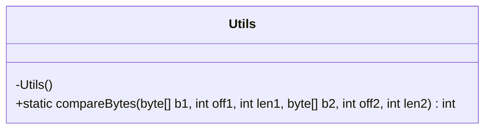
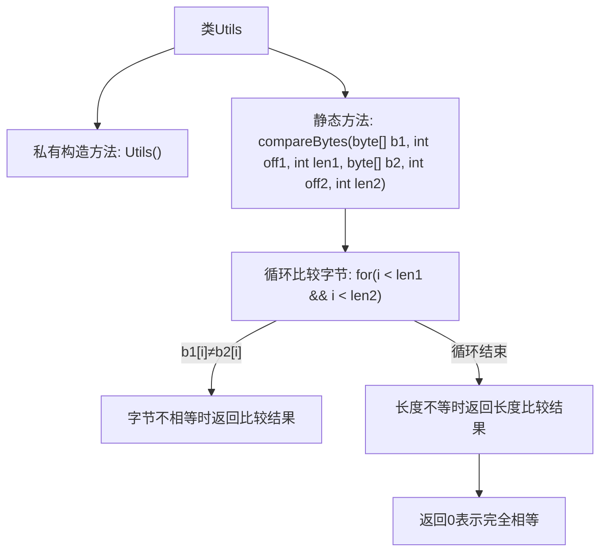

# 基础信息

|      |      |
|------|------|
| 名称 | Utils |
| 编码语言 | .java |
| 代码路径 | zookeeper/zookeeper-jute/src/main/java/org/apache/jute/Utils.java |
| 包名 | org.apache.jute |
| 依赖项 | [] |
| 概述说明 | 工具类Utils提供静态方法compareBytes，用于比较两个字节数组的指定范围。若内容不同返回差异，长度不同返回长度差，相同返回0。禁止实例化。 |

# 说明

该内容描述了一个名为Utils的工具类，该类包含一个私有构造方法以防止实例化。类中定义了一个静态方法compareBytes，用于比较两个字节数组的指定范围。方法首先逐个比较字节，若发现不同则返回-1或1表示大小关系。若所有比较字节相同但长度不同，则根据长度返回-1或1。若完全一致则返回0。该方法实现了字节数组的字典序比较功能。

# 类列表 Class Summary

| 名称   | 类型  | 说明 |
|-------|------|-------------|
| Utils | class | Utils工具类禁止实例化，提供静态方法compareBytes比较两个字节数组片段，按字典序返回-1、0或1。 |

## 类 Utils

|      |      |
|------|------|
| 访问范围 | public |
| 类型 | class |
| 名称 | Utils |
| 说明 | Utils工具类禁止实例化，提供静态方法compareBytes比较两个字节数组片段，按字典序返回-1、0或1。 |

### UML类图

这段代码展示了一个工具类Utils，它包含一个私有构造方法防止实例化，以及一个核心静态方法compareBytes用于比较两个字节数组的字典序。该方法通过逐字节比较两个数组的指定范围，返回-1/0/1表示小于/等于/大于关系，并处理长度不等的情况。类图清晰地反映了该工具类的不可实例化特性和单一功能设计。

### 内部方法调用关系图

这段代码是Utils类的字节数组比较工具，核心方法是compareBytes。流程图展示了从构造方法禁止实例化开始，到比较逻辑的分支处理：先逐字节比较差异，再处理长度差异，最后返回三种可能结果(-1/0/1)。该方法实现了类似Java标准库的字典序比较逻辑，但针对原始字节数组进行了优化设计，适用于二进制数据的高效比对场景。

### 字段列表 Field List

| 名称  | 类型  | 说明 |
|-------|-------|------|

### 方法列表 Method List

| 名称  | 类型  | 说明 |
|-------|-------|------|
| compareBytes | int | 比较两个字节数组的指定范围，返回-1、0或1表示小于、等于或大于。逐个字节比较，长度不等时较短者小。 |

