# 基础信息

|      |      |
|------|------|
| 名称 | jute |
| 编码语言 | .java |
| 代码路径 | zookeeper/zookeeper-jute/src/main/java/org/apache/jute |
| 包名 | zookeeper.docs.zookeeper-jute.src.main.java.org.apache.jute |
| 概述说明 | ZooKeeper Jute是跨语言代码生成器，将数据结构转为Java/C++/C#等类型安全代码，含序列化/比较逻辑。支持基本/复合类型，用于分布式通信协议开发，类似Protocol Buffers。含输入/输出归档接口及二进制/字符串实现。 |

# 说明

## 概述  
1. 该模块是ZooKeeper Jute的跨语言序列化框架，核心职责是实现分布式系统通信数据的二进制编解码。例如通过InputArchive/OutputArchive接口处理基本类型和复杂结构的序列化。  
2. 主要接口规范包括Record的序列化契约（如serialize/deserialize方法）和归档格式（如BinaryInputArchive的二进制协议），类似Protobuf的编解码体系。  
3. 关键数据结构涵盖Index状态追踪器、字节数组比较工具（Utils.compareBytes）以及BinaryOutputArchive的动态缓冲区。  
4. 外部依赖仅需标准IO库，例如Java的DataInput/DataOutput接口实现底层字节操作。  
5. 通过"例如"说明：BinaryInputArchive使用jute.maxbuffer系统参数控制反序列化安全阈值，防止内存溢出攻击。  

## 主要业务场景  
1. 支持ZooKeeper服务端-客户端的网络通信流程，例如将Record对象序列化为二进制流传输。  
2. 采用双工归档设计（InputArchive/OutputArchive），同步处理请求响应数据流，类似TCP协议的字节流封装。  
3. 功能覆盖基础类型序列化、结构化数据标记（如startRecord/v{}）和安全性校验（如缓冲区长度检查）。  
4. 主要用于分布式协调服务的数据交换场景，类似RPC框架中的消息编解码层。  
5. 提供可扩展的归档实现API，例如ToStringOutputArchive支持调试用的文本格式输出。  
6. 与ZooKeeper核心深度集成，例如BinaryOutputArchive直接用于服务端的网络包构造。

### 包内部结构视图

```mermaid
graph TD
    jute --> compiler
    jute --> InputArchive.java
    jute --> Utils.java
    jute --> Record.java
    jute --> OutputArchive.java
    jute --> Index.java
    jute --> BinaryInputArchive.java
    jute --> BinaryOutputArchive.java
    jute --> ToStringOutputArchive.java
    compiler --> generated
    compiler --> JCompType.java
    compiler --> CGenerator.java
    compiler --> CppGenerator.java
    compiler --> JString.java
    compiler --> JByte.java
    compiler --> JLong.java
    compiler --> JMap.java
    compiler --> JType.java
    compiler --> JRecord.java
    compiler --> JFile.java
    compiler --> JInt.java
    compiler --> JDouble.java
    compiler --> JBoolean.java
    compiler --> JField.java
    compiler --> CSharpGenerator.java
    compiler --> JavaGenerator.java
    compiler --> JBuffer.java
    compiler --> JVector.java
    compiler --> JFloat.java
```

该流程图展示了Apache Jute项目的目录结构，以jute为根节点，包含compiler子目录和多个独立文件。compiler目录下又包含generated目录和众多Java源文件，主要涉及代码生成器、类型定义和序列化相关组件。整体结构清晰地反映了Jute作为序列化框架的模块划分，核心功能集中在compiler目录实现。

# 文件列表 File List

| 名称   | 类型  | 说明 |
|-------|------|-------------|
| [Record.java](Record.md) | file | 公开接口Record定义序列化方法serialize和反序列化方法deserialize，均可能抛出IOException异常。 |
| [InputArchive.java](InputArchive.md) | file | InputArchive接口定义了读取各种数据类型的方法，包括基本类型、字符串、缓冲区和复杂结构如记录、向量和映射，所有方法都可能抛出IOException。 |
| [ToStringOutputArchive.java](ToStringOutputArchive.md) | file | ToStringOutputArchive类实现OutputArchive接口，用于将数据序列化为字符串输出。主要功能包括写入基本类型、字符串、缓冲区和记录，支持向量和映射的序列化，自动添加逗号分隔，统计数据大小，并处理转义字符。 |
| [BinaryOutputArchive.java](BinaryOutputArchive.md) | file | BinaryOutputArchive实现二进制数据输出，支持基本类型、字符串、缓冲区和记录的序列化，自动计算数据大小并优化UTF8编码。 |
| [BinaryInputArchive.java](BinaryInputArchive.md) | file | BinaryInputArchive是用于二进制数据反序列化的类，支持读取基本类型、字符串、缓冲区和记录，包含缓冲区大小检查和索引管理功能。 |
| [Index.java](Index.md) | file | 接口Index定义了两个方法：done()返回布尔值表示是否完成，incr()用于递增操作。 |
| [OutputArchive.java](OutputArchive.md) | file | OutputArchive接口定义了数据序列化方法，包括写入基本类型、字符串、缓冲区、记录、向量和映射，支持开始/结束标记，并提供数据大小查询功能。 |
| [Utils.java](Utils.md) | file | 工具类Utils提供静态方法compareBytes，用于比较两个字节数组的指定范围。若内容不同返回差异，长度不同返回长度差，相同返回0。禁止实例化。 |
| [compiler](compiler/_module.md) | package | JCompType是JType子类，处理多语言类型转换，支持生成C++/Java/C#方法。CGenerator/CppGenerator生成C++代码文件，含许可证和兼容声明。JString/JByte/JLong等子类处理特定类型转换和代码生成。JRecord管理跨语言记录类型生成。JFile支持多语言代码生成。JField处理字段信息。CSharp/JavaGenerator生成对应语言代码。JBuffer处理字节数组，JVector处理向量类型。 |

