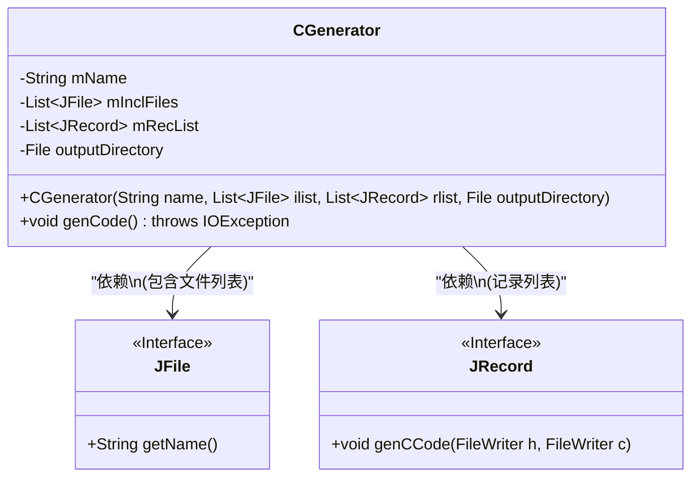
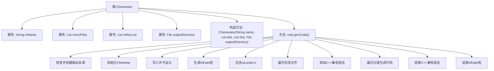

# 基础信息

|      |      |
|------|------|
| 名称 | CGenerator |
| 编码语言 | .java |
| 代码路径 | zookeeper/zookeeper-jute/src/main/java/org/apache/jute/compiler/CGenerator.java |
| 包名 | org.apache.jute.compiler |
| 依赖项 | ['java.io.File', 'java.io.FileWriter', 'java.io.IOException', 'java.util.Iterator', 'java.util.List'] |
| 概述说明 | CGenerator类用于生成C++代码，包含文件名、包含文件列表、记录列表和输出目录。构造函数初始化这些属性。genCode方法创建输出目录，生成.c和.h文件，写入Apache许可证，处理包含文件和记录代码，确保C++兼容性。 |

# 说明

CGenerator类用于生成C++代码文件。构造函数接收文件名、包含文件列表、记录列表和输出目录参数。genCode方法负责创建输出目录并生成.c和.h文件。文件头部包含Apache许可证声明。.h文件生成包含保护宏、recordio.h引用和用户指定的头文件引用，并添加C++兼容性声明。.c文件包含stdlib.h和对应头文件引用。每个JRecord实例生成相应代码。最后关闭C++兼容性声明和包含保护宏。

# 类列表 Class Summary

| 名称   | 类型  | 说明 |
|-------|------|-------------|
| CGenerator | class | CGenerator类用于生成C++代码，包含文件名、包含文件列表和记录列表。构造函数初始化这些属性。genCode方法创建输出目录，生成.c和.h文件，写入许可证头文件，处理包含文件和记录代码，确保C++兼容性。 |

## 类 CGenerator

|      |      |
|------|------|
| 访问范围 | None |
| 类型 | class |
| 名称 | CGenerator |
| 说明 | CGenerator类用于生成C++代码，包含文件名、包含文件列表和记录列表。构造函数初始化这些属性。genCode方法创建输出目录，生成.c和.h文件，写入许可证头文件，处理包含文件和记录代码，确保C++兼容性。 |

### UML类图

这段代码展示了一个C代码生成器类CGenerator，它负责生成C语言头文件和源文件。该类包含私有成员变量mName（文件名）、mInclFiles（包含文件列表）、mRecList（记录列表）和outputDirectory（输出目录）。主要功能是通过genCode()方法生成.c和.h文件，包括写入许可证头、包含语句以及调用JRecord接口生成记录级代码。该类依赖于JFile和JRecord两个接口，分别用于获取文件信息和生成记录代码。整个设计体现了单一职责原则，将文件级和记录级代码生成分离。

### 内部方法调用关系图

这段代码是CGenerator类的实现，主要用于生成C/C++代码文件。流程图展示了从类结构到代码生成的全过程，包括初始化参数、创建输出目录、生成.h和.c文件、写入许可证头、处理包含文件、添加C++兼容语法，最后遍历记录列表生成具体代码。整个过程严格遵循C/C++文件生成规范，确保生成的文件可直接编译使用。

### 字段列表 Field List

| 名称  | 类型  | 说明 |
|-------|-------|------|
| mName | String | 私有字符串变量mName。 |
| mRecList | List<JRecord> | 私有JRecord列表变量mRecList。 |
| mInclFiles | List<JFile> | 私有文件列表变量mInclFiles，类型为JFile对象的集合。 |
| outputDirectory | File | 私有文件输出目录变量。 |

### 方法列表 Method List

| 名称  | 类型  | 说明 |
|-------|-------|------|
| genCode | void | 生成C和H文件，检查输出目录，写入Apache许可证，处理头文件保护宏和C++兼容性，包含依赖头文件，生成记录代码。 |

