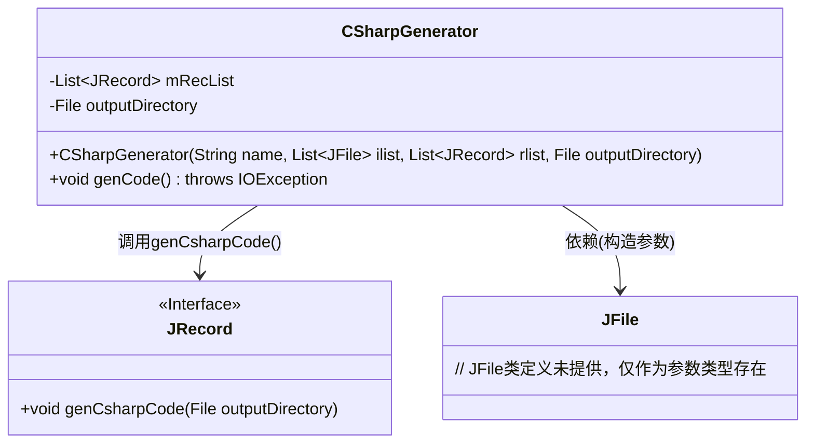
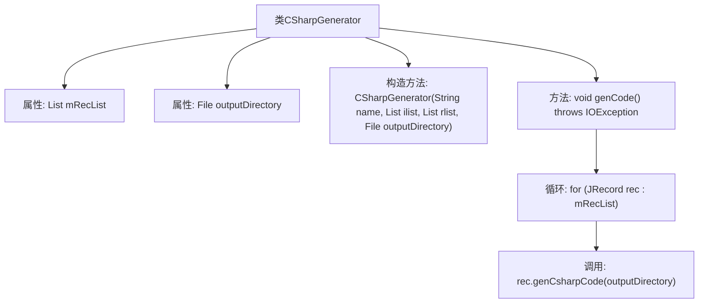

# 基础信息

|      |      |
|------|------|
| 名称 | CSharpGenerator |
| 编码语言 | .java |
| 代码路径 | zookeeper/zookeeper-jute/src/main/java/org/apache/jute/compiler/CSharpGenerator.java |
| 包名 | org.apache.jute.compiler |
| 依赖项 | ['java.io.File', 'java.io.IOException', 'java.util.List'] |
| 概述说明 | CSharpGenerator类用于生成C#代码，构造函数接收输出目录和记录列表，genCode方法遍历记录列表并调用JRecord生成代码。 |

# 说明

CSharpGenerator是一个用于生成C#代码的类，包含两个主要成员变量：mRecList（JRecord对象列表）和outputDirectory（输出目录路径）。构造函数接收文件名、包含文件列表、记录列表和输出目录参数，初始化成员变量。genCode方法遍历mRecList，调用每个JRecord对象的genCsharpCode方法生成C#代码文件到指定目录。该类仅处理文件级代码生成，记录级代码由JRecord类负责。

# 类列表 Class Summary

| 名称   | 类型  | 说明 |
|-------|------|-------------|
| CSharpGenerator | class | CSharpGenerator类用于生成C#代码，构造函数接收文件名、依赖文件和记录列表，genCode方法遍历记录列表并调用JRecord生成代码。 |

## 类 CSharpGenerator

|      |      |
|------|------|
| 访问范围 | public |
| 类型 | class |
| 名称 | CSharpGenerator |
| 说明 | CSharpGenerator类用于生成C#代码，构造函数接收文件名、依赖文件和记录列表，genCode方法遍历记录列表并调用JRecord生成代码。 |

### UML类图

该代码展示了一个C#代码生成器（CSharpGenerator），它通过构造函数接收输出目录和记录列表（JRecord），其核心方法genCode()会遍历所有记录并调用其genCsharpCode()方法生成代码。类图中包含三个主要元素：CSharpGenerator作为核心类，JRecord作为生成代码的接口，JFile作为辅助参数类型。箭头表示CSharpGenerator对JRecord的调用依赖关系，体现了职责分离的设计思想。

### 内部方法调用关系图

该流程图展示了CSharpGenerator类的结构及其核心逻辑。类包含两个私有属性（mRecList和outputDirectory）和一个构造方法，主要功能由genCode()方法实现，该方法遍历mRecList列表并调用每个JRecord对象的genCsharpCode方法。整个过程体现了文件级代码生成委托给JRecord实例处理的协作模式，输出目录作为参数贯穿整个流程。

### 字段列表 Field List

| 名称  | 类型  | 说明 |
|-------|-------|------|
| outputDirectory | File | 私有文件输出目录变量。 |
| mRecList | List<JRecord> | 私有JRecord列表变量mRecList。 |

### 方法列表 Method List

| 名称  | 类型  | 说明 |
|-------|-------|------|
| genCode | void | 

该方法遍历记录列表，为每条记录生成C#代码到指定目录，可能抛出IO异常。 |

