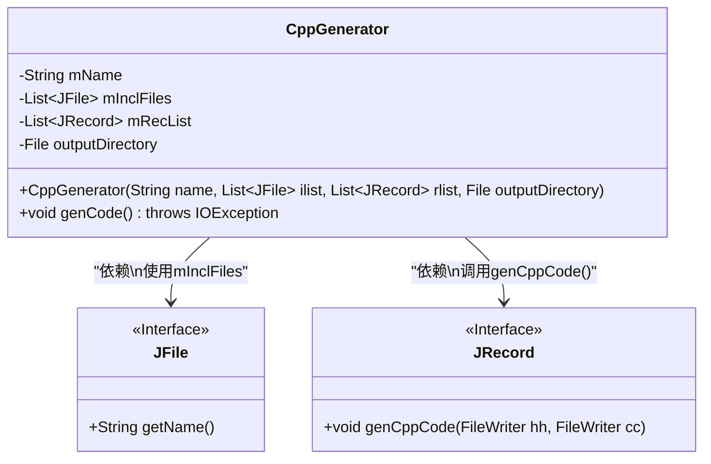
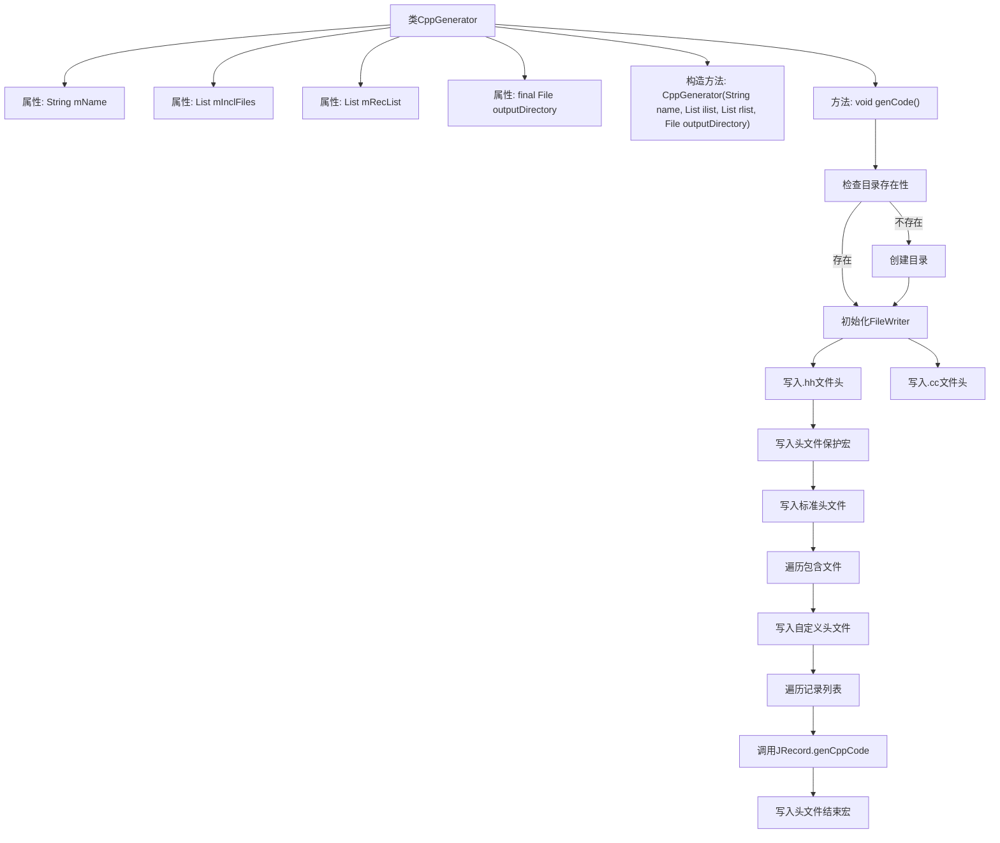

# 基础信息

|      |      |
|------|------|
| 名称 | CppGenerator |
| 编码语言 | .java |
| 代码路径 | zookeeper/zookeeper-jute/src/main/java/org/apache/jute/compiler/CppGenerator.java |
| 包名 | org.apache.jute.compiler |
| 依赖项 | ['java.io.File', 'java.io.FileWriter', 'java.io.IOException', 'java.util.Iterator', 'java.util.List'] |
| 概述说明 | CppGenerator类用于生成C++代码，包含文件名、包含文件和记录列表，输出.cc和.hh文件，处理文件级元素如include语句，记录级代码由JRecord生成。 |

# 说明

CppGenerator类用于生成C++代码文件。构造函数接收文件名、包含文件列表、记录列表和输出目录参数。genCode方法创建输出目录并生成.cc和.hh文件，写入Apache许可证头信息。.hh文件包含防止重复包含的宏定义、recordio.hh和用户指定的头文件引用。.cc文件包含对应的.hh文件引用。每个JRecord对象负责生成自身的C++代码。输出文件以原始文件名加扩展名命名，保存在指定目录中。

# 类列表 Class Summary

| 名称   | 类型  | 说明 |
|-------|------|-------------|
| CppGenerator | class | CppGenerator类用于生成C++代码，包含文件名、引入文件和记录列表，输出目录创建失败会抛出异常，生成.cc和.hh文件并写入Apache许可证和头文件保护宏。 |

## 类 CppGenerator

|      |      |
|------|------|
| 访问范围 | None |
| 类型 | class |
| 名称 | CppGenerator |
| 说明 | CppGenerator类用于生成C++代码，包含文件名、引入文件和记录列表，输出目录创建失败会抛出异常，生成.cc和.hh文件并写入Apache许可证和头文件保护宏。 |

### UML类图

这段代码描述了一个C++代码生成器类CppGenerator，它通过构造函数接收文件名、包含文件列表、记录列表和输出目录，并提供了genCode()方法来生成.hh和.cc文件。该类依赖于JFile接口获取文件名，依赖JRecord接口生成记录级代码。流程图展示了CppGenerator与两个接口之间的依赖关系，其中JFile提供文件名，JRecord负责实际代码生成逻辑。

### 内部方法调用关系图

这段代码是C++代码生成器的主要实现，负责创建.hh和.cc源文件并写入基础内容。流程图展示了从类结构到生成代码的完整过程：首先检查输出目录，然后创建文件写入流，依次写入许可证声明、头文件保护宏、包含指令，最后遍历记录列表调用JRecord的代码生成方法。整个过程严格遵循C++文件生成规范，确保生成的文件可直接用于编译。

### 字段列表 Field List

| 名称  | 类型  | 说明 |
|-------|-------|------|
| mRecList | List<JRecord> | 私有JRecord列表变量mRecList。 |
| mInclFiles | List<JFile> | 私有文件列表变量mInclFiles，类型为JFile对象的集合。 |
| outputDirectory | File | 私有文件输出目录变量。 |
| mName | String | 私有字符串变量mName。 |

### 方法列表 Method List

| 名称  | 类型  | 说明 |
|-------|-------|------|
| genCode | void | 方法genCode()创建输出目录并生成.cc和.hh文件，写入Apache许可证头，处理头文件包含和记录定义。 |

