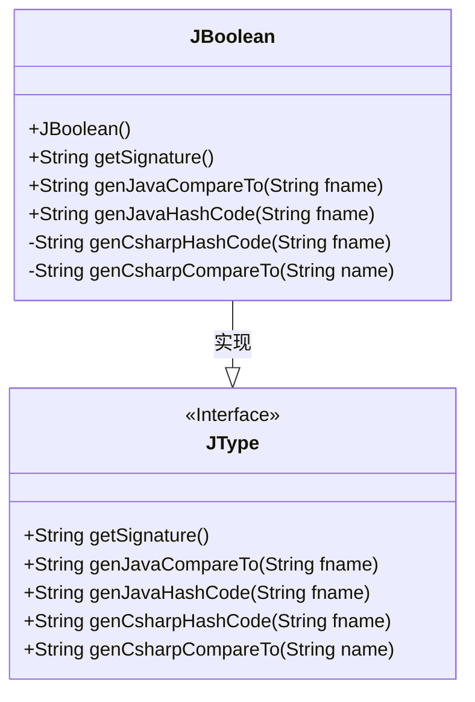
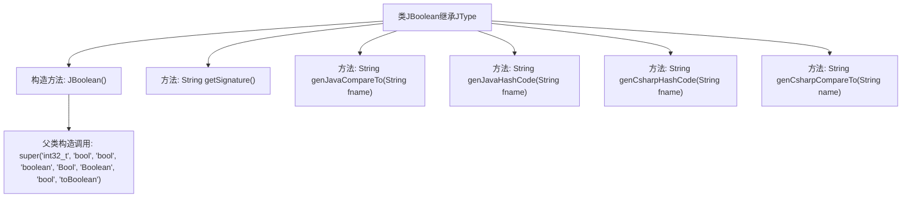

# 基础信息

|      |      |
|------|------|
| 名称 | JBoolean |
| 编码语言 | .java |
| 代码路径 | zookeeper/zookeeper-jute/src/main/java/org/apache/jute/compiler/JBoolean.java |
| 包名 | org.apache.jute.compiler |
| 依赖项 | [] |
| 概述说明 | JBoolean类继承JType，定义布尔类型处理逻辑，包括构造方法、签名生成及Java/C#的哈希值、比较方法实现。 |

# 说明

该代码定义了一个名为JBoolean的类，继承自JType类。JBoolean类用于处理布尔类型数据，提供了多种语言的类型映射和操作方法。构造函数初始化了不同语言中的布尔类型名称和转换方法。类中包含获取类型签名的方法getSignature，以及生成Java和C#语言中比较和哈希码计算的方法。这些方法包括genJavaCompareTo、genJavaHashCode、genCsharpHashCode和genCsharpCompareTo，分别用于生成对应语言的代码逻辑片段。所有方法均围绕布尔类型数据的处理展开，支持跨语言类型转换和基本操作。

# 类列表 Class Summary

| 名称   | 类型  | 说明 |
|-------|------|-------------|
| JBoolean | class | JBoolean类继承JType，定义布尔类型处理逻辑，包括构造函数、签名获取及生成Java/C#的CompareTo和HashCode方法代码。 |

## 类 JBoolean

|      |      |
|------|------|
| 访问范围 | public |
| 类型 | class |
| 名称 | JBoolean |
| 说明 | JBoolean类继承JType，定义布尔类型处理逻辑，包括构造函数、签名获取及生成Java/C#的CompareTo和HashCode方法代码。 |

### UML类图

这段类图展示了JBoolean类继承自JType接口的结构。JBoolean是一个处理布尔类型数据的类，提供了多种语言（Java/C#）的哈希码生成和比较方法实现。其中getSignature()返回"z"表示Java中boolean类型的签名，genJavaCompareTo()和genCsharpCompareTo()生成比较逻辑代码，genJavaHashCode()和genCsharpHashCode()分别生成Java和C#的哈希计算方法。类中公有方法用于Java交互，私有方法处理C#特定逻辑，体现了跨语言类型系统的设计。

### 内部方法调用关系图

这段代码展示了一个继承自JType的JBoolean类，主要用于处理布尔类型在不同语言环境下的转换和操作。类中包含构造方法初始化类型信息，以及生成Java/C#语言特定代码的方法，如比较逻辑(compareTo)和哈希计算(hashCode)。所有方法都返回字符串形式的代码片段，用于后续代码生成。构造方法通过super调用父类初始化类型描述，体现了多语言类型系统的设计。

### 字段列表 Field List

| 名称  | 类型  | 说明 |
|-------|-------|------|

### 方法列表 Method List

| 名称  | 类型  | 说明 |
|-------|-------|------|
| getSignature | String | 方法返回字符串"z"。 |
| genJavaHashCode | String | 生成Java布尔类型哈希码的方法，输入字符串fname，返回对应布尔值的哈希码计算代码。 |
| genCsharpCompareTo | String | 生成C#比较方法，判断两对象属性值大小，相等返回0，当前对象大返回1，否则返回-1。 |
| genCsharpHashCode | String | 生成C#哈希代码方法：根据输入字符串首字母是否大写返回0或1。 |
| genJavaCompareTo | String | 生成Java比较方法，返回字段比较的三元表达式，格式简洁。 |

