# 基础信息

|      |      |
|------|------|
| 名称 | JBuffer |
| 编码语言 | .java |
| 代码路径 | zookeeper/zookeeper-jute/src/main/java/org/apache/jute/compiler/JBuffer.java |
| 包名 | org.apache.jute.compiler |
| 依赖项 | [] |
| 概述说明 | JBuffer类继承JCompType，用于处理字节数组操作，提供C++/Java的读写、比较、哈希等方法，支持缓冲区序列化和比较功能。 |

# 说明

JBuffer是JCompType的子类，用于处理字节数组类型数据。构造函数初始化类型名称为struct buffer，并指定多种语言中的对应类型。提供生成C++的getter和setter方法，生成Java的读写包装方法，以及比较、相等判断、哈希计算等功能。包含处理字节数组的特定方法，如读取VInt、比较字节数组等，支持序列化和反序列化操作。

# 类列表 Class Summary

| 名称   | 类型  | 说明 |
|-------|------|-------------|
| JBuffer | class | JBuffer类继承JCompType，用于处理字节数组操作，提供C++和Java的读写、比较、哈希等方法，支持缓冲区操作和字节比较。 |


## 类 JBuffer

|      |      |
|------|------|
| 访问范围 | public |
| 类型 | class |
| 名称 | JBuffer |
| 说明 | JBuffer类继承JCompType，用于处理字节数组操作，提供C++和Java的读写、比较、哈希等方法，支持缓冲区操作和字节比较。 |


### UML类图

```mermaid
classDiagram
    class JCompType {
        <<Abstract>>
    }
    
    class JBuffer {
        +JBuffer()
        +String genCppGetSet(String fname, int fIdx)
        +String getSignature()
        +String genJavaReadWrapper(String fname, String tag, boolean decl)
        +String genJavaWriteWrapper(String fname, String tag)
        +String genJavaCompareTo(String fname, String other)
        +String genJavaCompareTo(String fname)
        +String genJavaCompareToWrapper(String fname, String other)
        +String genJavaEquals(String fname, String peer)
        +String genJavaHashCode(String fname)
        +String genJavaSlurpBytes(String b, String s, String l)
        +String genJavaCompareBytes()
    }
    
    JCompType <|-- JBuffer

    // JBuffer继承自JCompType，专注于处理字节缓冲区相关的操作
    // 提供C++/Java的序列化、比较、哈希等方法的生成功能
    // 核心功能包括生成getter/setter、读写包装器、比较逻辑等
```

这段代码展示了一个继承自抽象类JCompType的JBuffer类，主要用于处理字节缓冲区(buffer)相关的操作。该类提供了多种方法来生成C++和Java代码，包括生成getter/setter方法、读写包装器、比较逻辑、哈希计算等。特别值得注意的是，它能够处理字节数组的序列化和反序列化，并提供了字节级别的比较功能。这些方法主要用于代码生成场景，可能是某种序列化框架或RPC框架的一部分。


### 内部方法调用关系图

```mermaid
graph TD
    A["类JBuffer"]
    B["继承: JCompType"]
    C["构造方法: JBuffer()"]
    D["方法: genCppGetSet(String fname, int fIdx)"]
    E["方法: getSignature()"]
    F["方法: genJavaReadWrapper(String fname, String tag, boolean decl)"]
    G["方法: genJavaWriteWrapper(String fname, String tag)"]
    H["方法: genJavaCompareTo(String fname, String other)"]
    I["方法: genJavaCompareTo(String fname)"]
    J["方法: genJavaCompareToWrapper(String fname, String other)"]
    K["方法: genJavaEquals(String fname, String peer)"]
    L["方法: genJavaHashCode(String fname)"]
    M["方法: genJavaSlurpBytes(String b, String s, String l)"]
    N["方法: genJavaCompareBytes()"]

    A --> B
    A --> C
    A --> D
    A --> E
    A --> F
    A --> G
    A --> H
    A --> I
    A --> J
    A --> K
    A --> L
    A --> M
    A --> N
```



该流程图展示了JBuffer类的继承关系和主要方法。JBuffer继承自JCompType，包含构造方法和多个功能方法，主要用于处理字节数组的读写、比较、哈希计算等操作。方法包括生成C++的get/set函数、Java的读写包装器、比较逻辑、相等判断、哈希计算以及字节处理等核心功能，适用于序列化和反序列化场景。

### 字段列表 Field List

| 名称  | 类型  | 说明 |
|-------|-------|------|

### 方法列表 Method List

| 名称  | 类型  | 说明 |
|-------|-------|------|
| genJavaEquals | String | 生成Java的equals方法，比较两个数组是否相等。 |
| genJavaCompareToWrapper | String | 生成Java比较方法包装器，调用内部比较逻辑。 |
| genJavaHashCode | String | 生成Java哈希码方法，返回字符串格式的数组哈希码计算代码。 |
| genJavaCompareTo | String | 生成Java比较方法，调用同名方法并传入字段名及peer前缀的字段名作为参数。 |
| genJavaCompareBytes | String | 该方法生成Java代码片段，用于比较字节数组。读取VInt值后计算长度偏移，再比较剩余字节。若结果非零则返回-1或0，否则更新偏移继续处理。 |
| genJavaCompareTo | String | 生成Java字节数组比较方法，使用org.apache.jute.Utils.compareBytes比较两个字节数组。 |
| genCppGetSet | String | 生成C++的getter方法，包含常量和非常量版本，返回成员变量并标记修改位。 |
| genJavaReadWrapper | String | 生成Java读取包装方法：根据参数声明字节数组并读取缓冲区数据。 |
| genJavaWriteWrapper | String | 生成Java写入包装方法，返回格式化字符串调用a_.writeBuffer，参数为fname和tag。 |
| getSignature | String | 方法返回字符串"B"。 |
| genJavaSlurpBytes | String | 生成Java方法读取字节流，计算VInt长度并更新偏移量和剩余长度。 |


