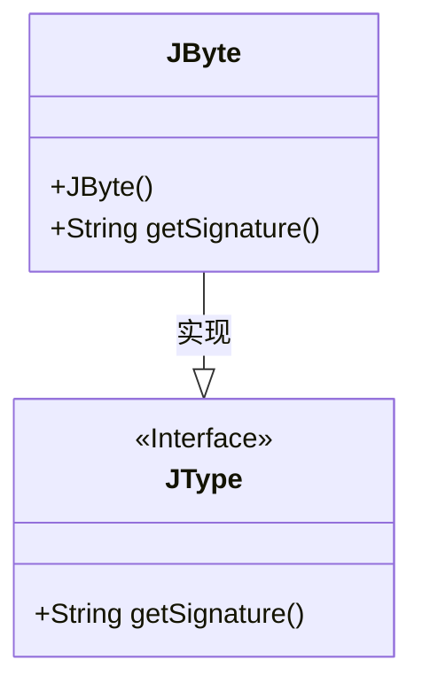
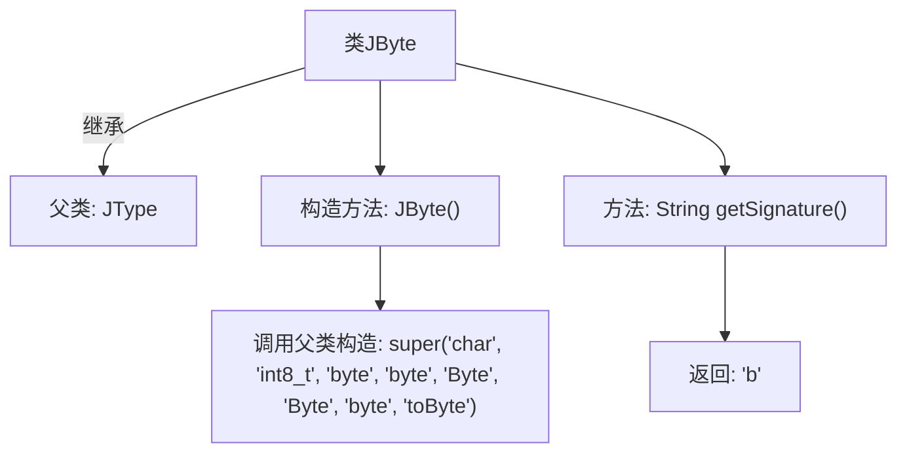

# 基础信息

|      |      |
|------|------|
| 名称 | JByte |
| 编码语言 | .java |
| 代码路径 | zookeeper/zookeeper-jute/src/main/java/org/apache/jute/compiler/JByte.java |
| 包名 | org.apache.jute.compiler |
| 依赖项 | [] |
| 概述说明 | JByte类继承JType，定义字节类型，包含构造函数初始化类型名称和签名方法返回"b"。 |

# 说明

该内容定义了一个名为JByte的Java类，继承自JType类。JByte类包含一个构造函数，初始化时传递了8个字符串参数，分别表示类型名称、C语言类型、Java类型、Kotlin类型、Java包装类、Kotlin包装类、Dart类型和类型转换方法。此外，该类还包含一个getSignature方法，返回表示字节类型的签名字符串"b"。整个类主要用于处理字节类型在不同编程语言中的表示和转换。

# 类列表 Class Summary

| 名称   | 类型  | 说明 |
|-------|------|-------------|
| JByte | class | JByte类继承JType，定义字节类型，包含类型名称映射和签名方法，返回"b"。构造函数初始化多种语言中的字节类型名称。 |

## 类 JByte

|      |      |
|------|------|
| 访问范围 | public |
| 类型 | class |
| 名称 | JByte |
| 说明 | JByte类继承JType，定义字节类型，包含类型名称映射和签名方法，返回"b"。构造函数初始化多种语言中的字节类型名称。 |

### UML类图

这段类图展示了JByte类继承自JType接口的层级关系。JType是一个接口(用<<Interface>>标注)，定义了getSignature()方法；JByte是具体实现类，通过构造函数初始化父类参数，并实现了接口方法。类图清晰地体现了JByte作为JType子类型的关系，其中JByte的构造函数调用了父类JType的构造方法，传递了8个字符串参数用于类型系统配置。

### 内部方法调用关系图

这段代码描述了一个名为JByte的类，它继承自JType父类。流程图展示了类结构关系，包括构造方法JByte()调用父类super()初始化参数，以及getSignature()方法返回固定签名"b"的流程。该类的核心功能是封装字节类型的基本属性和操作，通过继承复用父类JType的通用类型定义能力。

### 字段列表 Field List

| 名称  | 类型  | 说明 |
|-------|-------|------|

### 方法列表 Method List

| 名称  | 类型  | 说明 |
|-------|-------|------|
| getSignature | String | 方法返回固定字符串"b"。 |

