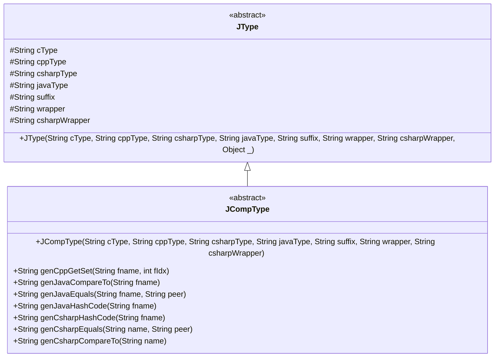
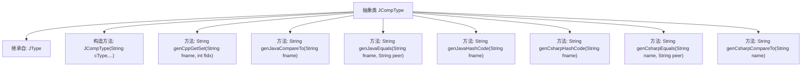

# 基础信息

|      |      |
|------|------|
| 名称 | JCompType |
| 编码语言 | .java |
| 代码路径 | zookeeper/zookeeper-jute/src/main/java/org/apache/jute/compiler/JCompType.java |
| 包名 | org.apache.jute.compiler |
| 依赖项 | [] |
| 概述说明 | JCompType是JType的子类，用于生成C++、Java和C#的get/set方法及比较、哈希代码等函数。包含多种语言的类型转换和方法实现。 |

# 说明

JCompType是JType的抽象子类，用于处理多种编程语言类型转换。构造函数接收7个参数描述各语言类型及包装信息。提供生成C++的getter/setter方法，包含const和非const版本。支持生成Java的compareTo、equals和hashCode方法实现。同时提供C#的GetHashCode、Equals和CompareTo方法生成逻辑，其中方法名自动首字母大写。所有生成方法均基于字段名和索引参数构建对应语言的标准比较和访问代码。

# 类列表 Class Summary

| 名称   | 类型  | 说明 |
|-------|------|-------------|
| JCompType | class | JCompType是JType的子类，提供多语言代码生成方法，包括C++的get/set函数、Java和C#的compareTo、equals和hashCode实现。 |

## 类 JCompType

|      |      |
|------|------|
| 访问范围 | abstract |
| 类型 | class |
| 名称 | JCompType |
| 说明 | JCompType是JType的子类，提供多语言代码生成方法，包括C++的get/set函数、Java和C#的compareTo、equals和hashCode实现。 |

### UML类图

这段代码展示了一个抽象类JCompType继承自另一个抽象类JType的类图结构。JCompType专注于为多种编程语言（C++、Java、C#）生成类型相关的辅助代码，包含生成getter/setter、比较、相等判断和哈希计算等方法模板。通过继承关系，JCompType复用JType的基础类型定义，同时扩展了针对复合类型的代码生成能力，体现了面向对象设计中抽象和特化的思想。

### 内部方法调用关系图

这段代码定义了一个抽象类`JCompType`，继承自`JType`，主要用于生成不同编程语言(C++/Java/C#)的成员函数代码片段。包含构造方法和6个生成方法：`genCppGetSet`生成C++的getter/setter，`genJavaCompareTo`/`Equals`/`HashCode`生成Java比较相关代码，`genCsharpHashCode`/`Equals`/`CompareTo`生成C#比较相关代码。所有方法都返回字符串形式的代码片段。

### 字段列表 Field List

| 名称  | 类型  | 说明 |
|-------|-------|------|

### 方法列表 Method List

| 名称  | 类型  | 说明 |
|-------|-------|------|
| genCsharpEquals | String | 生成C#的Equals方法代码，比较对象与peer参数是否相等，返回布尔值结果。 |
| genCsharpHashCode | String | 生成C#哈希代码方法，输入字符串参数，返回格式化哈希计算代码。 |
| genJavaCompareTo | String | 生成Java比较方法代码，用于比较两个对象的指定字段。 |
| genJavaHashCode | String | 生成Java哈希码方法，返回字段fname的哈希值代码字符串。 |
| genCppGetSet | String | 生成C++成员变量的getter函数，包含常量和非常量版本，非常量版本标记字段修改。 |
| genJavaEquals | String | 生成Java equals方法比较代码片段，比较两个字符串对象是否相等。 |
| genCsharpCompareTo | String | 生成C# CompareTo方法代码，比较当前对象与peer对象的指定属性。 |

