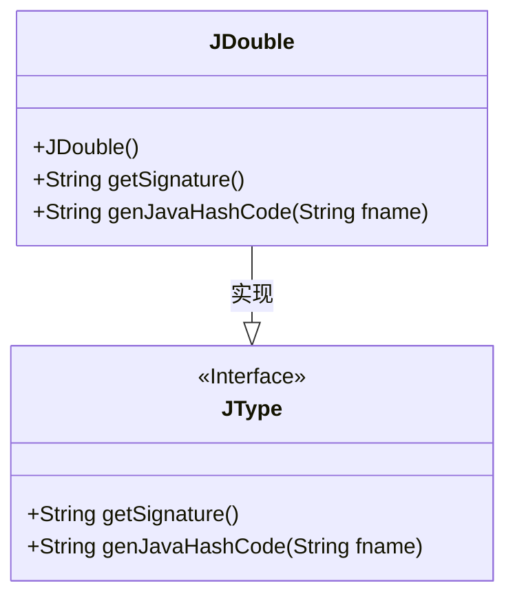
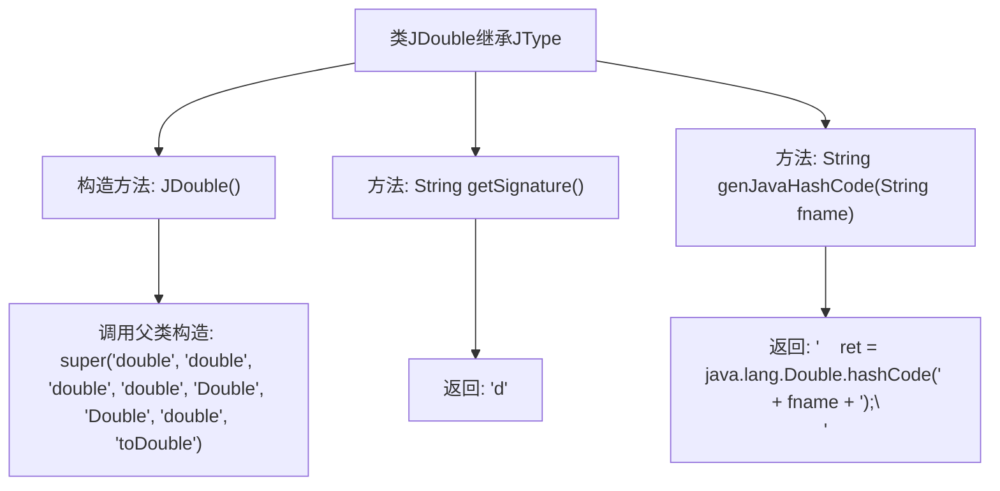

# 基础信息

|      |      |
|------|------|
| 名称 | JDouble |
| 编码语言 | .java |
| 代码路径 | zookeeper/zookeeper-jute/src/main/java/org/apache/jute/compiler/JDouble.java |
| 包名 | org.apache.jute.compiler |
| 依赖项 | [] |
| 概述说明 | JDouble类继承JType，定义double类型相关属性和方法，包括构造函数、签名获取及生成哈希码功能。 |

# 说明

该代码定义了一个名为JDouble的类，继承自JType类。JDouble类表示Java中的double类型，构造函数初始化了父类JType的相关属性，包括类型名称、包装类名等。类中包含两个方法：getSignature返回类型签名"d"，genJavaHashCode生成Java代码用于计算double类型字段的哈希值，调用java.lang.Double.hashCode方法实现。整个类专注于处理double类型在代码生成中的相关操作。

# 类列表 Class Summary

| 名称   | 类型  | 说明 |
|-------|------|-------------|
| JDouble | class | JDouble类继承JType，定义double类型相关属性和方法，包括构造函数、签名获取及生成哈希码功能。 |

## 类 JDouble

|      |      |
|------|------|
| 访问范围 | public |
| 类型 | class |
| 名称 | JDouble |
| 说明 | JDouble类继承JType，定义double类型相关属性和方法，包括构造函数、签名获取及生成哈希码功能。 |

### UML类图

这段类图展示了JDouble类与其父接口JType的关系。JDouble是一个具体类，实现了JType接口定义的两个方法：getSignature()返回类型签名"d"，genJavaHashCode()生成Java代码用于计算double类型的哈希值。JType作为接口定义了这两个方法的契约，而JDouble通过继承关系具体实现了这些功能，专门处理double类型相关的操作。类图清晰地体现了这种接口-实现关系，并展示了JDouble特有的构造函数初始化逻辑。

### 内部方法调用关系图

该流程图展示了JDouble类的结构，它是一个继承自JType的类。构造方法JDouble()通过super调用父类构造器初始化类型信息，包含两个核心方法：getSignature()返回"d"表示双精度类型签名，genJavaHashCode()生成Java代码用于计算Double类型字段的哈希值。整个类专注于处理Java中double类型的元信息生成和操作。

### 字段列表 Field List

| 名称  | 类型  | 说明 |
|-------|-------|------|

### 方法列表 Method List

| 名称  | 类型  | 说明 |
|-------|-------|------|
| genJavaHashCode | String | 生成Java哈希码方法，返回Double类型字段的哈希值计算代码。 |
| getSignature | String | 方法getSignature返回固定字符串"d"。 |

