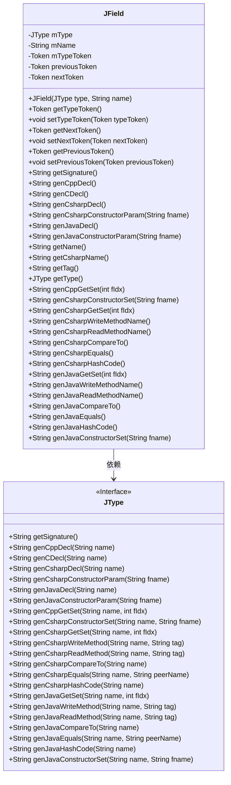

# 基础信息

|      |      |
|------|------|
| 名称 | JField |
| 编码语言 | .java |
| 代码路径 | zookeeper/zookeeper-jute/src/main/java/org/apache/jute/compiler/JField.java |
| 包名 | org.apache.jute.compiler |
| 依赖项 | ['org.apache.jute.compiler.generated.RccConstants', 'org.apache.jute.compiler.generated.Token'] |
| 概述说明 | JField类表示字段，包含类型、名称及前后Token，提供多种语言（C++、C、C#、Java）的声明、读写方法生成功能，支持构造参数、比较、哈希等操作。 |

# 说明

JField类用于表示字段信息，包含字段类型mType和名称mName。通过mTypeToken、previousToken和nextToken管理字段相关的标记信息。提供多种方法生成不同语言的字段声明、构造函数参数、读写方法、比较逻辑、哈希计算等，支持C++、C、C#和Java。特殊处理C#中字段名Id转为ZKId。通过getter和setter方法访问和修改字段属性。

# 类列表 Class Summary

| 名称   | 类型  | 说明 |
|-------|------|-------------|
| JField | class | JField类表示字段，包含类型、名称及前后Token引用，提供多种语言（C++、C、C#、Java）的声明、读写、比较等方法生成功能。 |

## 类 JField

|      |      |
|------|------|
| 访问范围 | public |
| 类型 | class |
| 名称 | JField |
| 说明 | JField类表示字段，包含类型、名称及前后Token引用，提供多种语言（C++、C、C#、Java）的声明、读写、比较等方法生成功能。 |

### UML类图

这段代码定义了一个`JField`类，用于表示字段的元数据信息，包含字段类型、名称及相关Token信息。该类提供了多种代码生成方法，支持C++、C、C#和Java等语言的字段声明、getter/setter方法、构造函数参数等生成功能。`JField`依赖于`JType`接口，通过该接口实现不同语言的具体代码生成逻辑。类中还包含对字段前后Token的引用，用于处理注释等特殊场景。整体设计体现了多语言代码生成的灵活性，通过组合模式将字段类型的具体实现委托给`JType`接口。

### 内部方法调用关系图

```mermaid
graph TD
    A["类JField"]
    B["属性: JType mType"]
    C["属性: String mName"]
    D["属性: Token mTypeToken"]
    E["属性: Token previousToken"]
    F["属性: Token nextToken"]
    G["构造方法: JField(JType type, String name)"]
    H["方法: Token getTypeToken()"]
    I["方法: void setTypeToken(Token typeToken)"]
    J["方法: Token getNextToken()"]
    K["方法: void setNextToken(Token nextToken)"]
    L["方法: Token getPreviousToken()"]
    M["方法: void setPreviousToken(Token previousToken)"]
    N["方法: String getSignature()"]
    O["方法: String genCppDecl()"]
    P["方法: String genCDecl()"]
    Q["方法: String genCsharpDecl()"]
    R["方法: String genCsharpConstructorParam(String fname)"]
    S["方法: String genJavaDecl()"]
    T["方法: String genJavaConstructorParam(String fname)"]
    U["方法: String getName()"]
    V["方法: String getCsharpName()"]
    W["方法: String getTag()"]
    X["方法: JType getType()"]
    Y["方法: String genCppGetSet(int fIdx)"]
    Z["方法: String genCsharpConstructorSet(String fname)"]
    AA["方法: String genCsharpGetSet(int fIdx)"]
    AB["方法: String genCsharpWriteMethodName()"]
    AC["方法: String genCsharpReadMethodName()"]
    AD["方法: String genCsharpCompareTo()"]
    AE["方法: String genCsharpEquals()"]
    AF["方法: String genCsharpHashCode()"]
    AG["方法: String genJavaGetSet(int fIdx)"]
    AH["方法: String genJavaWriteMethodName()"]
    AI["方法: String genJavaReadMethodName()"]
    AJ["方法: String genJavaCompareTo()"]
    AK["方法: String genJavaEquals()"]
    AL["方法: String genJavaHashCode()"]
    AM["方法: String genJavaConstructorSet(String fname)"]

    A --> B
    A --> C
    A --> D
    A --> E
    A --> F
    A --> G
    A --> H
    A --> I
    A --> J
    A --> K
    A --> L
    A --> M
    A --> N
    A --> O
    A --> P
    A --> Q
    A --> R
    A --> S
    A --> T
    A --> U
    A --> V
    A --> W
    A --> X
    A --> Y
    A --> Z
    A --> AA
    A --> AB
    A --> AC
    A --> AD
    A --> AE
    A --> AF
    A --> AG
    A --> AH
    A --> AI
    A --> AJ
    A --> AK
    A --> AL
    A --> AM
```

这段代码定义了一个名为JField的类，主要用于处理字段相关的操作。该类包含多个属性如mType、mName和多个Token类型的属性，以及一系列方法用于生成不同编程语言（如C++、C、C#和Java）的声明、构造函数参数、get/set方法、比较方法等。流程图展示了类的主要结构和方法的调用关系，清晰地呈现了类的功能和方法之间的关联。

### 字段列表 Field List

| 名称  | 类型  | 说明 |
|-------|-------|------|
| mName | String | 私有字符串变量mName。 |
| mTypeToken | Token | 私有成员变量mTypeToken，类型为Token。 |
| previousToken | Token | 声明一个私有Token类型变量previousToken。 |
| nextToken | Token | 私有令牌变量nextToken。 |
| mType | JType | 私有成员变量mType，类型为JType。 |

### 方法列表 Method List

| 名称  | 类型  | 说明 |
|-------|-------|------|
| genCsharpConstructorParam | String | 生成C#构造函数参数的字符串，调用mType的对应方法处理fname。 |
| getTag | String | 该方法返回字符串类型的成员变量mName的值。 |
| setNextToken | void | 设置下一个令牌的方法，将输入参数nextToken赋值给当前对象的nextToken属性。 |
| getSignature | String | 该方法返回mType对象的签名字符串。 |
| genCsharpWriteMethodName | String | 生成C#写入方法名称，调用mType的genCsharpWriteMethod方法，传入当前对象名称和标签作为参数。 |
| genCppGetSet | String | 生成C++的get/set方法，根据字段索引fIdx调用mType的方法处理mName。 |
| genCsharpDecl | String | 生成C#声明的方法，调用mType的genCsharpDecl并传入mName参数。 |
| genJavaGetSet | String | 生成Java的getter和setter方法，基于字段索引fIdx，调用mType的genJavaGetSet方法实现。 |
| genCsharpGetSet | String | 生成C#属性的get和set方法，基于字段索引和名称。 |
| genJavaConstructorParam | String | 这是一个Java方法，用于生成构造函数的参数字符串。方法名为genJavaConstructorParam，接收字符串参数fname，并调用mType的同名方法处理该参数后返回结果。 |
| getType | JType | 这是一个Java方法，返回类成员变量mType的值，类型为JType。 |
| genCsharpCompareTo | String | 生成C#比较方法代码，调用类型对象的genCsharpCompareTo方法并传入当前名称参数。 |
| genCDecl | String | Java方法genCDecl调用mType的genCDecl方法，传入mName参数并返回结果字符串。 |
| genCppDecl | String | 这是一个Java方法，返回类型为String，方法名为genCppDecl。方法调用mType对象的genCppDecl方法，传入mName参数，并返回结果。 |
| getTypeToken | Token | 方法`getTypeToken`返回成员变量`mTypeToken`的值。 |
| getName | String | 这是一个Java方法，返回成员变量mName的值。 |
| genJavaDecl | String | 生成Java声明的方法，调用mType的genJavaDecl并传入mName参数。 |
| genJavaEquals | String | 生成Java的equals方法代码，比较当前对象与peer对象的指定属性值。 |
| getPreviousToken | Token | 方法返回前一个令牌对象。 |
| genJavaCompareTo | String | 生成Java比较方法，调用mType的genJavaCompareTo并传入当前名称。 |
| genCsharpHashCode | String | 生成C#哈希码的方法，调用mType的genCsharpHashCode并传入当前名称。 |
| genCsharpConstructorSet | String | 生成C#构造函数设置方法，调用mType的genCsharpConstructorSet方法，传入mName和fname参数。 |
| getNextToken | Token | 获取下一个令牌的方法，返回nextToken。 |
| getCsharpName | String | 方法getCsharpName返回字符串，若mName为"Id"则返回"ZKId"，否则返回mName本身。 |
| genJavaReadMethodName | String | 生成Java读取方法名，调用mType的genJavaReadMethod，传入名称和标签参数。 |
| genCsharpEquals | String | 生成C#相等比较方法，调用类型相关逻辑比较当前对象与peer对象属性。 |
| genCsharpReadMethodName | String | 生成C#读取方法名，调用mType的genCsharpReadMethod，参数为CsharpName和Tag。 |
| genJavaWriteMethodName | String | 生成Java写入方法名，调用mType的genJavaWriteMethod方法，传入名称和标签参数。 |
| setTypeToken | void | 方法设置类型令牌，将参数typeToken赋值给成员变量mTypeToken。 |
| setPreviousToken | void | 设置前一个令牌的方法，将参数赋给类的成员变量previousToken。 |
| genJavaHashCode | String | 生成Java哈希码方法，调用mType的genJavaHashCode并传入getName结果。 |
| genJavaConstructorSet | String | 生成Java构造函数设置方法，调用mType的genJavaConstructorSet方法，传入mName和fname参数。 |

