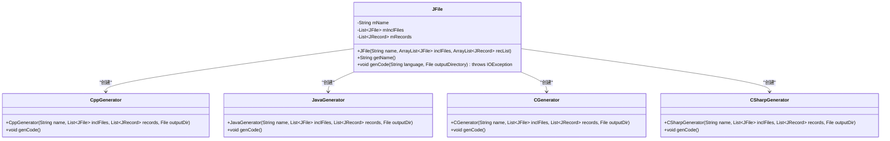
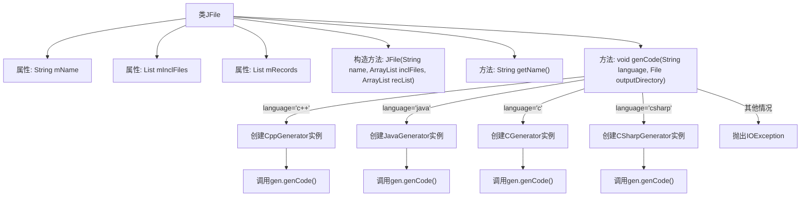

# 基础信息

|      |      |
|------|------|
| 名称 | JFile |
| 编码语言 | .java |
| 代码路径 | zookeeper/zookeeper-jute/src/main/java/org/apache/jute/compiler/JFile.java |
| 包名 | org.apache.jute.compiler |
| 依赖项 | ['java.io.File', 'java.io.IOException', 'java.util.ArrayList', 'java.util.List'] |
| 概述说明 | JFile类表示文件，包含名称、包含文件和记录列表。构造函数初始化这些属性。getName方法返回文件名。genCode方法根据语言生成代码，支持C++、Java、C和C#，不支持则抛出异常。 |

# 说明

JFile类表示一个文件对象，包含文件名、包含的文件列表和记录列表。构造函数接收文件名、包含文件列表和记录列表作为参数。getName方法返回文件的基本名称，去除路径部分。genCode方法根据指定语言生成代码，支持C++、Java、C和C#，若语言不支持则抛出异常。生成代码时使用对应语言的生成器类，传递文件名、包含文件列表、记录列表和输出目录参数。

# 类列表 Class Summary

| 名称   | 类型  | 说明 |
|-------|------|-------------|
| JFile | class | JFile类表示文件，包含名称、包含文件和记录列表。构造函数初始化这些属性。getName方法返回基本文件名。genCode方法根据指定语言生成代码，支持C++、Java、C和C#，否则抛出异常。 |

## 类 JFile

|      |      |
|------|------|
| 访问范围 | public |
| 类型 | class |
| 名称 | JFile |
| 说明 | JFile类表示文件，包含名称、包含文件和记录列表。构造函数初始化这些属性。getName方法返回基本文件名。genCode方法根据指定语言生成代码，支持C++、Java、C和C#，否则抛出异常。 |

### UML类图

这段代码描述了一个JFile类，该类用于管理文件信息并生成不同编程语言的代码。JFile包含文件名、包含文件列表和记录列表，通过genCode方法根据指定语言类型创建对应的代码生成器（如CppGenerator、JavaGenerator等）来生成代码。类图展示了JFile与各生成器类之间的创建关系，体现了策略模式的设计思想，通过不同生成器实现多语言代码生成的可扩展性。

### 内部方法调用关系图

这段代码描述了一个JFile类，该类用于管理文件信息并生成不同编程语言的代码。类包含三个私有属性：文件名、包含的文件列表和记录列表。构造方法初始化这些属性，getName()方法提取文件名中的基本名称。genCode()方法是核心功能，根据指定的编程语言参数创建相应的代码生成器实例（如C++、Java、C或C#），并调用其genCode()方法生成代码。如果语言不被支持，则抛出IOException异常。流程图清晰地展示了类的结构和主要方法的逻辑分支。

### 字段列表 Field List

| 名称  | 类型  | 说明 |
|-------|-------|------|
| mInclFiles | List<JFile> | 私有文件列表变量mInclFiles。 |
| mRecords | List<JRecord> | 私有JRecord列表变量mRecords。 |
| mName | String | 私有字符串变量mName。 |

### 方法列表 Method List

| 名称  | 类型  | 说明 |
|-------|-------|------|
| getName | String | 该方法从字符串mName中提取最后一个斜杠后的子串，若无斜杠则返回原字符串。 |
| genCode | void | 该方法根据输入语言生成对应代码文件。支持C++、Java、C和C#，若语言不匹配则抛出异常。 |

