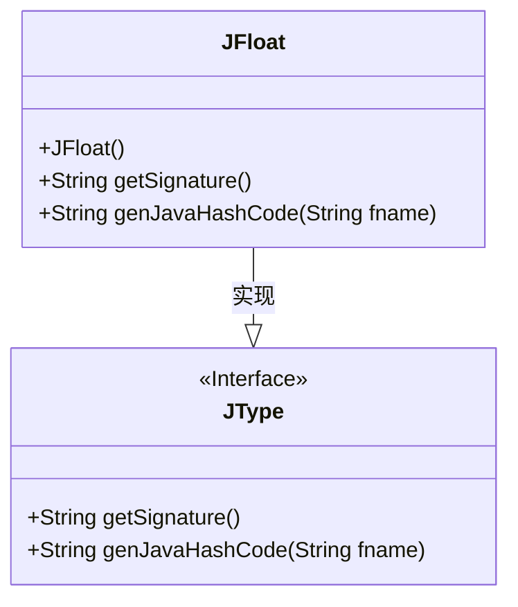
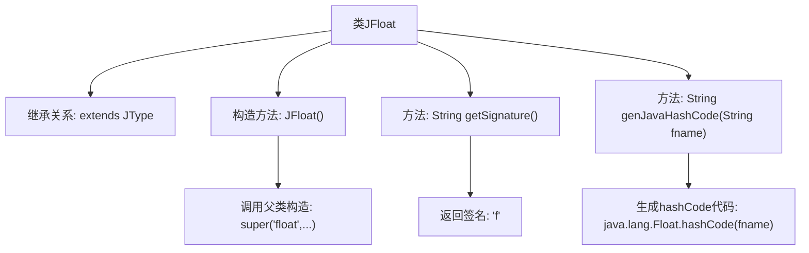

# 基础信息

|      |      |
|------|------|
| 名称 | JFloat |
| 编码语言 | .java |
| 代码路径 | zookeeper/zookeeper-jute/src/main/java/org/apache/jute/compiler/JFloat.java |
| 包名 | org.apache.jute.compiler |
| 依赖项 | [] |
| 概述说明 | JFloat类继承JType，定义浮点类型，包含构造方法、签名获取、生成Java哈希码方法。 |

# 说明

该内容描述了一个名为JFloat的Java类，继承自JType类。JFloat类用于表示浮点类型，构造函数初始化了类型名称、包装类名及相关方法名。类中包含两个方法：getSignature返回类型签名"f"，genJavaHashCode生成计算浮点值哈希值的Java代码字符串。整个类专注于处理浮点类型的基本操作和属性。

# 类列表 Class Summary

| 名称   | 类型  | 说明 |
|-------|------|-------------|
| JFloat | class | JFloat类继承JType，定义float类型相关属性和方法，包括构造函数、签名获取和生成哈希码功能。 |

## 类 JFloat

|      |      |
|------|------|
| 访问范围 | public |
| 类型 | class |
| 名称 | JFloat |
| 说明 | JFloat类继承JType，定义float类型相关属性和方法，包括构造函数、签名获取和生成哈希码功能。 |

### UML类图

这段类图展示了JFloat类与其父接口JType的关系。JFloat是一个具体实现类，继承自JType接口，提供了针对float类型的特定实现。类中包含构造函数JFloat()和两个方法：getSignature()返回"f"表示float类型签名，genJavaHashCode()生成Java中float类型的哈希代码计算语句。JType作为接口定义了这两个方法的契约，体现了面向接口编程的思想。整个结构清晰地表达了类型系统中的一个基础数值类型的实现方式。

### 内部方法调用关系图

这段代码描述了一个继承自JType的JFloat类，主要用于处理Java中float类型的相关操作。流程图展示了类继承关系、构造方法调用父类初始化参数、获取类型签名的方法以及生成浮点数哈希值的代码生成逻辑。其中构造方法通过super调用传递了8个固定参数，getSignature()返回"f"表示浮点类型签名，genJavaHashCode()生成调用Float.hashCode()的Java代码字符串。

### 字段列表 Field List

| 名称  | 类型  | 说明 |
|-------|-------|------|

### 方法列表 Method List

| 名称  | 类型  | 说明 |
|-------|-------|------|
| genJavaHashCode | String | 生成Java浮点数哈希码的方法，输入字符串fname，返回对应Float.hashCode调用代码。 |
| getSignature | String | 方法返回固定字符串"f"。 |

