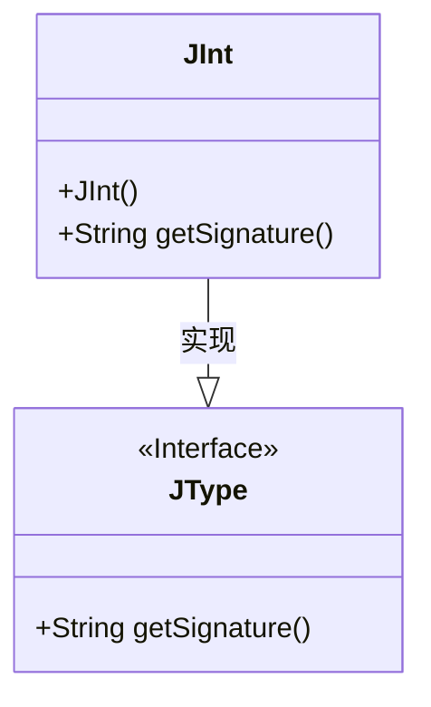
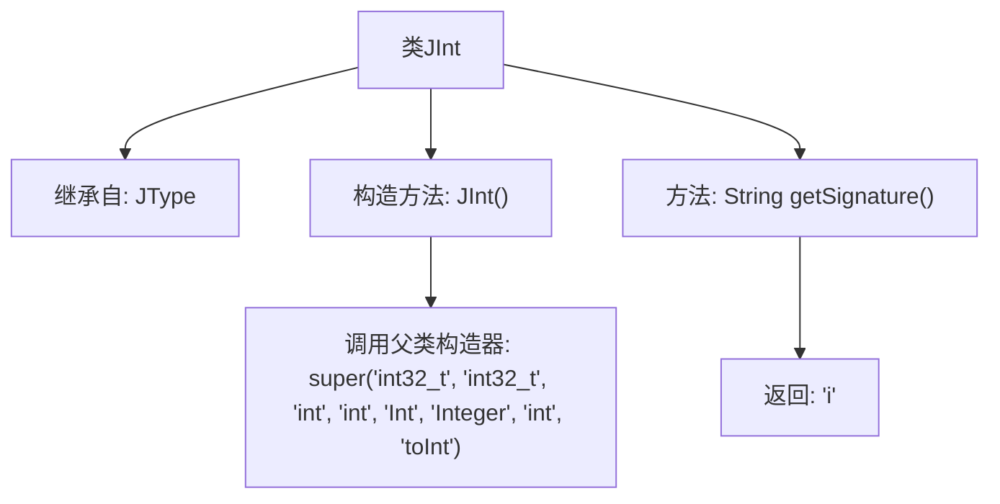

# 基础信息

|      |      |
|------|------|
| 名称 | JInt |
| 编码语言 | .java |
| 代码路径 | zookeeper/zookeeper-jute/src/main/java/org/apache/jute/compiler/JInt.java |
| 包名 | org.apache.jute.compiler |
| 依赖项 | [] |
| 概述说明 | JInt类继承JType，定义int类型，包含构造函数和返回签名"i"的方法。 |

# 说明

该内容定义了一个名为JInt的类，继承自JType类。JInt类表示整数类型，构造函数初始化了多种类型名称和转换方法的相关字符串参数，包括C语言类型名、Java类型名等。该类还包含一个getSignature方法，返回表示整数类型的签名字符"i"。

# 类列表 Class Summary

| 名称   | 类型  | 说明 |
|-------|------|-------------|
| JInt | class | JInt类继承JType，构造函数初始化类型信息，提供获取签名方法返回"i"。 |

## 类 JInt

|      |      |
|------|------|
| 访问范围 | public |
| 类型 | class |
| 名称 | JInt |
| 说明 | JInt类继承JType，构造函数初始化类型信息，提供获取签名方法返回"i"。 |

### UML类图

这段类图展示了JInt类与JType接口的继承关系。JInt是一个具体类，实现了JType接口中定义的getSignature()方法。JType作为接口(用<<Interface>>标注)，规定了子类必须实现的方法契约。JInt通过继承关系(用--|>表示)实现了该接口，并提供了具体的构造函数和方法实现。图中清晰体现了面向对象编程中的接口与实现分离原则，以及子类对父类契约的履行关系。

### 内部方法调用关系图

这段代码展示了一个名为JInt的类，它继承自JType类。JInt类包含一个构造方法和一个getSignature方法。构造方法通过super调用父类JType的构造器，传入多个字符串参数用于初始化。getSignature方法返回一个简单的字符串"i"，表示该类型的签名。整个类结构简洁，主要用于表示某种特定类型的整数数据。

### 字段列表 Field List

| 名称  | 类型  | 说明 |
|-------|-------|------|

### 方法列表 Method List

| 名称  | 类型  | 说明 |
|-------|-------|------|
| getSignature | String | 方法返回字符串"i"。 |

