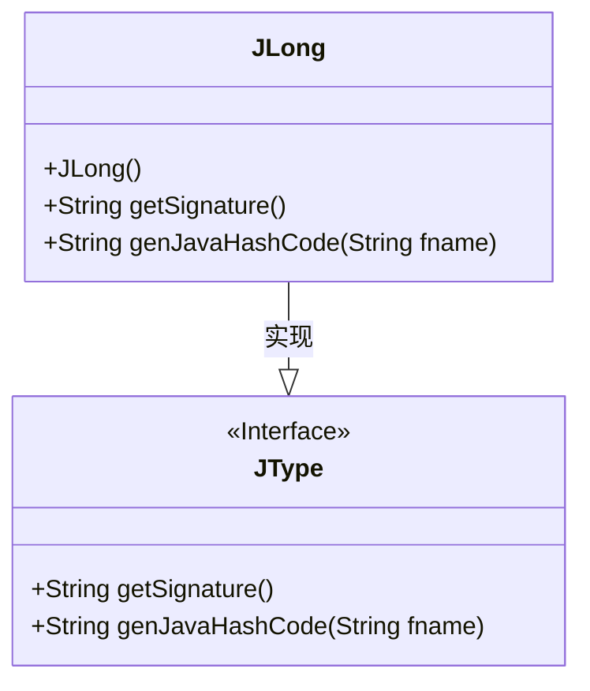
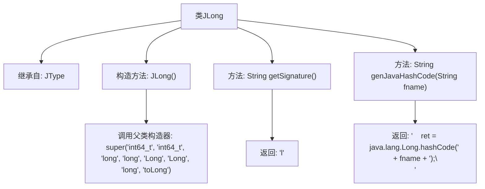

# 基础信息

|      |      |
|------|------|
| 名称 | JLong |
| 编码语言 | .java |
| 代码路径 | zookeeper/zookeeper-jute/src/main/java/org/apache/jute/compiler/JLong.java |
| 包名 | org.apache.jute.compiler |
| 依赖项 | [] |
| 概述说明 | JLong类继承JType，定义长整型数据类型，包含构造函数、签名方法和生成Java哈希码方法。 |

# 说明

这是一个名为JLong的Java类，继承自JType类。该类表示长整型数据类型，构造函数初始化了类型名称和相关标识符，包括C++类型名、Java类型名等。提供了两个方法：getSignature返回类型签名"l"，genJavaHashCode生成长整型字段的Java哈希代码计算语句，使用java.lang.Long.hashCode方法。

# 类列表 Class Summary

| 名称   | 类型  | 说明 |
|-------|------|-------------|
| JLong | class | JLong类继承JType，定义长整型数据类型，包含构造函数、签名方法和生成Java哈希码方法。 |

## 类 JLong

|      |      |
|------|------|
| 访问范围 | public |
| 类型 | class |
| 名称 | JLong |
| 说明 | JLong类继承JType，定义长整型数据类型，包含构造函数、签名方法和生成Java哈希码方法。 |

### UML类图

这段代码展示了一个继承体系，其中JLong类实现了JType接口（标记为<<Interface>>）。JLong是处理long类型数据的包装类，提供了获取类型签名(getSignature)和生成Java哈希码(genJavaHashCode)的方法实现。类图清晰地体现了JLong继承自JType的关系，并展示了两个类的方法签名，其中JLong通过构造函数初始化了父类的类型相关信息。

### 内部方法调用关系图

这段代码描述了一个继承自JType的JLong类，主要用于处理长整型数据类型。流程图展示了类继承关系、构造方法调用父类初始化参数的过程，以及两个关键方法：getSignature()返回类型签名'l'，genJavaHashCode()生成Java长整型的哈希代码计算语句。构造方法通过super调用传递了8个类型相关的标识参数，体现了类型系统的设计细节。

### 字段列表 Field List

| 名称  | 类型  | 说明 |
|-------|-------|------|

### 方法列表 Method List

| 名称  | 类型  | 说明 |
|-------|-------|------|
| getSignature | String | 方法返回固定字符串"l"。 |
| genJavaHashCode | String | 生成Java哈希码方法，返回长整型字段的哈希值计算代码。 |

