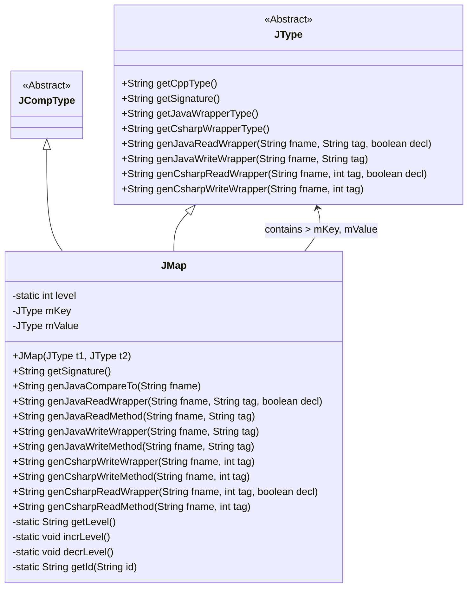

# 基础信息

|      |      |
|------|------|
| 名称 | JMap |
| 编码语言 | .java |
| 代码路径 | zookeeper/zookeeper-jute/src/main/java/org/apache/jute/compiler/JMap.java |
| 包名 | org.apache.jute.compiler |
| 依赖项 | [] |
| 概述说明 | JMap类继承JCompType，实现多语言映射类型，支持Java和C#的读写操作，包含键值类型管理、层级控制和序列化方法。 |

# 说明

JMap类继承自JCompType，用于表示映射类型数据结构。它包含静态方法管理层级标识，以及键值对类型成员mKey和mValue。构造函数支持C++、Java和C#的类型映射。提供生成签名、比较操作的方法，以及针对Java和C#的序列化（write）与反序列化（read）方法。这些方法处理映射的遍历、键值读写及格式转换，确保跨语言兼容性。

# 类列表 Class Summary

| 名称   | 类型  | 说明 |
|-------|------|-------------|
| JMap | class | JMap类继承JCompType，实现键值对映射功能，支持Java和C#的读写操作，包含生成签名、比较和序列化方法。 |

## 类 JMap

|      |      |
|------|------|
| 访问范围 | public |
| 类型 | class |
| 名称 | JMap |
| 说明 | JMap类继承JCompType，实现键值对映射功能，支持Java和C#的读写操作，包含生成签名、比较和序列化方法。 |

### UML类图

这段类图展示了JMap类继承自JCompType和JType两个抽象类，并包含两个JType类型的成员变量mKey和mValue。JMap是一个用于处理映射类型的工具类，提供了生成Java和C#代码的方法，包括读写操作、比较操作等。通过静态变量level和方法实现嵌套层级的控制，支持跨语言的序列化/反序列化操作，主要面向Apache Jute框架的数据处理需求。

### 内部方法调用关系图

```mermaid
graph TD
    A["类JMap"]
    B["继承自: JCompType"]
    C["静态属性: int level"]
    D["静态方法: getLevel()"]
    E["静态方法: incrLevel()"]
    F["静态方法: decrLevel()"]
    G["静态方法: getId(String id)"]
    H["属性: JType mKey"]
    I["属性: JType mValue"]
    J["构造方法: JMap(JType t1, JType t2)"]
    K["方法: getSignature()"]
    L["方法: genJavaCompareTo(String fname)"]
    M["方法: genJavaReadWrapper(String fname, String tag, boolean decl)"]
    N["方法: genJavaReadMethod(String fname, String tag)"]
    O["方法: genJavaWriteWrapper(String fname, String tag)"]
    P["方法: genJavaWriteMethod(String fname, String tag)"]
    Q["方法: genCsharpWriteWrapper(String fname, int tag)"]
    R["方法: genCsharpWriteMethod(String fname, int tag)"]
    S["方法: genCsharpReadWrapper(String fname, int tag, boolean decl)"]
    T["方法: genCsharpReadMethod(String fname, int tag)"]

    A --> B
    A --> C
    A --> D
    A --> E
    A --> F
    A --> G
    A --> H
    A --> I
    A --> J
    A --> K
    A --> L
    A --> M
    A --> N
    A --> O
    A --> P
    A --> Q
    A --> R
    A --> S
    A --> T
```

这段代码定义了一个名为JMap的类，继承自JCompType，用于处理映射类型的数据结构。它包含静态方法管理层级计数，以及多种生成Java和C#代码的方法，用于序列化和反序列化操作。主要功能包括生成签名、比较方法、读写包装器和方法，支持Java和C#两种语言的代码生成，适用于跨语言数据交换场景。

### 字段列表 Field List

| 名称  | 类型  | 说明 |
|-------|-------|------|
| mValue | JType | 私有JType类型变量mValue。 |
| mKey | JType | 私有成员变量mKey，类型为JType。 |
| level = 0 | int | 私有静态整型变量level，初始值为0。 |

### 方法列表 Method List

| 名称  | 类型  | 说明 |
|-------|-------|------|
| incrLevel | void | 私有方法incrLevel，功能是将变量level的值加1。 |
| genJavaWriteMethod | String | 生成Java写入方法，调用genJavaWriteWrapper处理fname和tag参数。 |
| genCsharpReadMethod | String | 生成C#读取方法，调用genCsharpReadWrapper函数，传入文件名和标签参数，不启用额外选项。 |
| getSignature | String | Java方法：返回由键和值的签名拼接而成的字符串，格式为"{键签名值签名}"。 |
| genJavaCompareTo | String | 生成Java比较方法，返回未实现操作的异常信息，包含输入参数名。 |
| genJavaReadWrapper | String | 生成Java读取TreeMap的包装方法，包含声明、初始化、键值读取及存入操作，使用Jute库处理序列化。 |
| getLevel | String | 私有静态方法getLevel返回整数level的字符串形式。 |
| decrLevel | void | 私有静态方法，减少level变量值1。 |
| genJavaWriteWrapper | String | 生成Java写入包装器方法，处理Map类型数据，遍历键值对并分别调用键值的写入方法。 |
| getId | String | 私有静态方法，接收字符串id，返回拼接了getLevel()结果的字符串。 |
| genJavaReadMethod | String | 生成Java读取方法，调用包装函数genJavaReadWrapper，参数为fname、tag和false。 |
| genCsharpWriteWrapper | String | 生成C#代码包装器，用于序列化映射数据，包括键值对的迭代和类型转换。 |
| genCsharpWriteMethod | String | 生成C#写入方法，调用genCsharpWriteWrapper函数，参数为fname和tag。 |
| genCsharpReadWrapper | String | 生成C#代码，创建SortedDictionary并读取键值对填充，支持声明和初始化。 |

