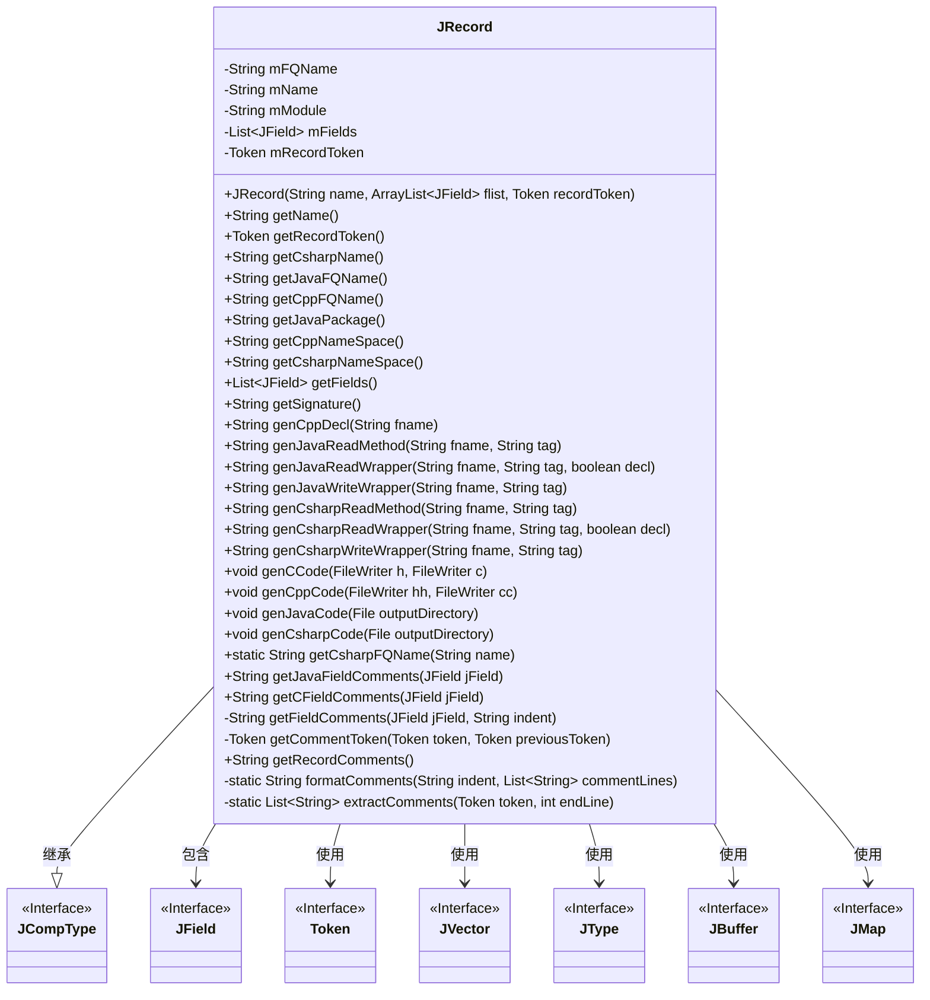

# 基础信息

|      |      |
|------|------|
| 名称 | JRecord |
| 编码语言 | .java |
| 代码路径 | zookeeper/zookeeper-jute/src/main/java/org/apache/jute/compiler/JRecord.java |
| 包名 | org.apache.jute.compiler |
| 依赖项 | ['java.io.File', 'java.io.FileWriter', 'java.io.IOException', 'java.util.ArrayList', 'java.util.Arrays', 'java.util.HashMap', 'java.util.Iterator', 'java.util.List', 'java.util.Map', 'org.apache.jute.compiler.generated.RccConstants', 'org.apache.jute.compiler.generated.Token'] |
| 概述说明 | JRecord类是一个记录类型生成器，支持Java、C++和C#代码生成，包含字段管理、序列化及多语言命名空间处理功能。 |

# 说明

JRecord类是一个用于生成跨语言记录类型的工具类，支持Java、C++和C#代码生成。它继承自JCompType，包含字段管理、命名空间处理、序列化/反序列化功能。主要功能包括：解析记录结构、生成各语言代码文件、处理字段注释、实现跨语言类型转换。类中定义了多种方法用于获取不同语言的限定名、生成序列化代码、处理嵌套类型（如JVector）。代码生成部分包含完整的类结构、构造函数、字段访问器、序列化逻辑、比较方法等，并支持注释提取和格式化。该类通过模块化设计实现了多语言代码生成的统一管理。

# 类列表 Class Summary

| 名称   | 类型  | 说明 |
|-------|------|-------------|
| JRecord | class | JRecord类是一个多语言序列化工具，支持Java、C++和C#代码生成。它包含字段管理、名称空间处理和序列化方法，能自动生成结构体定义、读写函数及跨语言兼容代码。核心功能包括字段列表维护、多语言命名转换、注释提取及序列化逻辑实现。 |

## 类 JRecord

|      |      |
|------|------|
| 访问范围 | public |
| 类型 | class |
| 名称 | JRecord |
| 说明 | JRecord类是一个多语言序列化工具，支持Java、C++和C#代码生成。它包含字段管理、名称空间处理和序列化方法，能自动生成结构体定义、读写函数及跨语言兼容代码。核心功能包括字段列表维护、多语言命名转换、注释提取及序列化逻辑实现。 |

### UML类图

这段类图展示了JRecord类的核心结构和关系。JRecord是一个记录类型生成器，继承自JCompType接口，包含多个JField字段和Token标记。主要功能包括生成C/C++/Java/C#等多种语言的序列化代码，处理字段注释，管理命名空间转换等。通过组合JVector、JType等接口实现复杂类型支持，体现了多语言代码生成的跨平台设计模式。类中大量字符串处理方法确保了不同语言规范的兼容性，而文件IO操作则用于输出生成的源代码文件。

### 内部方法调用关系图

```mermaid
graph TD
    A["类JRecord"]
    B["属性: String mFQName"]
    C["属性: String mName"]
    D["属性: String mModule"]
    E["属性: List<JField> mFields"]
    F["属性: Token mRecordToken"]
    G["构造方法: JRecord(String name, ArrayList<JField> flist, Token recordToken)"]
    H["方法: String getName()"]
    I["方法: Token getRecordToken()"]
    J["方法: String getCsharpName()"]
    K["方法: String getJavaFQName()"]
    L["方法: String getCppFQName()"]
    M["方法: String getJavaPackage()"]
    N["方法: String getCppNameSpace()"]
    O["方法: String getCsharpNameSpace()"]
    P["方法: List<JField> getFields()"]
    Q["方法: String getSignature()"]
    R["方法: String genCppDecl(String fname)"]
    S["方法: String genJavaReadMethod(String fname, String tag)"]
    T["方法: String genJavaReadWrapper(String fname, String tag, boolean decl)"]
    U["方法: String genJavaWriteWrapper(String fname, String tag)"]
    V["方法: String genCsharpReadMethod(String fname, String tag)"]
    W["方法: String genCsharpReadWrapper(String fname, String tag, boolean decl)"]
    X["方法: String genCsharpWriteWrapper(String fname, String tag)"]
    Y["方法: void genCCode(FileWriter h, FileWriter c)"]
    Z["方法: void genCppCode(FileWriter hh, FileWriter cc)"]
    AA["方法: void genJavaCode(File outputDirectory)"]
    AB["方法: void genCsharpCode(File outputDirectory)"]
    AC["静态方法: String getCsharpFQName(String name)"]
    AD["方法: String getJavaFieldComments(JField jField)"]
    AE["方法: String getCFieldComments(JField jField)"]
    AF["方法: String getRecordComments()"]

    A --> B
    A --> C
    A --> D
    A --> E
    A --> F
    A --> G
    A --> H
    A --> I
    A --> J
    A --> K
    A --> L
    A --> M
    A --> N
    A --> O
    A --> P
    A --> Q
    A --> R
    A --> S
    A --> T
    A --> U
    A --> V
    A --> W
    A --> X
    A --> Y
    A --> Z
    A --> AA
    A --> AB
    A -.-> AC
    A --> AD
    A --> AE
    A --> AF
```

这段代码定义了一个JRecord类，用于生成不同编程语言（Java、C++、C#）的序列化代码。该类继承自JCompType，包含字段名称、模块信息、字段列表等属性，并提供了多种方法来生成不同语言的代码结构、序列化/反序列化逻辑、注释处理等。主要功能包括：1) 构造记录结构；2) 生成各语言专属的字段声明和方法；3) 处理代码注释；4) 实现跨语言的命名空间转换。流程图展示了类属性、构造方法和核心方法之间的调用关系，体现了代码生成器的核心架构。

### 字段列表 Field List

| 名称  | 类型  | 说明 |
|-------|-------|------|
| mRecordToken | Token | 私有令牌变量mRecordToken。 |
| vectorStructs = new HashMap<>() | Map<String, String> | 定义静态哈希映射变量vectorStructs，键值类型为String。 |
| mFields | List<JField> | 私有字段mFields，类型为JField的列表。 |
| mName | String | 私有字符串类型变量mName。 |
| mFQName | String | 私有字符串变量mFQName，用于存储完全限定名称。 |
| mModule | String | 私有字符串变量mModule |

### 方法列表 Method List

| 名称  | 类型  | 说明 |
|-------|-------|------|
| extractStructName | String | 提取结构体名称：若类型以"struct "开头则去除前缀，否则返回原类型。 |
| getName | String | 这是一个Java方法，返回私有成员变量mName的值。 |
| genCsharpCode | void | 生成C#类文件，包含构造、序列化、比较、哈希等方法，遵循Apache协议。 |
| getCFieldComments | String | Java方法getCFieldComments接收JField参数，调用getFieldComments并传入缩进字符串"    "，返回字段注释。 |
| getJavaPackage | String | 方法getJavaPackage返回字符串mModule的值。 |
| genCppDecl | String | 生成C++成员变量声明，格式为命名空间::类名 m变量名。 |
| genJavaReadWrapper | String | 生成Java读取包装方法：声明变量（可选）、创建对象并调用读取记录。 |
| genCppCode | void | 生成C++类代码，包含命名空间、字段声明、序列化/反序列化方法、比较运算符及验证逻辑。 |
| genDeserialize | void | 该代码定义了一个私有方法，根据不同类型生成反序列化代码。处理记录类型时调用对应结构体反序列化，处理向量类型时调用元素类型反序列化，其他类型则调用基础反序列化方法。 |
| getSignature | String | 生成Java类方法签名字符串，拼接类名和字段签名，格式为"L类名(字段签名)"。 |
| getRecordToken | Token | 获取记录令牌的方法，返回成员变量mRecordToken的值。 |
| getCsharpFQName | String | Java方法：将点分隔字符串转换为C#风格全名，首字母大写，"Id"替换为"ZKId"。 |
| extractMethodSuffix | String | 静态方法`extractMethodSuffix`根据输入类型返回方法后缀：若为JRecord类型则调用`extractStructName`，否则返回`getMethodSuffix`结果。 |
| getCppNameSpace | String | 方法将模块名中的点替换为双冒号，返回C++命名空间格式的字符串。 |
| getFieldComments | String | 方法`getFieldComments`获取字段注释：检查字段及类型标记非空后，提取行前注释和同行行尾注释，合并后格式化返回。 |
| genJavaReadMethod | String | 生成Java读取方法，调用genJavaReadWrapper函数，传入文件名、标签及false参数。 |
| genCsharpWriteWrapper | String | 生成C#写入包装方法，调用a_.WriteRecord写入指定文件名和标签。 |
| getCsharpName | String | 方法getCsharpName返回字符串，若mName为"Id"则返回"ZKId"，否则返回mName本身。 |
| genCsharpReadWrapper | String | 生成C#读取包装方法，声明变量并初始化，调用ReadRecord读取数据。 |
| getCppFQName | String | 该方法将字符串中的点号替换为双冒号，返回修改后的字符串。 |
| getJavaFQName | String | Java方法：返回成员变量mFQName的完全限定名。 |
| getCsharpNameSpace | String | 该方法将模块名按点分割，首字母大写后拼接为C#命名空间格式返回。 |
| getFields | List<JField> | 方法返回字段列表mFields。 |
| genCCode | void | 生成C代码结构体及序列化函数，包括向量处理、内存分配/释放、序列化/反序列化操作。 |
| genJavaCode | void | 生成Java类文件，包含包路径创建、类定义、字段声明、构造方法、序列化/反序列化、比较、哈希和签名功能。 |
| getJavaFieldComments | String | 这是一个Java方法，用于获取字段注释，调用另一个方法并传入字段和缩进参数。 |
| genSerialize | void | 该代码定义了一个私有方法genSerialize，用于根据不同类型生成序列化代码。方法接收文件写入器、类型、标签和名称参数，针对JRecord、JVector和其他类型分别生成不同的序列化调用语句。 |
| genJavaWriteWrapper | String | 生成Java写入包装方法，返回格式化字符串调用a_.writeRecord，参数为fname和tag。 |
| genCsharpReadMethod | String | 生成C#读取方法，调用genCsharpReadWrapper函数处理字段名和标签。 |
| getCommentToken | Token | 获取注释标记：若标记存在且含特殊标记，则遍历至首个特殊标记；跳过与前一标记同行的行尾注释，返回结果标记。 |
| getRecordComments | String | 方法`getRecordComments`检查记录令牌是否存在特殊令牌，若无则返回空字符串。否则获取类前注释并格式化返回。 |
| formatComments | String | 格式化注释行：若输入为空返回空字符串，否则按缩进逐行拼接注释并换行。 |
| extractComments | List<String> | 提取代码注释的方法，处理单行和多行注释，保留格式并去除多余缩进。若token非注释类型则抛出异常。 |

