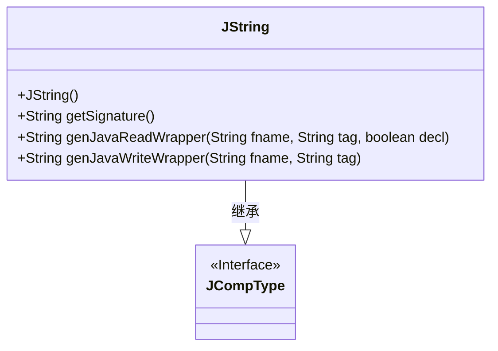
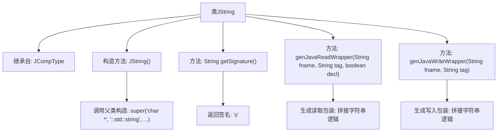

# 基础信息

|      |      |
|------|------|
| 名称 | JString |
| 编码语言 | .java |
| 代码路径 | zookeeper/zookeeper-jute/src/main/java/org/apache/jute/compiler/JString.java |
| 包名 | org.apache.jute.compiler |
| 依赖项 | [] |
| 概述说明 | JString类继承JCompType，定义字符串类型处理逻辑，包含构造方法、签名获取、Java读写包装方法。构造方法初始化类型信息，读写方法生成字符串操作代码。 |

# 说明

JString是JCompType的子类，用于处理字符串类型。构造函数初始化了多种字符串类型标识。提供了获取签名的方法getSignature，返回字符"s"。包含生成Java读写包装器的方法：genJavaReadWrapper根据参数生成字符串读取代码，可选是否声明变量；genJavaWriteWrapper生成字符串写入代码。所有方法均操作字符串变量和标签参数。

# 类列表 Class Summary

| 名称   | 类型  | 说明 |
|-------|------|-------------|
| JString | class | JString类继承JCompType，定义字符串类型处理逻辑，包括构造方法、获取签名、生成读写包装器方法。构造方法初始化类型信息，读写方法处理字符串序列化。 |

## 类 JString

|      |      |
|------|------|
| 访问范围 | public |
| 类型 | class |
| 名称 | JString |
| 说明 | JString类继承JCompType，定义字符串类型处理逻辑，包括构造方法、获取签名、生成读写包装器方法。构造方法初始化类型信息，读写方法处理字符串序列化。 |

### UML类图

这段代码展示了一个继承自JCompType接口的JString类，主要用于处理字符串类型的序列化操作。JString类提供了构造方法初始化字符串类型信息，并实现了获取类型签名(getSignature)、生成Java读取包装器(genJavaReadWrapper)和写入包装器(genJavaWriteWrapper)的方法。这些方法用于在序列化过程中处理字符串的读写操作，其中读取包装器支持可选声明，写入包装器直接将字符串写入输出流。类图清晰地展示了JString与JCompType之间的继承关系。

### 内部方法调用关系图

该流程图展示了JString类的继承关系和核心方法调用链。作为JCompType的子类，通过构造方法初始化了7个类型标识字符串。主要功能包括：1) 返回固定签名"s"；2) 生成Java字符串读取包装代码（支持可选声明）；3) 生成字符串写入包装代码。两个包装方法都涉及动态拼接包含标签参数的字符串操作，用于序列化/反序列化场景。

### 字段列表 Field List

| 名称  | 类型  | 说明 |
|-------|-------|------|

### 方法列表 Method List

| 名称  | 类型  | 说明 |
|-------|-------|------|
| getSignature | String | 方法返回固定字符串"s"。 |
| genJavaReadWrapper | String | 生成Java读取包装方法：根据参数声明变量并返回读取字符串的代码，包含变量名和标签。 |
| genJavaWriteWrapper | String | 生成Java字符串写入包装方法，输入文件名和标签，输出格式化写入语句。 |

