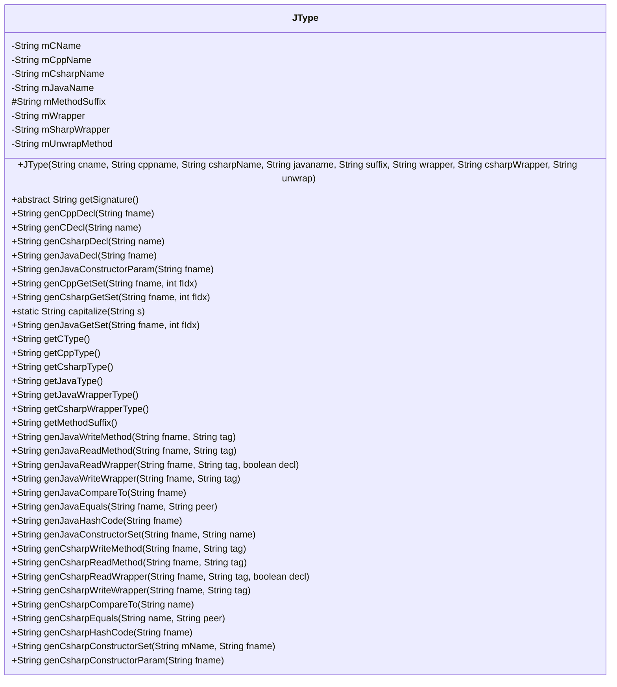

# 基础信息

|      |      |
|------|------|
| 名称 | JType |
| 编码语言 | .java |
| 代码路径 | zookeeper/zookeeper-jute/src/main/java/org/apache/jute/compiler/JType.java |
| 包名 | org.apache.jute.compiler |
| 依赖项 | [] |
| 概述说明 | 抽象类JType定义多语言类型映射，包含C/C++/C#/Java类型名及包装方法，提供生成声明、读写、比较等跨语言代码的通用模板。 |

# 说明

JType是一个抽象类，用于管理多种编程语言（C、C++、C#、Java）的类型信息。它包含各语言对应的类型名称字段（mCName、mCppName等）、方法后缀、包装类型和解包方法。类提供了生成各种语言声明、getter/setter、读写方法、比较逻辑等实用功能的方法。特别处理了C#中"Id"类型转换为"ZKId"的情况，并为每种语言提供了特定的大小写转换和代码生成逻辑。该类支持包装类型的读写操作，并包含构造参数生成、哈希码计算等辅助功能，是多语言代码生成的核心基础类。

# 类列表 Class Summary

| 名称   | 类型  | 说明 |
|-------|------|-------------|
| JType | class | 抽象类JType定义多语言类型映射，包含C/C++/C#/Java的字段名、包装类及生成方法，支持各语言声明、读写、比较等操作。 |

## 类 JType

|      |      |
|------|------|
| 访问范围 | public abstract |
| 类型 | class |
| 名称 | JType |
| 说明 | 抽象类JType定义多语言类型映射，包含C/C++/C#/Java的字段名、包装类及生成方法，支持各语言声明、读写、比较等操作。 |

### UML类图

这段代码定义了一个抽象类`JType`，用于处理多种编程语言（C、C++、C#、Java）的类型声明和方法生成。该类包含私有字段存储各语言类型名称、方法后缀、包装类信息等，并提供了一系列生成方法用于创建不同语言的类成员声明、getter/setter、序列化/反序列化方法等核心功能。通过抽象方法`getSignature()`强制子类实现特定签名生成逻辑，体现了多语言代码生成器的核心设计模式。

### 内部方法调用关系图

```mermaid
graph TD
    A["抽象类JType"]
    B["私有属性: String mCName/mCppName/mCsharpName/mJavaName"]
    C["保护属性: String mMethodSuffix"]
    D["私有属性: String mWrapper/mSharpWrapper/mUnwrapMethod"]
    E["构造方法: JType(String cname, String cppname, String csharpName, String javaname, String suffix, String wrapper, String csharpWrapper, String unwrap)"]
    F["抽象方法: String getSignature()"]
    G["生成方法: genCppDecl/genCDecl/genCsharpDecl/genJavaDecl"]
    H["构造参数方法: genJavaConstructorParam/genCsharpConstructorParam"]
    I["GetSet方法: genCppGetSet/genCsharpGetSet/genJavaGetSet"]
    J["工具方法: capitalize"]
    K["类型获取方法: getCType/getCppType/getCsharpType/getJavaType/getJavaWrapperType/getCsharpWrapperType/getMethodSuffix"]
    L["读写方法: genJavaWriteMethod/genJavaReadMethod/genCsharpWriteMethod/genCsharpReadMethod"]
    M["包装器方法: genJavaReadWrapper/genJavaWriteWrapper/genCsharpReadWrapper/genCsharpWriteWrapper"]
    N["比较方法: genJavaCompareTo/genJavaEquals/genJavaHashCode/genCsharpCompareTo/genCsharpEquals/genCsharpHashCode"]
    O["构造设置方法: genJavaConstructorSet/genCsharpConstructorSet"]

    A --> B
    A --> C
    A --> D
    A --> E
    A --> F
    A --> G
    A --> H
    A --> I
    A --> J
    A --> K
    A --> L
    A --> M
    A --> N
    A --> O
```

这段代码定义了一个抽象类JType，用于处理多语言(C/C++/C#/Java)的类型转换和代码生成。类包含各种语言的类型名称属性、包装器信息和生成方法，能生成不同语言的变量声明、get/set方法、读写方法、比较方法等。特别处理了类型名称转换、大小写规范化和包装器解包逻辑，为多语言代码生成提供了基础框架。流程图展示了类的主要结构和功能模块关系。

### 字段列表 Field List

| 名称  | 类型  | 说明 |
|-------|-------|------|
| mUnwrapMethod | String | 私有字符串变量mUnwrapMethod。 |
| mCsharpName | String | 私有字符串变量mCsharpName，用于存储C#名称。 |
| mCppName | String | 私有字符串变量mCppName。 |
| mWrapper | String | 私有字符串变量mWrapper。 |
| mMethodSuffix | String | 声明了一个受保护的字符串变量mMethodSuffix。 |
| mCName | String | 私有字符串变量mCName。 |
| mSharpWrapper | String | 私有字符串变量mSharpWrapper。 |
| mJavaName | String | 私有字符串变量mJavaName。 |

### 方法列表 Method List

| 名称  | 类型  | 说明 |
|-------|-------|------|
| getCType | String | 方法返回成员变量mCName的值。 |
| genCppGetSet | String | 生成C++的getter和setter函数，getter返回成员变量，setter设置成员变量并标记修改位。 |
| genJavaConstructorParam | String | 生成Java构造函数的参数，格式为"类型 参数名"。 |
| genCppDecl | String | 该代码定义了一个生成C++成员变量声明的方法，根据输入参数fname生成格式为"mCppName mfname;"的字符串，并添加缩进和换行。 |
| genJavaConstructorSet | String | 生成Java构造函数赋值语句，将参数name赋值给字段fname。 |
| genCDecl | String | 生成C语言变量声明字符串函数，输入变量名，返回格式化声明语句。 |
| getSignature | String | 获取方法签名字符串。 |
| getJavaWrapperType | String | 这是一个Java方法，返回成员变量mWrapper的值。方法名为getJavaWrapperType，无参数。 |
| getJavaType | String | 方法getJavaType返回成员变量mJavaName的值。 |
| genJavaGetSet | String | 生成Java类的getter和setter方法，返回字段名和类型拼接的代码字符串。 |
| genJavaReadWrapper | String | 生成Java读取包装器代码：根据参数声明变量并初始化，从输入流读取数据。 |
| genJavaDecl | String | 生成Java私有成员变量声明，格式为"private 类型 变量名;"。 |
| genCsharpReadWrapper | String | 生成C#读取包装方法：若decl为真声明变量，返回变量声明及读取标签数据的代码。 |
| genCsharpWriteWrapper | String | 根据mUnwrapMethod是否存在，生成不同的C#写入方法调用代码。无则直接写入，有则调用方法后写入。 |
| genCsharpCompareTo | String | 生成C#比较方法代码片段，根据属性值比较返回0（相等）、-1（小于）或1（大于）。 |
| genCsharpEquals | String | 生成C#相等比较代码，将输入参数拆解并格式化为比较语句，返回结果字符串。 |
| genCsharpHashCode | String | 生成C#哈希码方法，返回格式化字符串，调用capitalize函数处理输入参数fname。 |
| genCsharpConstructorSet | String | 生成C#构造函数设置字段的代码，将字段名赋给成员变量。 |
| genCsharpConstructorParam | String | 生成C#构造函数参数，格式为" 类型名 参数名"。 |
| genJavaHashCode | String | 生成Java哈希码方法，返回字段fname的整型值。 |
| capitalize | String | 定义静态方法capitalize，将字符串首字母大写后返回。输入字符串s，输出首字母大写的字符串。 |
| genCsharpGetSet | String | C#自动生成属性方法，包含get和set访问器。 |
| genCsharpDecl | String | 生成C#私有变量声明代码，输入变量名，输出格式化字符串。 |
| genJavaWriteMethod | String | 生成Java写入方法，接收字段名和标签，返回格式化字符串调用a_.write方法。 |
| genJavaWriteWrapper | String | 生成Java写入包装方法，将字段名和标签转换为特定格式的写入调用。 |
| genJavaEquals | String | 生成Java的equals方法比较代码，返回布尔值结果。 |
| genCsharpReadMethod | String | 生成C#读取方法：根据输入参数生成读取字段的代码，格式为“字段名=读取方法("标签")”。 |
| getCsharpType | String | C#方法返回成员变量mCsharpName的值。 |
| getCppType | String | 返回成员变量mCppName的C++类型名称。 |
| getMethodSuffix | String | 这是一个返回成员变量mMethodSuffix值的简单getter方法。 |
| genCsharpWriteMethod | String | 生成C#写入方法，参数为文件名和标签，返回格式化字符串调用a_.Write方法。 |
| genJavaCompareTo | String | 生成Java比较方法代码片段，用于比较两个对象的字段值，返回0（相等）、-1（小于）或1（大于）。 |
| getCsharpWrapperType | String | 方法返回C#包装类型mSharpWrapper。 |
| genJavaReadMethod | String | 生成Java读取方法，根据输入参数拼接字符串，返回格式化的方法调用代码。 |

