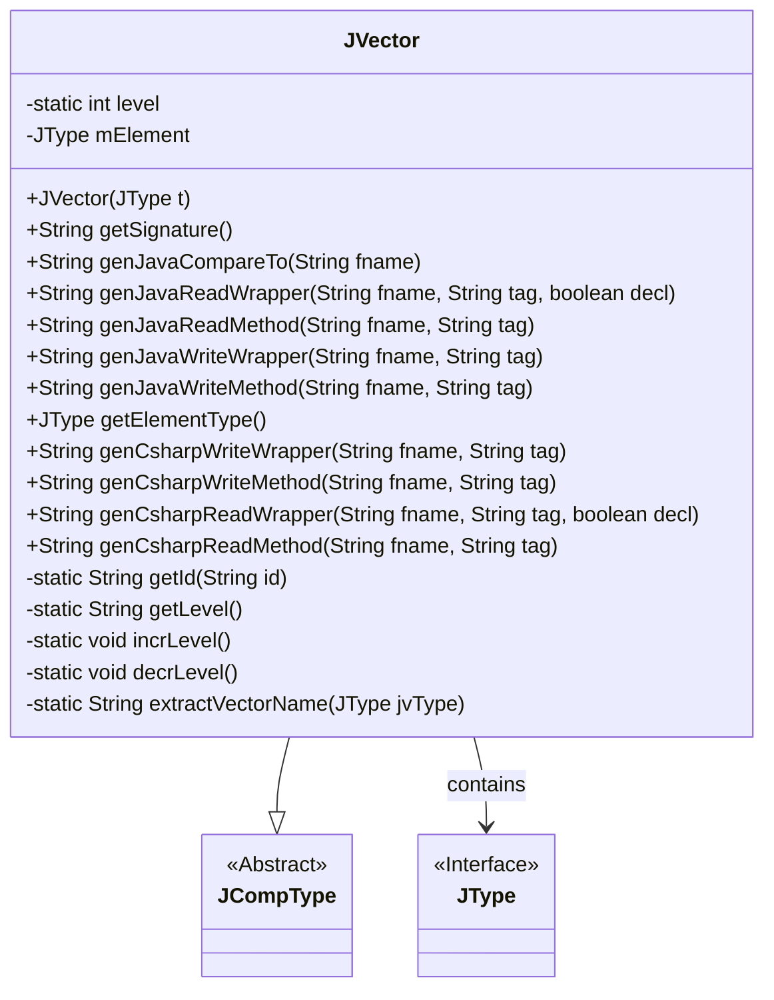

# 基础信息

|      |      |
|------|------|
| 名称 | JVector |
| 编码语言 | .java |
| 代码路径 | zookeeper/zookeeper-jute/src/main/java/org/apache/jute/compiler/JVector.java |
| 包名 | org.apache.jute.compiler |
| 依赖项 | [] |
| 概述说明 | JVector类继承JCompType，实现多语言向量操作，包含Java和C#的读写方法，管理元素类型和层级计数。 |

# 说明

JVector是一个继承自JCompType的类，用于表示向量类型。它包含静态方法管理层级标识符（level），并提供生成不同语言（Java、C#）的读写方法。构造函数接收JType参数，定义向量在C++、C#和Java中的类型名称。主要功能包括生成签名、比较操作、读写包装器方法，支持向量元素的序列化和反序列化。通过静态方法extractVectorName从元素类型提取向量名称。

# 类列表 Class Summary

| 名称   | 类型  | 说明 |
|-------|------|-------------|
| JVector | class | JVector类继承JCompType，实现多语言向量类型封装，支持Java和C#的读写操作，包含元素类型管理和层级控制方法。 |

## 类 JVector

|      |      |
|------|------|
| 访问范围 | public |
| 类型 | class |
| 名称 | JVector |
| 说明 | JVector类继承JCompType，实现多语言向量类型封装，支持Java和C#的读写操作，包含元素类型管理和层级控制方法。 |

### UML类图

这段代码展示了一个名为JVector的类，它继承自抽象类JCompType并包含一个JType接口的实例。JVector主要用于处理向量类型数据的序列化和反序列化操作，支持Java和C#两种语言。类中提供了多种生成代码的方法，如生成比较、读写包装器等，同时通过静态方法管理层级标识。JVector的核心功能是封装向量操作，为不同编程语言提供统一的接口实现。

### 内部方法调用关系图

```mermaid
graph TD
    A["类JVector"]
    B["静态属性: int level"]
    C["静态方法: String getId(String id)"]
    D["静态方法: String getLevel()"]
    E["静态方法: void incrLevel()"]
    F["静态方法: void decrLevel()"]
    G["属性: JType mElement"]
    H["构造方法: JVector(JType t)"]
    I["方法: String getSignature()"]
    J["方法: String genJavaCompareTo(String fname)"]
    K["方法: String genJavaReadWrapper(String fname, String tag, boolean decl)"]
    L["方法: String genJavaReadMethod(String fname, String tag)"]
    M["方法: String genJavaWriteWrapper(String fname, String tag)"]
    N["方法: String genJavaWriteMethod(String fname, String tag)"]
    O["方法: JType getElementType()"]
    P["方法: String genCsharpWriteWrapper(String fname, String tag)"]
    Q["方法: String genCsharpWriteMethod(String fname, String tag)"]
    R["方法: String genCsharpReadWrapper(String fname, String tag, boolean decl)"]
    S["方法: String genCsharpReadMethod(String fname, String tag)"]
    T["静态方法: String extractVectorName(JType jvType)"]

    A --> B
    A --> C
    A --> D
    A --> E
    A --> F
    A --> G
    A --> H
    A --> I
    A --> J
    A --> K
    A --> L
    A --> M
    A --> N
    A --> O
    A --> P
    A --> Q
    A --> R
    A --> S
    A --> T
    K --> E
    K --> D
    K --> C
    K --> F
    M --> E
    M --> C
    M --> F
    P --> E
    P --> C
    P --> F
    R --> E
    R --> C
    R --> F
    H --> T
```

该流程图展示了JVector类的完整结构，包含静态属性level和8个静态/实例方法。核心功能围绕向量操作展开，包括Java/C#的读写封装方法（如genJavaReadWrapper/genCsharpWriteWrapper），这些方法会调用level管理方法（incrLevel/decrLevel）和ID生成方法（getId）。构造方法通过extractVectorName生成类型名称，所有方法最终服务于对mElement属性的操作。类设计体现了多语言支持（Java/C#）和嵌套数据结构处理能力。

### 字段列表 Field List

| 名称  | 类型  | 说明 |
|-------|-------|------|
| mElement | JType | 私有成员变量mElement，类型为JType。 |
| level = 0 | int | 私有静态整型变量level初始化为0。 |

### 方法列表 Method List

| 名称  | 类型  | 说明 |
|-------|-------|------|
| getElementType | JType | 该方法返回成员变量mElement的类型JType。 |
| getLevel | String | 私有静态方法返回整数level的字符串形式。 |
| genJavaWriteWrapper | String | 生成Java代码，用于序列化向量数据，包含开始标记、循环处理元素及结束标记。 |
| incrLevel | void | 私有静态方法incrLevel，功能是将level变量加1。 |
| genJavaCompareTo | String | 生成Java比较方法，抛出未实现异常，提示比较功能未完成。 |
| genJavaReadMethod | String | 生成Java读取方法，调用包装函数，传入文件名和标签参数。 |
| genJavaReadWrapper | String | 生成Java读取包装方法，创建列表并填充元素，处理向量索引和结束标记。 |
| genJavaWriteMethod | String | 生成Java写入方法，调用genJavaWriteWrapper处理fname和tag参数。 |
| getId | String | 私有方法getId接收字符串id，返回拼接了getLevel()结果的字符串。 |
| genCsharpWriteMethod | String | 生成C#写入方法，调用包装函数genCsharpWriteWrapper处理文件名和标签。 |
| genCsharpReadWrapper | String | 生成C#代码：读取向量数据到列表，包含声明、循环填充和结束处理。 |
| genCsharpReadMethod | String | 这是一个C#方法，生成读取包装器，接受文件名和标签参数，调用内部方法处理。 |
| extractVectorName | String | 提取方法后缀并拼接"_vector"生成向量名称。 |
| getSignature | String | 方法返回带方括号的mElement签名字符串。 |
| decrLevel | void | 私有静态方法，减少level变量值1。 |
| genCsharpWriteWrapper | String | 生成C#代码包装器，用于序列化向量数据，包含开始/结束标记和循环处理元素。 |

