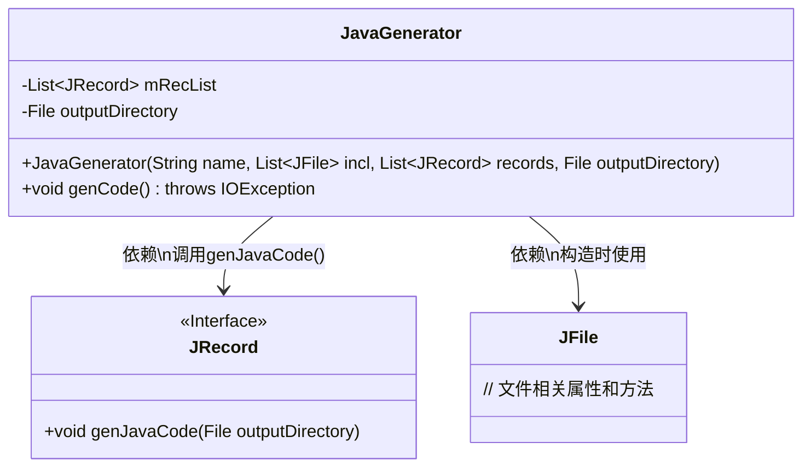
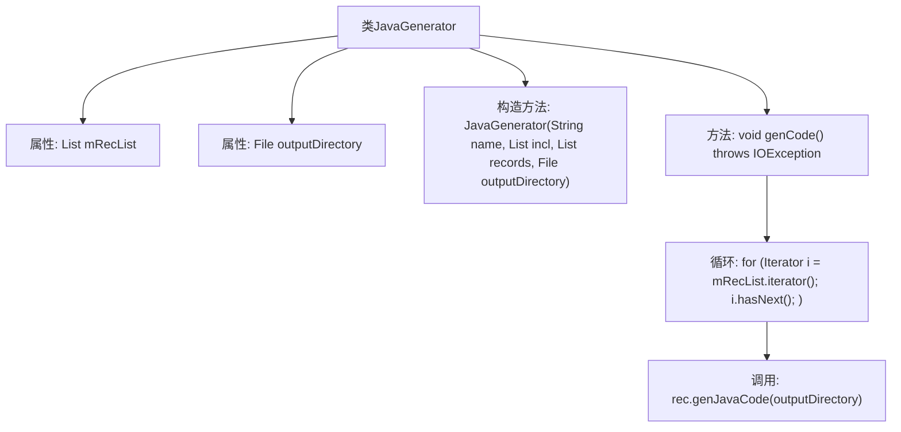

# 基础信息

|      |      |
|------|------|
| 名称 | JavaGenerator |
| 编码语言 | .java |
| 代码路径 | zookeeper/zookeeper-jute/src/main/java/org/apache/jute/compiler/JavaGenerator.java |
| 包名 | org.apache.jute.compiler |
| 依赖项 | ['java.io.File', 'java.io.IOException', 'java.util.Iterator', 'java.util.List'] |
| 概述说明 | JavaGenerator类用于生成Java代码，构造函数接收文件名、包含文件、记录列表和输出目录。genCode方法遍历记录列表，调用每个记录的genJavaCode方法生成代码文件。 |

# 说明

JavaGenerator类用于生成Java代码，包含一个记录列表和输出目录。构造函数接收文件名、包含文件列表、记录列表和输出目录参数，初始化内部变量。genCode方法遍历记录列表，调用每个记录的genJavaCode方法生成代码到指定目录。该类不直接生成代码，而是委托给JRecord类处理。

# 类列表 Class Summary

| 名称   | 类型  | 说明 |
|-------|------|-------------|
| JavaGenerator | class | JavaGenerator类用于生成Java代码，通过构造函数接收记录列表和输出目录，genCode方法遍历记录并调用其genJavaCode方法生成代码。 |

## 类 JavaGenerator

|      |      |
|------|------|
| 访问范围 | None |
| 类型 | class |
| 名称 | JavaGenerator |
| 说明 | JavaGenerator类用于生成Java代码，通过构造函数接收记录列表和输出目录，genCode方法遍历记录并调用其genJavaCode方法生成代码。 |

### UML类图

这段类图展示了JavaGenerator类的结构及其与JRecord接口、JFile类的关系。JavaGenerator通过构造函数接收JFile列表和JRecord列表，并依赖JRecord接口的genJavaCode()方法为每个记录生成Java代码。输出目录由outputDirectory字段指定，整个过程通过genCode()方法驱动，体现了代码生成器的核心功能。

### 内部方法调用关系图

这段代码描述了一个JavaGenerator类，用于生成Java代码记录。该类包含两个私有属性：mRecList（JRecord列表）和outputDirectory（输出目录文件）。构造方法接收文件名、包含文件列表、记录列表和输出目录作为参数。genCode()方法遍历mRecList中的每个JRecord对象，并调用其genJavaCode方法生成对应的Java代码文件到指定输出目录。流程图清晰地展示了类结构、方法调用关系和循环处理逻辑。

### 字段列表 Field List

| 名称  | 类型  | 说明 |
|-------|-------|------|
| mRecList | List<JRecord> | 私有JRecord类型列表变量mRecList。 |
| outputDirectory | File | 私有文件输出目录。 |

### 方法列表 Method List

| 名称  | 类型  | 说明 |
|-------|-------|------|
| genCode | void | 该方法遍历记录列表，为每个记录生成Java代码并输出到指定目录。 |

