# 基础信息

|      |      |
|------|------|
| 名称 | compiler |
| 编码语言 | .java |
| 代码路径 | zookeeper/zookeeper-jute/src/main/java/org/apache/jute/compiler |
| 包名 | zookeeper.docs.zookeeper-jute.src.main.java.org.apache.jute.compiler |
| 概述说明 | JCompType是JType子类，处理多语言类型转换，支持生成C++/Java/C#方法。CGenerator/CppGenerator生成C++代码文件，含许可证和兼容声明。JString/JByte/JLong等子类处理特定类型转换和代码生成。JRecord管理跨语言记录类型生成。JFile支持多语言代码生成。JField处理字段信息。CSharp/JavaGenerator生成对应语言代码。JBuffer处理字节数组，JVector处理向量类型。 |

# 说明

## 概述  
1. 该模块是ZooKeeper Jute的跨语言代码生成器，核心职责是将数据结构定义转换为多种编程语言的类型安全代码。例如支持Java/C++/C#的类声明、序列化方法和比较逻辑生成。  
2. 主要接口规范通过JCompType及其子类实现，例如JString生成字符串类型的读写包装器，JMap处理键值对的序列化逻辑。  
3. 关键数据结构包括JRecord（记录类型容器）、JField（字段描述符）和JType层级体系，类似编译器中的抽象语法树结构。  
4. 外部依赖仅需标准库支持，例如Java的反射机制用于类型推断，C++的STL容器用于代码生成。  
5. 通过"例如"说明：JType抽象类维护各语言类型映射表，如C#的"Id"自动转为"ZKId"。

## 主要业务场景  
1. 支持ZooKeeper协议文件的编译流程，例如将.jute文件转为Java的compareTo方法或C++的序列化代码。  
2. 采用生成器模式（如CGenerator/CppGenerator）实现同步代码生成，每个JRecord实例负责自身的目标代码输出。  
3. 功能覆盖基本类型（JInt/JLong）和复合类型（JVector/JMap），例如JBuffer专门处理字节数组的跨语言转换。  
4. 主要用于分布式系统通信协议开发，类似Protocol Buffers的IDL编译器场景。  
5. 提供语言特定的生成器API，例如CSharpGenerator通过genCsharpCode方法输出.cs文件。  
6. 与ZooKeeper原生集成，例如Jute生成的Java类直接用于服务端-客户端通信协议。

### 包内部结构视图

```mermaid
graph TD
    compiler --> generated
    compiler --> JCompType.java
    compiler --> CGenerator.java
    compiler --> CppGenerator.java
    compiler --> JString.java
    compiler --> JByte.java
    compiler --> JLong.java
    compiler --> JMap.java
    compiler --> JType.java
    compiler --> JRecord.java
    compiler --> JFile.java
    compiler --> JInt.java
    compiler --> JDouble.java
    compiler --> JBoolean.java
    compiler --> JField.java
    compiler --> CSharpGenerator.java
    compiler --> JavaGenerator.java
    compiler --> JBuffer.java
    compiler --> JVector.java
    compiler --> JFloat.java
```

该流程图展示了Zookeeper Jute编译器模块的源代码结构，根节点为compiler目录，包含generated子目录和18个Java源文件。这些文件主要分为两类：一类是各种编程语言的代码生成器（如CGenerator、CppGenerator等），另一类是Jute类型系统的定义文件（如JString、JMap等）。整个结构清晰地反映了编译器核心功能的模块化设计。

# 文件列表 File List

| 名称   | 类型  | 说明 |
|-------|------|-------------|
| [generated](generated/_module.md) | package | None |
| [CppGenerator.java](CppGenerator.md) | file | CppGenerator类用于生成C++代码，包含文件名、包含文件和记录列表，输出.cc和.hh文件，处理文件级元素如include语句，记录级代码由JRecord生成。 |
| [CGenerator.java](CGenerator.md) | file | CGenerator类用于生成C++代码，包含文件名、包含文件列表、记录列表和输出目录。构造函数初始化这些属性。genCode方法创建输出目录，生成.c和.h文件，写入Apache许可证，处理包含文件和记录代码，确保C++兼容性。 |
| [JCompType.java](JCompType.md) | file | JCompType是JType的子类，用于生成C++、Java和C#的get/set方法及比较、哈希代码等函数。包含多种语言的类型转换和方法实现。 |
| [JDouble.java](JDouble.md) | file | JDouble类继承JType，定义double类型相关属性和方法，包括构造函数、签名获取及生成哈希码功能。 |
| [JInt.java](JInt.md) | file | JInt类继承JType，定义int类型，包含构造函数和返回签名"i"的方法。 |
| [JFile.java](JFile.md) | file | JFile类表示文件，包含名称、包含文件和记录列表。构造函数初始化这些属性。getName方法返回文件名。genCode方法根据语言生成代码，支持C++、Java、C和C#，不支持则抛出异常。 |
| [JRecord.java](JRecord.md) | file | JRecord类是一个记录类型生成器，支持Java、C++和C#代码生成，包含字段管理、序列化及多语言命名空间处理功能。 |
| [JType.java](JType.md) | file | 抽象类JType定义多语言类型映射，包含C/C++/C#/Java类型名及包装方法，提供生成声明、读写、比较等跨语言代码的通用模板。 |
| [JMap.java](JMap.md) | file | JMap类继承JCompType，实现多语言映射类型，支持Java和C#的读写操作，包含键值类型管理、层级控制和序列化方法。 |
| [JLong.java](JLong.md) | file | JLong类继承JType，定义长整型数据类型，包含构造函数、签名方法和生成Java哈希码方法。 |
| [JByte.java](JByte.md) | file | JByte类继承JType，定义字节类型，包含构造函数初始化类型名称和签名方法返回"b"。 |
| [JFloat.java](JFloat.md) | file | JFloat类继承JType，定义浮点类型，包含构造方法、签名获取、生成Java哈希码方法。 |
| [JVector.java](JVector.md) | file | JVector类继承JCompType，实现多语言向量操作，包含Java和C#的读写方法，管理元素类型和层级计数。 |
| [JBuffer.java](JBuffer.md) | file | JBuffer类继承JCompType，用于处理字节数组操作，提供C++/Java的读写、比较、哈希等方法，支持缓冲区序列化和比较功能。 |
| [JavaGenerator.java](JavaGenerator.md) | file | JavaGenerator类用于生成Java代码，构造函数接收文件名、包含文件、记录列表和输出目录。genCode方法遍历记录列表，调用每个记录的genJavaCode方法生成代码文件。 |
| [CSharpGenerator.java](CSharpGenerator.md) | file | CSharpGenerator类用于生成C#代码，构造函数接收输出目录和记录列表，genCode方法遍历记录列表并调用JRecord生成代码。 |
| [JField.java](JField.md) | file | JField类表示字段，包含类型、名称及前后Token，提供多种语言（C++、C、C#、Java）的声明、读写方法生成功能，支持构造参数、比较、哈希等操作。 |
| [JBoolean.java](JBoolean.md) | file | JBoolean类继承JType，定义布尔类型处理逻辑，包括构造方法、签名生成及Java/C#的哈希值、比较方法实现。 |
| [JString.java](JString.md) | file | JString类继承JCompType，定义字符串类型处理逻辑，包含构造方法、签名获取、Java读写包装方法。构造方法初始化类型信息，读写方法生成字符串操作代码。 |

