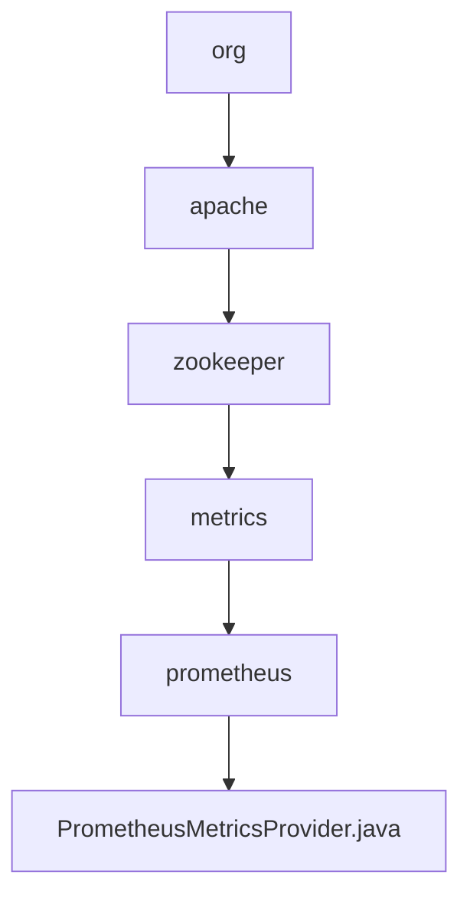

# 基础信息

|      |      |
|------|------|
| 名称 | org |
| 编码语言 | .java |
| 代码路径 | zookeeper/zookeeper-metrics-providers/zookeeper-prometheus-metrics/src/main/java/org |
| 包名 | zookeeper.docs.zookeeper-metrics-providers.zookeeper-prometheus-metrics.src.main.java.org |
| 概述说明 | PrometheusMetricsProvider实现MetricsProvider接口，提供Prometheus监控功能。支持HTTP/HTTPS端口配置，JVM信息导出，SSL安全设置，多线程任务队列处理，以及多种指标类型（计数器、仪表盘、摘要）的收集与上报。通过Jetty服务器暴露/metrics端点供Prometheus抓取。 |

# 说明

PrometheusMetricsProvider是一个实现MetricsProvider接口的类，用于集成Prometheus监控系统。它提供了HTTP/HTTPS端点暴露指标数据，支持JVM信息导出，并包含线程池配置用于异步报告指标。类中定义了SSL相关配置参数，如密钥库和信任库路径、密码及类型。通过configure方法加载配置参数，包括HTTP/HTTPS端口、工作线程数、队列大小等。start方法初始化服务器并设置SSL上下文，stop方法用于安全关闭。内部类Context管理各类指标（计数器、仪表盘、摘要等），并提供了线程工厂和任务队列处理机制。指标数据通过Servlet暴露，支持标签和详细级别配置。

### 包内部结构视图

该流程图展示了Zookeeper Prometheus Metrics模块的Java包层级结构，从顶级org包开始，逐级深入到apache、zookeeper、metrics和prometheus子包，最终指向核心实现类PrometheusMetricsProvider.java。这种层级结构体现了标准Java项目的包组织规范，符合从通用到具体的命名空间划分原则。

# 文件列表 File List

| 名称   | 类型  | 说明 |
|-------|------|-------------|
| [apache](apache/_module.md) | package | PrometheusMetricsProvider实现MetricsProvider接口，提供Prometheus监控功能。支持HTTP/HTTPS端口配置，JVM信息导出，SSL安全设置，多线程任务队列处理，以及多种指标类型（计数器、仪表盘、摘要）的收集与上报。通过Jetty服务器暴露/metrics端点供Prometheus抓取。 |

