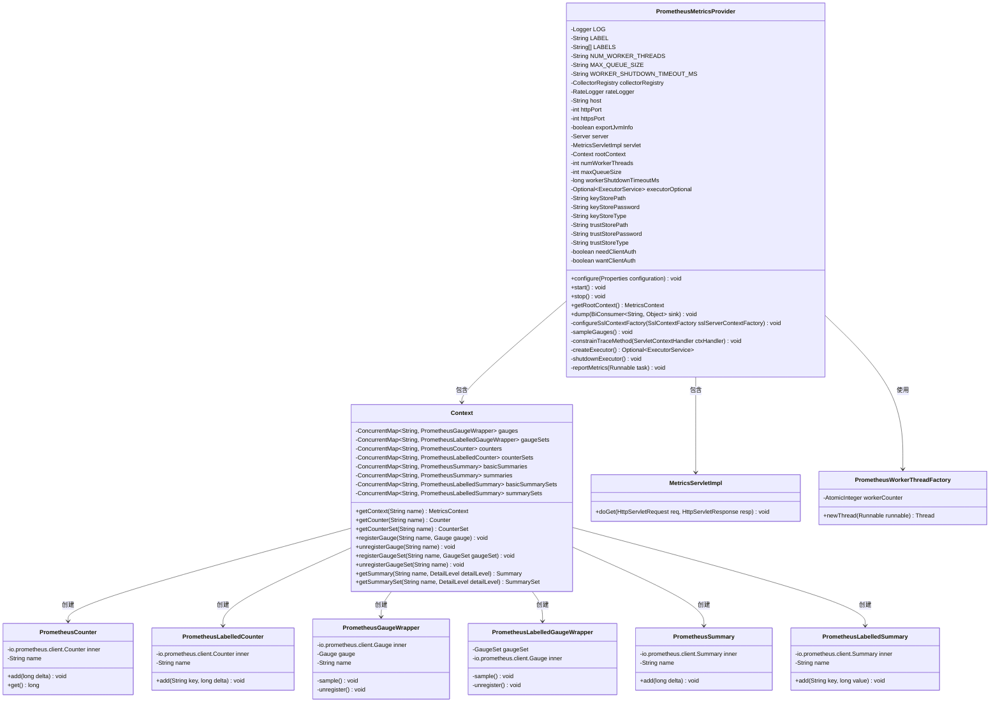
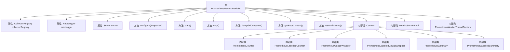
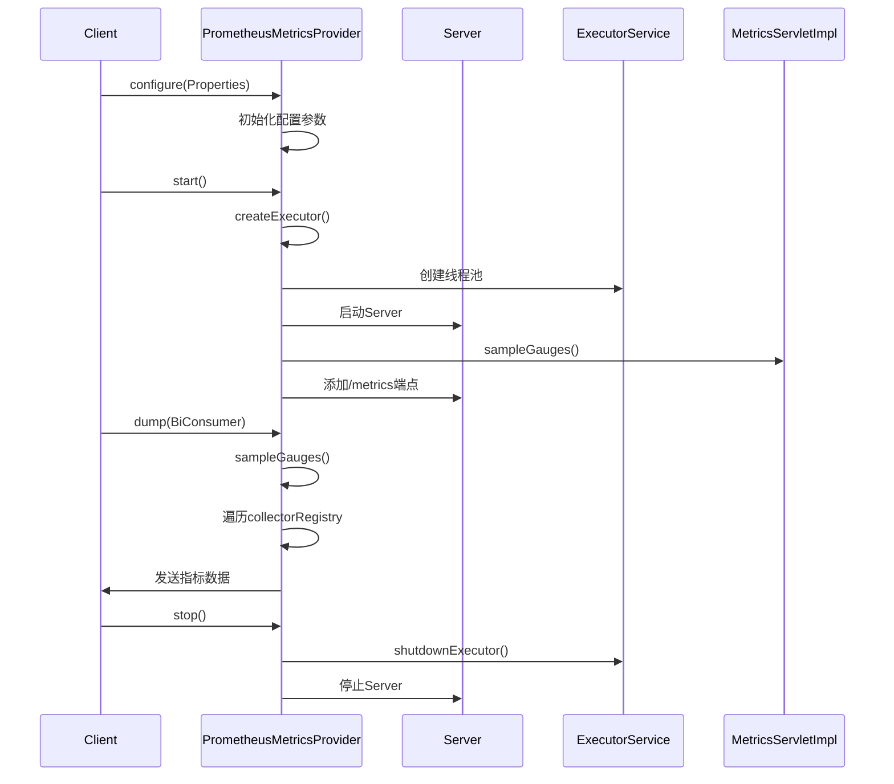

# 基础信息

|      |      |
|------|------|
| 名称 | PrometheusMetricsProvider |
| 编码语言 | .java |
| 代码路径 | zookeeper/zookeeper-metrics-providers/zookeeper-prometheus-metrics/src/main/java/org/apache/zookeeper/metrics/prometheus/PrometheusMetricsProvider.java |
| 包名 | org.apache.zookeeper.metrics.prometheus |
| 依赖项 | ['io.prometheus.client.Collector', 'io.prometheus.client.CollectorRegistry', 'io.prometheus.client.exporter.MetricsServlet', 'io.prometheus.client.hotspot.DefaultExports', 'java.io.IOException', 'java.net.InetSocketAddress', 'java.util.Enumeration', 'java.util.Objects', 'java.util.Optional', 'java.util.Properties', 'java.util.concurrent.BlockingQueue', 'java.util.concurrent.ConcurrentHashMap', 'java.util.concurrent.ConcurrentMap', 'java.util.concurrent.ExecutorService', 'java.util.concurrent.LinkedBlockingQueue', 'java.util.concurrent.RejectedExecutionException', 'java.util.concurrent.ThreadFactory', 'java.util.concurrent.ThreadPoolExecutor', 'java.util.concurrent.TimeUnit', 'java.util.concurrent.atomic.AtomicInteger', 'java.util.function.BiConsumer', 'javax.servlet.ServletException', 'javax.servlet.http.HttpServletRequest', 'javax.servlet.http.HttpServletResponse', 'org.apache.zookeeper.metrics.Counter', 'org.apache.zookeeper.metrics.CounterSet', 'org.apache.zookeeper.metrics.Gauge', 'org.apache.zookeeper.metrics.GaugeSet', 'org.apache.zookeeper.metrics.MetricsContext', 'org.apache.zookeeper.metrics.MetricsProvider', 'org.apache.zookeeper.metrics.MetricsProviderLifeCycleException', 'org.apache.zookeeper.metrics.Summary', 'org.apache.zookeeper.metrics.SummarySet', 'org.apache.zookeeper.server.RateLogger', 'org.eclipse.jetty.security.ConstraintMapping', 'org.eclipse.jetty.security.ConstraintSecurityHandler', 'org.eclipse.jetty.server.Server', 'org.eclipse.jetty.server.ServerConnector', 'org.eclipse.jetty.servlet.ServletContextHandler', 'org.eclipse.jetty.servlet.ServletHolder', 'org.eclipse.jetty.util.security.Constraint', 'org.eclipse.jetty.util.ssl.KeyStoreScanner', 'org.eclipse.jetty.util.ssl.SslContextFactory', 'org.slf4j.Logger', 'org.slf4j.LoggerFactory'] |
| 概述说明 | PrometheusMetricsProvider实现MetricsProvider接口，提供Prometheus监控功能。支持HTTP/HTTPS端口配置，JVM信息导出，SSL安全设置，多线程任务队列处理，以及多种指标类型（计数器、仪表盘、摘要）的收集与上报。通过Jetty服务器暴露/metrics端点供Prometheus抓取。 |

# 说明

PrometheusMetricsProvider是一个实现MetricsProvider接口的类，用于集成Prometheus监控系统。它提供了HTTP/HTTPS端点暴露指标数据，支持JVM信息导出，并包含线程池配置用于异步报告指标。类中定义了SSL相关配置参数，如密钥库和信任库路径、密码及类型。通过configure方法加载配置参数，包括HTTP/HTTPS端口、工作线程数、队列大小等。start方法初始化服务器并设置SSL上下文，stop方法用于安全关闭。内部类Context管理各类指标（计数器、仪表盘、摘要等），并提供了线程工厂和任务队列处理机制。指标数据通过Servlet暴露，支持标签和详细级别配置。

# 类列表 Class Summary

| 名称   | 类型  | 说明 |
|-------|------|-------------|
| PrometheusMetricsProvider | class | PrometheusMetricsProvider类实现MetricsProvider接口，提供Prometheus指标收集功能。支持HTTP/HTTPS端口配置、JVM信息导出、SSL安全设置，内置计数器、仪表盘和摘要等指标类型，使用多线程处理指标上报任务，并包含指标转储和重置功能。 |

## 类 PrometheusMetricsProvider

|      |      |
|------|------|
| 访问范围 | public |
| 类型 | class |
| 名称 | PrometheusMetricsProvider |
| 说明 | PrometheusMetricsProvider类实现MetricsProvider接口，提供Prometheus指标收集功能。支持HTTP/HTTPS端口配置、JVM信息导出、SSL安全设置，内置计数器、仪表盘和摘要等指标类型，使用多线程处理指标上报任务，并包含指标转储和重置功能。 |

### UML类图

这段代码实现了一个Prometheus指标提供者，主要功能包括配置HTTP/HTTPS服务端点、管理指标收集与上报、处理SSL认证等。核心类PrometheusMetricsProvider通过内部类Context管理各类指标（计数器、仪表盘、摘要等），使用Prometheus客户端库进行指标收集，并通过Jetty服务器暴露/metrics端点。系统支持多线程异步上报、SSL安全通信、JVM信息导出等功能，通过配置参数可调整工作线程数、队列大小等运行时特性。

### 内部方法调用关系图

这段代码实现了一个完整的Prometheus指标提供系统，包含配置管理、HTTP/HTTPS服务启停、指标收集和上报功能。核心流程包括：1) 通过configure方法加载SSL、端口等配置；2) start方法初始化线程池并启动Jetty服务器；3) 通过内部Context类管理各类指标收集器；4) 使用dump方法将指标数据导出到指定接收器。系统采用多线程异步处理指标上报任务，并提供了完善的错误处理和资源清理机制。

### 字段列表 Field List

| 名称  | 类型  | 说明 |
|-------|-------|------|
| MAX_QUEUE_SIZE = "maxQueueSize" | String | 定义静态常量MAX_QUEUE_SIZE，值为字符串"maxQueueSize"。 |
| SSL_KEYSTORE_LOCATION = "ssl.keyStore.location" | String | SSL密钥库位置配置参数。 |
| SCAN_INTERVAL = 60 * 10 | int | 定义静态常量SCAN_INTERVAL，值为600秒（10分钟）。 |
| numWorkerThreads = 1 | int | 私有整型变量numWorkerThreads，初始值为1。 |
| LABEL = "key" | String | 私有静态常量字符串LABEL值为"key"。 |
| SSL_WANT_CLIENT_AUTH = "ssl.want.client.auth" | String | SSL配置项：要求客户端认证参数。 |
| WORKER_SHUTDOWN_TIMEOUT_MS = "workerShutdownTimeoutMs" | String | 静态常量字符串，定义工作线程关闭超时参数名。 |
| wantClientAuth = true | boolean | 私有布尔变量wantClientAuth设为true，表示需要客户端认证。 |
| SSL_X509_CN = "ssl.x509.cn" | String | SSL_X509_CN是静态常量字符串，值为"ssl.x509.cn"。 |
| servlet = new MetricsServletImpl() | MetricsServletImpl | 私有成员servlet初始化为MetricsServletImpl实例。 |
| exportJvmInfo = true | boolean | 私有布尔变量exportJvmInfo，默认值为true。 |
| executorOptional = Optional.empty() | Optional<ExecutorService> | 声明一个可选的ExecutorService实例，初始为空。 |
| keyStoreType | String | 声明私有字符串变量keyStoreType，用于存储密钥库类型。 |
| keyStorePath | String | 私有字符串变量keyStorePath，用于存储密钥库路径。 |
| SSL_X509_REGEX_CN = "ssl.x509.cn.regex" | String | 静态常量SSL_X509_REGEX_CN定义SSL证书通用名正则表达式配置键。 |
| SSL_TRUSTSTORE_TYPE = "ssl.trustStore.type" | String | SSL信任库类型配置键。 |
| needClientAuth = true | boolean | 私有布尔变量needClientAuth设为true，表示需要客户端认证。 |
| httpsPort = -1 | int | 私有整型变量httpsPort初始值为-1。 |
| LABELS = {LABEL} | String[] | 私有静态常量字符串数组LABELS，初始值为{LABEL}。 |
| SSL_KEYSTORE_TYPE = "ssl.keyStore.type" | String | SSL密钥库类型配置键，用于指定密钥库的存储格式。 |
| workerShutdownTimeoutMs = 1000 | long | 私有长整型变量workerShutdownTimeoutMs，默认值1000毫秒。 |
| collectorRegistry = CollectorRegistry.defaultRegistry | CollectorRegistry | 私有收集器注册表设为默认注册表。 |
| trustStorePath | String | 私有字符串变量trustStorePath，用于存储信任库路径。 |
| maxQueueSize = 1000000 | int | 私有整型变量maxQueueSize，初始值为1000000，表示队列最大容量。 |
| httpPort = -1 | int | 私有整型变量httpPort初始值为-1。 |
| SSL_NEED_CLIENT_AUTH = "ssl.need.client.auth" | String | SSL客户端认证配置项 |
| host = "0.0.0.0" | String | 私有字符串变量host被初始化为"0.0.0.0"。 |
| trustStorePassword | String | 私有字符串变量，存储信任库密码。 |
| SSL_TRUSTSTORE_LOCATION = "ssl.trustStore.location" | String | SSL信任库位置配置键，用于指定信任库文件路径。 |
| rootContext = new Context() | Context | 声明一个私有不可变的Context对象rootContext并初始化。 |
| keyStorePassword | String | 私有字符串变量keyStorePassword，用于存储密钥库密码。 |
| SSL_KEYSTORE_PASSWORD = "ssl.keyStore.password" | String | SSL密钥库密码配置键。 |
| trustStoreType | String | 声明私有字符串变量trustStoreType，用于存储信任库类型。 |
| LOG = LoggerFactory.getLogger(PrometheusMetricsProvider.class) | Logger | 私有静态日志常量LOG，用于PrometheusMetricsProvider类的日志记录。 |
| server | Server | 私有服务器实例变量。 |
| rateLogger = new RateLogger(LOG, 60 * 1000) | RateLogger | 私有常量rateLogger初始化为每分钟记录一次的日志工具实例。 |
| NUM_WORKER_THREADS = "numWorkerThreads" | String | 定义静态常量NUM_WORKER_THREADS，值为字符串"numWorkerThreads"。 |
| SSL_TRUSTSTORE_PASSWORD = "ssl.trustStore.password" | String | 这是一个Java静态常量，定义SSL信任库密码的配置键为"ssl.trustStore.password"。 |

### 方法列表 Method List

| 名称  | 类型  | 说明 |
|-------|-------|------|
| configure | void | 方法配置指标服务，读取主机、端口、SSL证书、认证等参数，设置JVM信息导出、工作线程数和队列大小等。 |
| start | void | 启动/metrics端点服务，配置HTTP/HTTPS端口和JVM信息导出。初始化服务器，设置SSL扫描器和连接器，处理异常并确保资源释放。 |
| getRootContext | MetricsContext | 重写getRootContext方法，返回rootContext对象。 |
| getServlet | MetricsServletImpl | 获取MetricsServletImpl实例的方法，直接返回servlet对象。 |
| configureSslContextFactory | void | 配置SSL上下文工厂，检查密钥库和信任库路径及密码，缺失则报错并抛出异常，设置客户端认证需求。 |
| dump | void | Java方法dump遍历指标族样本，采样后通过BiConsumer输出键值对。 |
| buildKeyForDump | String | 该方法为样本生成唯一键，包含名称及标签名值对（格式为{name="value",...}）。若无标签则仅返回名称。 |
| sampleGauges | void | 私有方法sampleGauges遍历并采样所有普通指标和带标签指标集。 |
| resetAllValues | void | 该方法用于重置所有数值，但在Prometheus平台上不支持此操作。 |
| constrainTraceMethod | void | 该方法为Servlet上下文处理器添加安全约束，禁止TRACE方法对所有路径的访问，要求认证。通过ConstraintSecurityHandler实现。 |
| createExecutor | Optional<ExecutorService> | 方法根据线程数决定是否创建线程池，若线程数小于1则返回空，否则创建固定大小的线程池并返回。 |
| shutdownExecutor | void | 关闭线程池：检查并关闭现有线程池，等待超时后强制终止，记录错误和异常。 |
| reportMetrics | void | 方法reportMetrics执行任务：若存在执行器则提交任务，队列满时记录日志；否则直接运行任务。 |
| stop | void | 重写stop方法：关闭执行器，停止Jetty服务器并处理异常，最后清空server引用。 |

