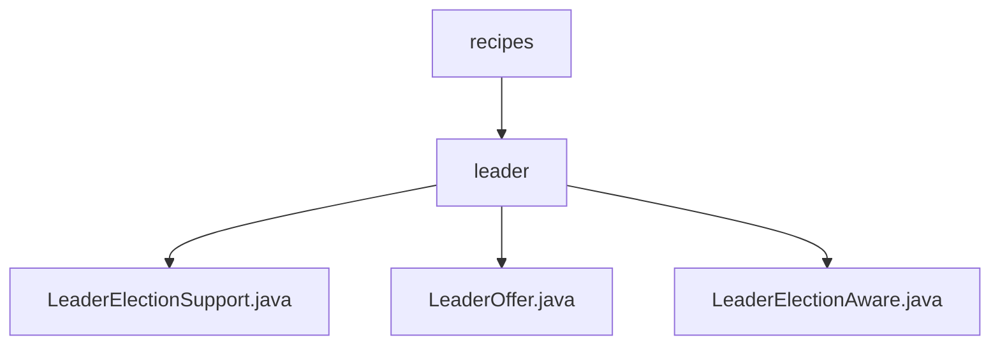

# 基础信息

|      |      |
|------|------|
| 名称 | recipes |
| 编码语言 | .java |
| 代码路径 | zookeeper/zookeeper-recipes/zookeeper-recipes-election/src/main/java/org/apache/zookeeper/recipes |
| 包名 | zookeeper.docs.zookeeper-recipes.zookeeper-recipes-election.src.main.java.org.apache.zookeeper.recipes |
| 概述说明 | LeaderElectionSupport类实现基于ZooKeeper的领导者选举，含状态管理和核心功能。LeaderOffer类存储领导节点信息并提供比较功能。LeaderElectionAware接口处理选举状态变化事件。 |

# 说明

## 概述  
1.该模块实现基于ZooKeeper的分布式领导者选举机制，类似集群中的主节点竞争协议。  
2.主要接口为LeaderElectionAware的事件回调机制，例如通过onElectionEvent处理状态变更。  
3.关键数据结构包括LeaderOffer提议对象，包含节点路径和主机名等元数据。  
4.外部依赖ZooKeeper服务，使用其临时顺序节点特性实现选举。  
5.例如通过makeOffer创建临时节点触发选举流程。  

## 主要业务场景  
1.支持集群节点通过竞争临时节点成为领导者，例如高可用服务的主备切换。  
2.采用事件驱动交互模式，例如状态变更触发dispatchEvent通知监听器。  
3.功能覆盖选举全生命周期，包含状态判断和资源释放等完整操作。  
4.主要用于分布式系统协调场景，如微服务集群的Leader选举。  
5.提供Java接口和类库形式的API，例如LeaderElectionSupport类。  
6.可与第三方系统集成，例如通过监听器接口实现自定义选举策略。

### 包内部结构视图

该流程图展示了Zookeeper选举模块的层级结构，根节点为recipes目录，其下包含leader子目录。leader目录中包含三个关键Java文件：LeaderElectionSupport.java实现选举核心逻辑，LeaderOffer.java封装候选者信息，LeaderElectionAware.java定义选举状态回调接口。整个结构清晰地反映了选举功能模块的文件组织方式，未超出给定的5条路径限制。

# 文件列表 File List

| 名称   | 类型  | 说明 |
|-------|------|-------------|
| [leader](leader/_module.md) | package | LeaderElectionSupport类实现基于ZooKeeper的领导者选举，含状态管理和核心功能。LeaderOffer类存储领导节点信息并提供比较功能。LeaderElectionAware接口处理选举状态变化事件。 |

