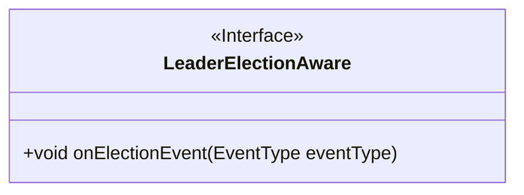
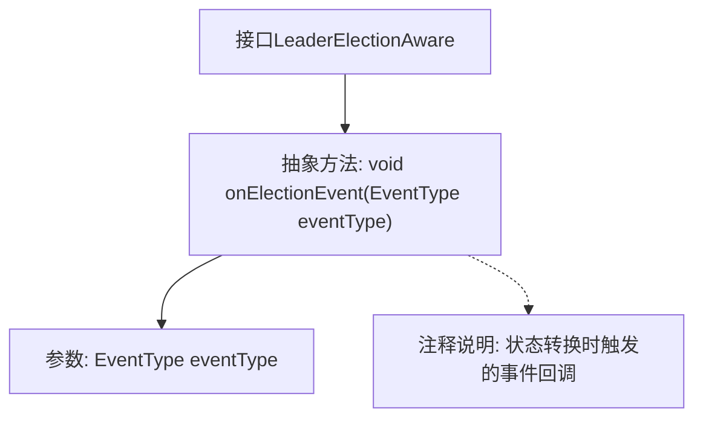

# 基础信息

|      |      |
|------|------|
| 名称 | LeaderElectionAware |
| 编码语言 | .java |
| 代码路径 | zookeeper/zookeeper-recipes/zookeeper-recipes-election/src/main/java/org/apache/zookeeper/recipes/leader/LeaderElectionAware.java |
| 包名 | org.apache.zookeeper.recipes.leader |
| 依赖项 | ['org.apache.zookeeper.recipes.leader.LeaderElectionSupport.EventType'] |
| 概述说明 | LeaderElectionAware接口定义了onElectionEvent方法，用于处理选举状态转换事件，如START、OFFER_START等。 |

# 说明

LeaderElectionAware接口定义了一个用于处理选举事件的方法onElectionEvent。该方法在每次状态转换时被调用，接收EventType参数表示当前的低级别事件。事件类型包括START、OFFER_START、OFFER_COMPLETE、DETERMINE_START、DETERMINE_COMPLETE等，分别对应选举过程中不同阶段的开始和完成事件。该接口主要用于在选举状态变化时进行相应处理。

# 类列表 Class Summary

| 名称   | 类型  | 说明 |
|-------|------|-------------|
| LeaderElectionAware | interface | LeaderElectionAware接口定义了onElectionEvent方法，用于在选举状态转换时处理事件类型。 |

## 类 LeaderElectionAware

|      |      |
|------|------|
| 访问范围 | public |
| 类型 | interface |
| 名称 | LeaderElectionAware |
| 说明 | LeaderElectionAware接口定义了onElectionEvent方法，用于在选举状态转换时处理事件类型。 |

### UML类图

这段代码定义了一个名为`LeaderElectionAware`的接口，该接口声明了一个方法`onElectionEvent`，用于处理选举过程中的状态转换事件。接口通过`EventType`参数接收不同类型的事件通知，适用于分布式系统中领导者选举的场景。该接口的设计允许实现类通过事件回调机制感知选举状态变化，为上层逻辑提供扩展点。类图清晰地展示了接口的单一职责和简洁的契约定义。

### 内部方法调用关系图

该流程图描述了`LeaderElectionAware`接口的结构，核心是`onElectionEvent`抽象方法，该方法在选举状态转换时被调用。接口通过事件类型参数接收状态变更通知，注释详细说明了该方法在状态机各阶段（如OFFER_START/DETERMINE_COMPLETE等）的触发时机。图形展现了接口与方法、参数及文档说明之间的层级关系。

### 字段列表 Field List

| 名称  | 类型  | 说明 |
|-------|-------|------|

### 方法列表 Method List

| 名称  | 类型  | 说明 |
|-------|-------|------|
| onElectionEvent | void | 这是一个事件处理方法，当选举事件发生时被调用，参数eventType表示事件类型。 |

