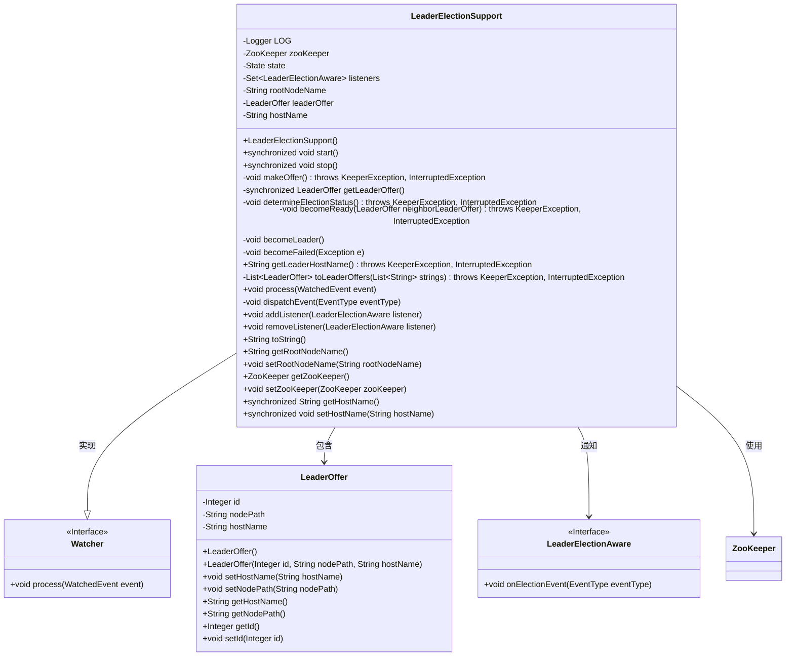
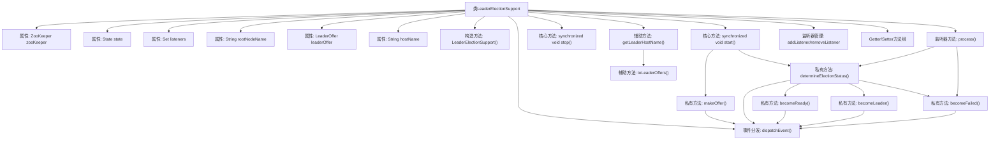
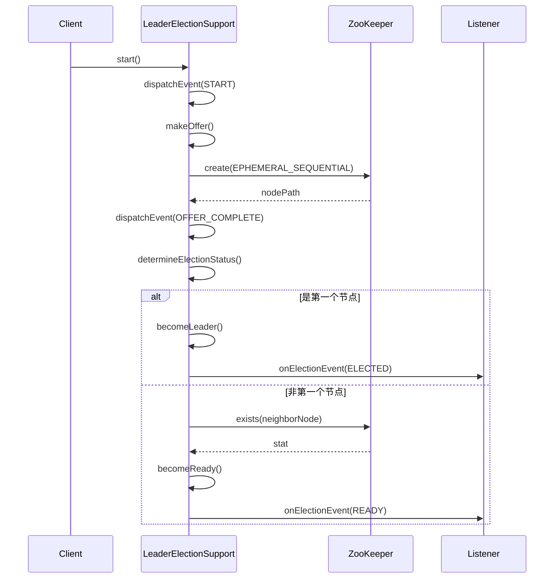

# 基础信息

|      |      |
|------|------|
| 名称 | LeaderElectionSupport |
| 编码语言 | .java |
| 代码路径 | zookeeper/zookeeper-recipes/zookeeper-recipes-election/src/main/java/org/apache/zookeeper/recipes/leader/LeaderElectionSupport.java |
| 包名 | org.apache.zookeeper.recipes.leader |
| 依赖项 | ['java.util.ArrayList', 'java.util.Collections', 'java.util.HashSet', 'java.util.List', 'java.util.Set', 'org.apache.zookeeper.CreateMode', 'org.apache.zookeeper.KeeperException', 'org.apache.zookeeper.WatchedEvent', 'org.apache.zookeeper.Watcher', 'org.apache.zookeeper.ZooDefs', 'org.apache.zookeeper.ZooKeeper', 'org.apache.zookeeper.data.Stat', 'org.slf4j.Logger', 'org.slf4j.LoggerFactory'] |
| 概述说明 | LeaderElectionSupport类实现基于ZooKeeper的领导者选举，支持启动、停止、监听事件和状态管理，确保高可用性。 |

# 说明

LeaderElectionSupport类实现了基于ZooKeeper的领导者选举机制。它通过创建临时顺序节点进行选举，状态包括START、OFFER、DETERMINE、ELECTED、READY、FAILED和STOP。核心功能包含启动选举(makeOffer)、状态判断(determineElectionStatus)、成为领导者(becomeLeader)或预备状态(becomeReady)。支持事件监听机制，通过dispatchEvent通知状态变化。关键属性包括ZooKeeper实例、根节点路径、主机名和领导者提议。提供完整的生命周期管理，包含start和stop方法，确保选举过程正确执行和资源释放。

# 类列表 Class Summary

| 名称   | 类型  | 说明 |
|-------|------|-------------|
| LeaderElectionSupport | class | LeaderElectionSupport类实现基于ZooKeeper的领导者选举，提供启动/停止选举、状态管理、监听器通知功能，支持故障处理和节点监控。 |

## 类 LeaderElectionSupport

|      |      |
|------|------|
| 访问范围 | public |
| 类型 | class |
| 名称 | LeaderElectionSupport |
| 说明 | LeaderElectionSupport类实现基于ZooKeeper的领导者选举，提供启动/停止选举、状态管理、监听器通知功能，支持故障处理和节点监控。 |

### UML类图

这段类图描述了基于ZooKeeper的领导者选举系统核心结构。LeaderElectionSupport类作为主控制器，实现了Watcher接口以监听ZooKeeper节点变化，维护选举状态机（包含START/OFFER/DETERMINE等7种状态），并通过LeaderElectionAware接口通知监听者选举事件。系统核心通过创建临时顺序节点（LeaderOffer）实现选举算法，当节点删除时触发重新选举流程。类图中清晰展示了状态管理、事件分发、ZooKeeper操作等核心组件的交互关系。

### 内部方法调用关系图

该流程图展示了ZooKeeper领导者选举的核心流程。类结构包含状态管理、ZooKeeper操作、事件分发三大模块，通过start()触发选举流程，依次经历创建临时节点(makeOffer)、状态判断(determineElectionStatus)，最终根据节点序号决定成为领导者(becomeLeader)或观察者(becomeReady)。时序图详细演示了从客户端调用到完成选举的完整交互过程，包含ZooKeeper节点创建、状态监听和事件回调机制，体现了分布式系统领导者选举的典型实现模式。

### 字段列表 Field List

| 名称  | 类型  | 说明 |
|-------|-------|------|
| hostName | String | 私有字符串变量hostName |
| rootNodeName | String | 私有字符串变量rootNodeName。 |
| zooKeeper | ZooKeeper | 私有ZooKeeper实例变量zooKeeper。 |
| listeners | Set<LeaderElectionAware> | 私有集合，存储LeaderElectionAware类型的监听器。 |
| leaderOffer | LeaderOffer | 私有成员变量leaderOffer，类型为LeaderOffer。 |
| state | State | 私有状态变量state。 |
| LOG = LoggerFactory.getLogger(LeaderElectionSupport.class) | Logger | 定义LeaderElectionSupport类的私有静态日志常量LOG。 |

### 方法列表 Method List

| 名称  | 类型  | 说明 |
|-------|-------|------|
| becomeReady | void | 方法becomeReady处理领导选举状态。若相邻节点存在，设为READY状态并派发事件；若不存在，重新进行选举。日志记录关键步骤和状态变化。 |
| toString | String | 重写toString方法，返回包含state、leaderOffer、zooKeeper、hostName和listeners的对象状态字符串。 |
| dispatchEvent | void | 私有方法dispatchEvent用于分发事件，同步遍历监听器列表并触发选举事件回调。 |
| getRootNodeName | String | 获取根节点名称的方法，返回字符串rootNodeName。 |
| toLeaderOffers | List<LeaderOffer> | 将字符串列表转换为LeaderOffer对象列表，按序号排序。每个字符串对应一个LeaderOffer，包含序号、路径和主机名。 |
| setZooKeeper | void | 设置ZooKeeper实例的方法，将传入参数赋值给类成员变量zooKeeper。 |
| getLeaderOffer | LeaderOffer | 私有同步方法，返回LeaderOffer对象。 |
| setHostName | void | 这是一个Java同步方法，用于设置主机名。方法名为setHostName，接受一个String参数hostName，并将其赋值给类的成员变量hostName。 |
| start | void | 这是一个同步公共方法start()，用于启动领导者选举。方法首先设置状态为START并分发事件，检查zooKeeper和hostName是否已设置，未设置则抛出异常。然后尝试发起选举并确定状态，失败则调用becomeFailed。 |
| becomeFailed | void | 方法在异常时记录错误日志，将状态设为FAILED并触发失败事件。 |
| removeListener | void | 移除指定的选举监听器。 |
| stop | void | 同步停止方法：设置状态为STOP，触发停止开始事件。若存在leaderOffer，删除其ZooKeeper节点路径并记录日志，异常时标记失败。最后触发停止完成事件。 |
| becomeLeader | void | 方法`becomeLeader`将状态设为ELECTED，触发ELECTED_START事件，记录成为主节点信息，最后触发ELECTED_COMPLETE事件。 |
| getHostName | String | 这是一个同步方法，返回私有变量hostName的值，确保线程安全。 |
| getZooKeeper | ZooKeeper | 获取ZooKeeper实例的方法，直接返回成员变量zooKeeper。 |
| process | void | 这是一个ZooKeeper节点删除事件处理逻辑。当监听到节点删除事件且非自身节点时，触发选举流程。若异常则标记失败。 |
| determineElectionStatus | void | 方法determineElectionStatus用于确定选举状态：获取当前领导提议，解析ID，比较所有提议顺序。若当前提议为首位则成为领导，否则监视前一位状态。完成后触发事件。 |
| getLeaderHostName | String | 该方法通过ZooKeeper获取根节点下的子节点列表，转换为LeaderOffer对象列表。若列表非空，返回首个LeaderOffer的主机名；否则返回null。可能抛出KeeperException和InterruptedException异常。 |
| makeOffer | void | 方法makeOffer创建临时有序节点竞选Leader，设置主机名并触发事件。同步块内生成节点路径，记录日志后通知完成。 |
| addListener | void | 方法`addListener`用于添加`LeaderElectionAware`类型的监听器到`listeners`集合中。 |
| setRootNodeName | void | 设置根节点名称的方法，参数为字符串rootNodeName，赋值给类的同名成员变量。 |

