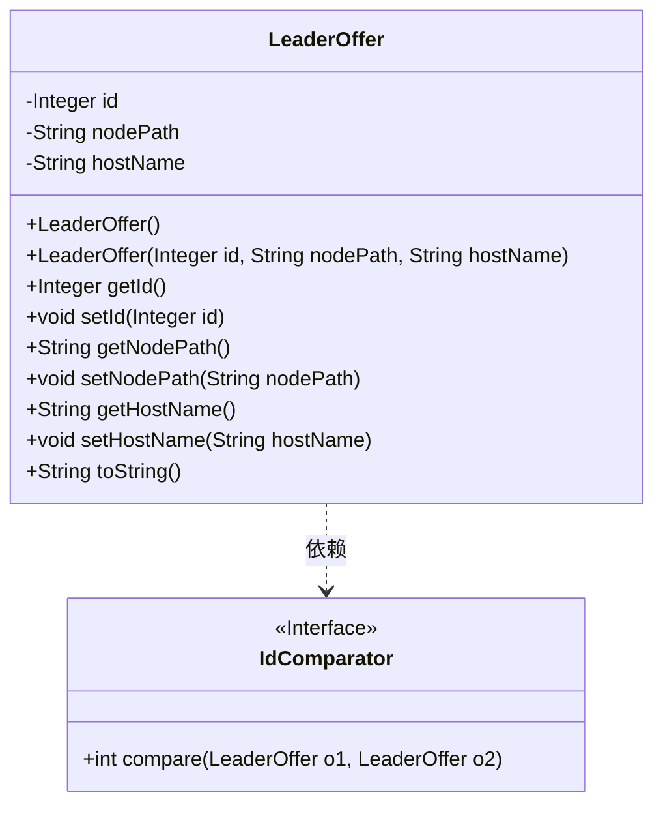
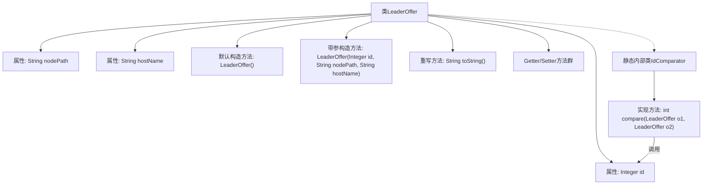

# 基础信息

|      |      |
|------|------|
| 名称 | LeaderOffer |
| 编码语言 | .java |
| 代码路径 | zookeeper/zookeeper-recipes/zookeeper-recipes-election/src/main/java/org/apache/zookeeper/recipes/leader/LeaderOffer.java |
| 包名 | org.apache.zookeeper.recipes.leader |
| 依赖项 | ['java.io.Serializable', 'java.util.Comparator'] |
| 概述说明 | LeaderOffer类包含id、nodePath和hostName属性，提供构造方法、getter/setter及toString方法，内部类IdComparator通过id比较实例。 |

# 说明

LeaderOffer类是一个包含id、nodePath和hostName三个私有属性的Java类。它提供了默认构造方法和带参构造方法，以及各属性的getter和setter方法。类中重写了toString方法，用于格式化输出对象内容。内部类IdComparator实现了Comparator接口，专门用于比较两个LeaderOffer对象的id属性。整个类结构清晰，功能明确，主要用于存储和比较领导节点信息。

# 类列表 Class Summary

| 名称   | 类型  | 说明 |
|-------|------|-------------|
| LeaderOffer | class | LeaderOffer类包含id、nodePath和hostName属性，提供构造方法、getter/setter及toString方法，内部类IdComparator通过id比较LeaderOffer实例。 |

## 类 LeaderOffer

|      |      |
|------|------|
| 访问范围 | public |
| 类型 | class |
| 名称 | LeaderOffer |
| 说明 | LeaderOffer类包含id、nodePath和hostName属性，提供构造方法、getter/setter及toString方法，内部类IdComparator通过id比较LeaderOffer实例。 |

### UML类图

这段代码描述了一个LeaderOffer类，用于存储领导节点的相关信息，包括id、节点路径和主机名。该类提供了默认构造方法和带参构造方法，以及各属性的getter和setter方法。内部静态类IdComparator实现了Comparator接口，专门用于比较两个LeaderOffer对象的id属性。类图清晰地展示了LeaderOffer的结构和与IdComparator的依赖关系，体现了通过id比较对象的核心功能。

### 内部方法调用关系图

这段代码定义了LeaderOffer类及其内部比较器类IdComparator。主类包含三个核心属性(id/nodePath/hostName)及其访问方法，通过静态内部类实现了基于id的比较功能。流程图清晰展示了类结构层次，包括属性定义、构造方法、标准方法以及内部比较器类的实现关系，特别突出了比较器方法对id属性的依赖调用路径。

### 字段列表 Field List

| 名称  | 类型  | 说明 |
|-------|-------|------|
| id | Integer | 私有整型ID字段。 |
| hostName | String | 私有字符串变量hostName，用于存储主机名。 |
| nodePath | String | 私有字符串变量nodePath。 |

### 方法列表 Method List

| 名称  | 类型  | 说明 |
|-------|-------|------|
| getHostName | String | 方法getHostName返回字符串hostName的值。 |
| getNodePath | String | 这是一个Java方法，返回字符串类型的nodePath变量值。方法名为getNodePath，无参数。 |
| toString | String | 重写toString方法，返回包含id、nodePath和hostName的字符串。 |
| getId | Integer | 获取对象ID的公共方法，返回整型值id。 |
| setNodePath | void | 这是一个Java方法，用于设置类的nodePath属性值。方法接受一个字符串参数nodePath，并将其赋值给当前对象的同名属性。 |
| setId | void | 设置对象ID的方法，将参数id赋值给当前对象的id属性。 |
| setHostName | void | 设置主机名的方法，将输入字符串赋值给类的hostName变量。 |

