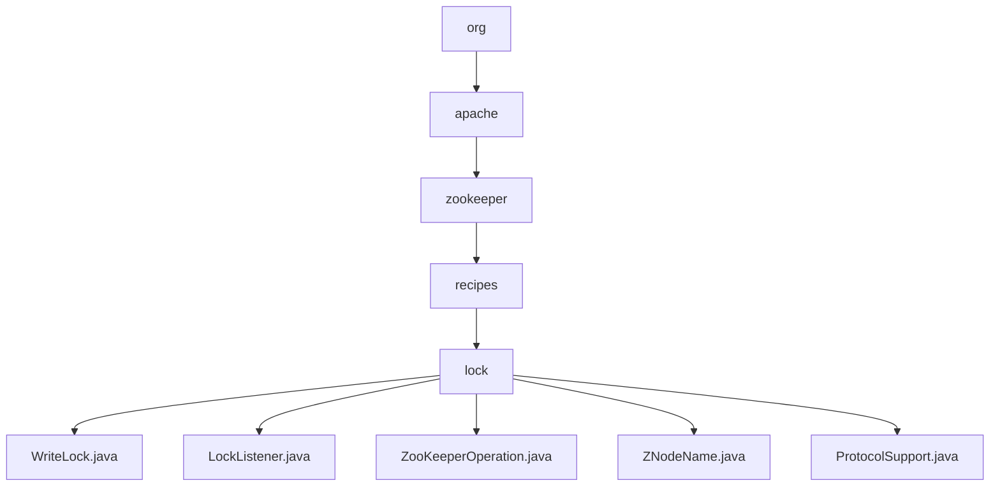

# 基础信息

|      |      |
|------|------|
| 名称 | org |
| 编码语言 | .java |
| 代码路径 | zookeeper/zookeeper-recipes/zookeeper-recipes-lock/src/main/java/org |
| 包名 | zookeeper.docs.zookeeper-recipes.zookeeper-recipes-lock.src.main.java.org |
| 概述说明 | WriteLock类基于ZooKeeper实现分布式写锁，支持公平获取和监听回调。LockListener接口定义锁状态回调。ZooKeeperOperation接口处理可重试操作。ZNodeName类解析带序号节点名。ProtocolSupport类提供ZooKeeper操作基类，支持重试和资源管理。 |

# 说明

## 概述  
1. 该模块是基于ZooKeeper实现的分布式写锁工具，核心职责是通过临时顺序节点实现公平锁获取与释放，类似银行排队叫号系统。  
2. 主要接口包括WriteLock的lock()/unlock()方法、LockListener的状态回调接口，以及ZooKeeperOperation的可重试操作接口。  
3. 关键数据结构包含ZNodeName的带序号节点比较逻辑，例如"node-1"会被拆解为前缀和序号进行排序。  
4. 外部依赖ZooKeeper客户端服务，通过ProtocolSupport基类封装ACL权限管理和会话重试机制。  
5. 例如锁获取时创建临时顺序节点，当成为最小序号节点时触发lockAcquired回调。  

## 主要业务场景  
1. 支持分布式环境下的写锁竞争流程，例如多客户端按节点序号顺序获取锁。  
2. 采用异步监听模式，通过LockListener回调通知锁状态变化，类似观察者模式的事件驱动机制。  
3. 功能完整性体现在支持会话中断恢复、自动重试和资源清理，例如ProtocolSupport提供10次重试上限。  
4. 主要用于需要强一致性的场景，如分布式配置更新或临界资源访问控制。  
5. 提供Java API接口，例如实现ZooKeeperOperation可定义自定义重试逻辑。  
6. 可与分布式系统集成，例如作为HBase RegionServer的分布式锁组件。

### 包内部结构视图

该流程图展示了Zookeeper锁模块的层级结构，从顶级包org开始，逐级展开到具体的锁实现文件。路径清晰地呈现了从org.apache.zookeeper.recipes.lock包到5个Java类文件的完整继承关系，包括WriteLock、LockListener等核心锁功能实现类，层级深度为5级，共包含8个节点。

# 文件列表 File List

| 名称   | 类型  | 说明 |
|-------|------|-------------|
| [apache](apache/_module.md) | package | WriteLock类基于ZooKeeper实现分布式写锁，支持公平获取和监听回调。LockListener接口定义锁状态回调。ZooKeeperOperation接口处理可重试操作。ZNodeName类解析带序号节点名。ProtocolSupport类提供ZooKeeper操作基类，支持重试和资源管理。 |

