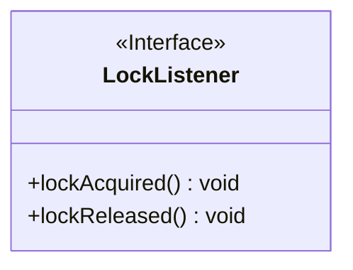
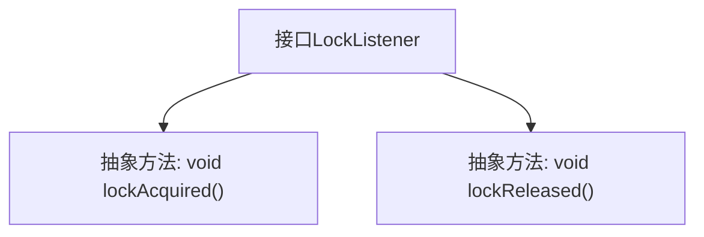

# 基础信息

|      |      |
|------|------|
| 名称 | LockListener |
| 编码语言 | .java |
| 代码路径 | zookeeper/zookeeper-recipes/zookeeper-recipes-lock/src/main/java/org/apache/zookeeper/recipes/lock/LockListener.java |
| 包名 | org.apache.zookeeper.recipes.lock |
| 依赖项 | [] |
| 概述说明 | LockListener接口定义了两个回调方法：lockAcquired()在锁被获取时调用，lockReleased()在锁被释放时调用。 |

# 说明

这是一个名为LockListener的公共接口，定义了两个回调方法。lockAcquired方法在锁被获取时调用，lockReleased方法在锁被释放时调用。该接口用于监听锁状态的变化，不包含任何实现代码。

# 类列表 Class Summary

| 名称   | 类型  | 说明 |
|-------|------|-------------|
| LockListener | interface | LockListener接口定义了两个回调方法：lockAcquired()在锁被获取时调用，lockReleased()在锁被释放时调用。 |

## 类 LockListener

|      |      |
|------|------|
| 访问范围 | public |
| 类型 | interface |
| 名称 | LockListener |
| 说明 | LockListener接口定义了两个回调方法：lockAcquired()在锁被获取时调用，lockReleased()在锁被释放时调用。 |

### UML类图

这段代码定义了一个名为`LockListener`的接口，该接口包含两个方法：`lockAcquired()`和`lockReleased()`，分别用于在锁被获取和释放时进行回调。接口用`<<Interface>>`标记，表明这是一个纯抽象接口，不包含具体实现。该接口可能被其他类实现，用于监听锁状态的变化，适用于需要响应锁获取/释放事件的场景，如并发控制或资源同步机制。

### 内部方法调用关系图

该流程图展示了LockListener接口的结构，包含两个核心回调方法：lockAcquired()和lockReleased()。这两个抽象方法分别定义了获取锁和释放锁时的回调行为，箭头表示接口与方法间的从属关系。该设计模式常用于实现异步锁状态通知机制，适用于需要监控锁状态变化的场景。

### 字段列表 Field List

| 名称  | 类型  | 说明 |
|-------|-------|------|

### 方法列表 Method List

| 名称  | 类型  | 说明 |
|-------|-------|------|
| lockReleased | void | 释放锁。 |
| lockAcquired | void | 方法声明：获取锁成功时的回调。 |

