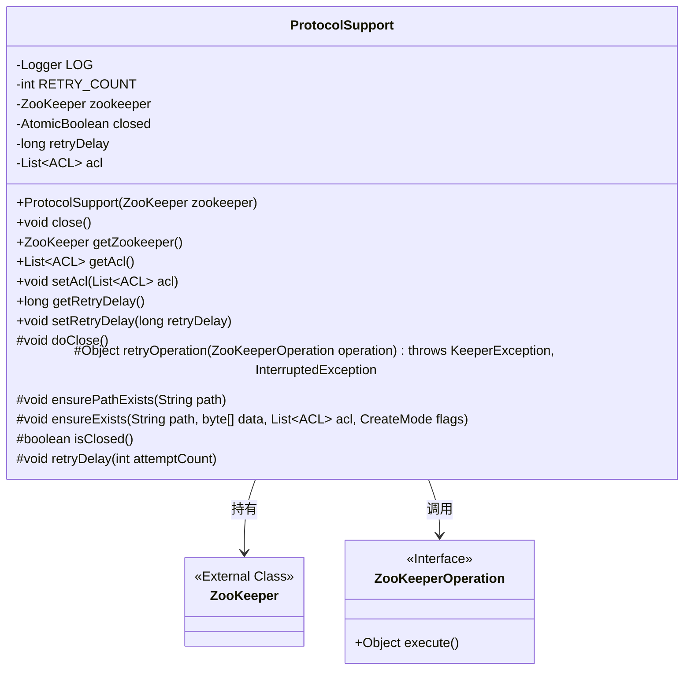
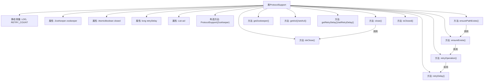

# 基础信息

|      |      |
|------|------|
| 名称 | ProtocolSupport |
| 编码语言 | .java |
| 代码路径 | zookeeper/zookeeper-recipes/zookeeper-recipes-lock/src/main/java/org/apache/zookeeper/recipes/lock/ProtocolSupport.java |
| 包名 | org.apache.zookeeper.recipes.lock |
| 依赖项 | ['java.util.List', 'java.util.concurrent.atomic.AtomicBoolean', 'org.apache.zookeeper.CreateMode', 'org.apache.zookeeper.KeeperException', 'org.apache.zookeeper.ZooDefs', 'org.apache.zookeeper.ZooKeeper', 'org.apache.zookeeper.data.ACL', 'org.apache.zookeeper.data.Stat', 'org.slf4j.Logger', 'org.slf4j.LoggerFactory'] |
| 概述说明 | ProtocolSupport类封装ZooKeeper操作，提供重试机制、路径确保和资源管理功能，支持自定义ACL和重试延迟设置。 |

# 说明

ProtocolSupport类是一个支持ZooKeeper协议操作的基类，封装了重试机制和资源管理功能。它包含以下核心功能：管理ZooKeeper客户端实例，设置ACL权限列表，控制重试延迟时间（默认500毫秒，最多重试10次），提供路径存在性检查和创建操作。通过AtomicBoolean实现线程安全的关闭机制，子类可通过覆盖doClose()实现自定义资源释放。关键方法包括带异常处理的retryOperation()、ensurePathExists()等，所有操作均支持连接丢失时的自动重试，并通过日志记录异常情况。

# 类列表 Class Summary

| 名称   | 类型  | 说明 |
|-------|------|-------------|
| ProtocolSupport | class | ProtocolSupport类封装了ZooKeeper客户端操作，提供重试机制、路径确保和资源管理功能，支持自定义ACL和重试延迟设置。 |

## 类 ProtocolSupport

|      |      |
|------|------|
| 访问范围 | None |
| 类型 | class |
| 名称 | ProtocolSupport |
| 说明 | ProtocolSupport类封装了ZooKeeper客户端操作，提供重试机制、路径确保和资源管理功能，支持自定义ACL和重试延迟设置。 |

### UML类图

类图描述：ProtocolSupport类是一个支持ZooKeeper协议操作的辅助类，封装了重试机制、路径确保等常用功能。它持有一个ZooKeeper客户端实例，通过原子布尔值管理关闭状态，提供ACL列表和重试延迟时间的配置。核心方法retryOperation实现了带重试机制的操作执行，ensureExists确保节点存在。该类设计为可扩展，通过protected方法允许子类自定义关闭逻辑。

### 内部方法调用关系图

该流程图展示了ProtocolSupport类的完整结构，包含5个属性和11个主要方法。核心功能围绕ZooKeeper连接管理展开，重点展示了关闭机制(close/doClose)和重试机制(retryOperation/retryDelay)的调用关系，以及路径确保功能(ensurePathExists/ensureExists)的层级调用。类设计采用模板方法模式，通过protected方法允许子类扩展，同时维护了原子性操作和异常处理能力。

### 字段列表 Field List

| 名称  | 类型  | 说明 |
|-------|-------|------|
| RETRY_COUNT = 10 | int | 定义私有静态常量RETRY_COUNT，值为10，表示重试次数。 |
| acl = ZooDefs.Ids.OPEN_ACL_UNSAFE | List<ACL> | ZooKeeper默认ACL设置为开放权限，不安全。 |
| retryDelay = 500L | long | 私有长整型变量retryDelay初始值为500毫秒。 |
| closed = new AtomicBoolean(false) | AtomicBoolean | 私有原子布尔变量closed，初始值为false。 |
| zookeeper | ZooKeeper | 受保护的ZooKeeper客户端实例。 |
| LOG = LoggerFactory.getLogger(ProtocolSupport.class) | Logger | 私有静态日志常量LOG，通过LoggerFactory获取ProtocolSupport类的日志实例。 |

### 方法列表 Method List

| 名称  | 类型  | 说明 |
|-------|-------|------|
| setAcl | void | 这是一个Java方法，用于设置对象的ACL（访问控制列表）属性。方法接受一个ACL类型的列表参数，并将其赋值给对象的acl成员变量。 |
| retryOperation | Object | 方法retryOperation尝试执行ZooKeeper操作，失败时重试。若会话过期直接抛出异常，连接丢失则重试指定次数后抛出异常。重试间有延迟。 |
| getZookeeper | ZooKeeper | 获取ZooKeeper实例的方法，返回成员变量zookeeper。 |
| close | void | 方法close()通过原子操作检查closed状态，若为false则设为true并执行doClose()，确保资源仅关闭一次。 |
| ensurePathExists | void | 确保路径存在，调用ensureExists方法，参数包括路径、空值、acl和持久化模式。 |
| ensureExists | void | 方法ensureExists检查ZooKeeper路径是否存在，不存在则创建节点，处理异常并记录日志。 |
| isClosed | boolean | 检查对象是否已关闭，返回布尔值。 |
| retryDelay | void | 方法retryDelay根据尝试次数计算延迟时间并休眠，捕获中断异常并记录日志。 |
| setRetryDelay | void | 设置重试延迟时间的方法，参数为长整型retryDelay。 |
| getRetryDelay | long | 获取重试延迟时间的方法，返回retryDelay值。 |
| getAcl | List<ACL> | 获取ACL列表的方法，直接返回成员变量acl。 |
| doClose | void | 这是一个空的受保护方法doClose，用于关闭操作，无具体实现。 |

