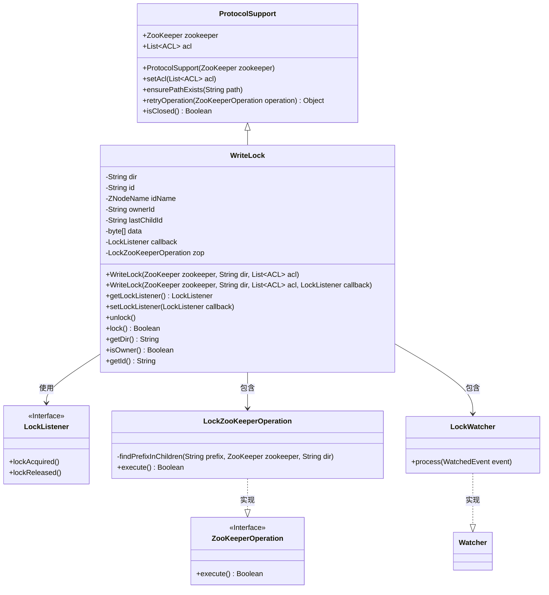
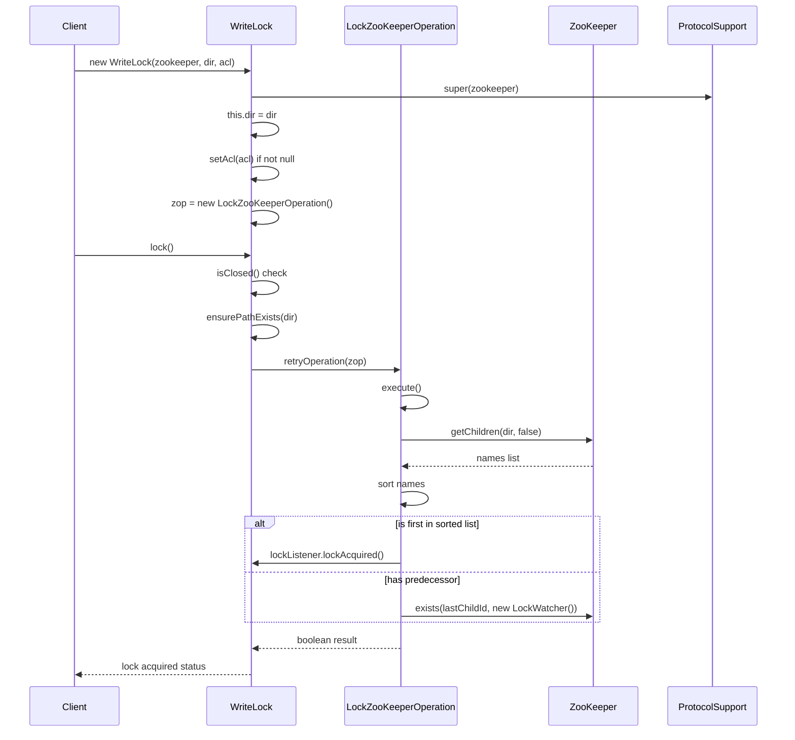

# 基础信息

|      |      |
|------|------|
| 名称 | WriteLock |
| 编码语言 | .java |
| 代码路径 | zookeeper/zookeeper-recipes/zookeeper-recipes-lock/src/main/java/org/apache/zookeeper/recipes/lock/WriteLock.java |
| 包名 | org.apache.zookeeper.recipes.lock |
| 依赖项 | ['org.apache.zookeeper.CreateMode.EPHEMERAL_SEQUENTIAL', 'edu.umd.cs.findbugs.annotations.SuppressFBWarnings', 'java.util.List', 'java.util.SortedSet', 'java.util.TreeSet', 'org.apache.zookeeper.KeeperException', 'org.apache.zookeeper.WatchedEvent', 'org.apache.zookeeper.Watcher', 'org.apache.zookeeper.ZooKeeper', 'org.apache.zookeeper.data.ACL', 'org.apache.zookeeper.data.Stat', 'org.slf4j.Logger', 'org.slf4j.LoggerFactory'] |
| 概述说明 | WriteLock类实现基于ZooKeeper的分布式写锁，支持锁获取、释放及回调监听，通过临时顺序节点和监听机制确保互斥访问。 |

# 说明

WriteLock类是一个基于ZooKeeper实现的分布式写锁工具，继承自ProtocolSupport。核心功能包括：通过ZNodeName排序机制实现公平锁获取，支持锁释放和监听回调。主要属性包含目录路径dir、节点ID、所有者ID、最后子节点ID及锁监听器callback。关键操作包括lock()尝试获取锁，unlock()释放锁，内部类LockZooKeeperOperation处理锁竞争逻辑，通过临时顺序节点实现锁队列。当成为最小序号节点时触发lockAcquired回调，支持会话中断处理和异常重试机制。

# 类列表 Class Summary

| 名称   | 类型  | 说明 |
|-------|------|-------------|
| WriteLock | class | WriteLock类实现基于ZooKeeper的分布式写锁，支持锁获取、释放及回调监听，通过临时顺序节点实现竞争机制。 |

## 类 WriteLock

|      |      |
|------|------|
| 访问范围 | public |
| 类型 | class |
| 名称 | WriteLock |
| 说明 | WriteLock类实现基于ZooKeeper的分布式写锁，支持锁获取、释放及回调监听，通过临时顺序节点实现竞争机制。 |

### UML类图

类图描述：
WriteLock类继承自ProtocolSupport，实现了基于ZooKeeper的分布式写锁机制。它包含核心操作类LockZooKeeperOperation和监听器LockWatcher，通过回调接口LockListener通知锁状态变化。ProtocolSupport提供基础ZK操作支持，ZooKeeperOperation接口定义执行契约。该结构实现了完整的锁竞争、监听和释放流程，通过临时顺序节点实现公平锁机制，支持可重试操作和异常处理。

### 内部方法调用关系图

```mermaid
graph TD
    A["类WriteLock"]
    B["继承: ProtocolSupport"]
    C["属性: Logger LOG"]
    D["属性: String dir"]
    E["属性: String id"]
    F["属性: ZNodeName idName"]
    G["属性: String ownerId"]
    H["属性: String lastChildId"]
    I["属性: byte[] data"]
    J["属性: LockListener callback"]
    K["属性: LockZooKeeperOperation zop"]
    L["构造方法: WriteLock(ZooKeeper, String, List<ACL>)"]
    M["构造方法: WriteLock(ZooKeeper, String, List<ACL>, LockListener)"]
    N["方法: LockListener getLockListener()"]
    O["方法: void setLockListener(LockListener)"]
    P["方法: void unlock()"]
    Q["内部类: LockWatcher"]
    R["内部类: LockZooKeeperOperation"]
    S["方法: boolean lock()"]
    T["方法: String getDir()"]
    U["方法: boolean isOwner()"]
    V["方法: String getId()"]

    A --> B
    A --> C
    A --> D
    A --> E
    A --> F
    A --> G
    A --> H
    A --> I
    A --> J
    A --> K
    A --> L
    A --> M
    A --> N
    A --> O
    A --> P
    A --> Q
    A --> R
    A --> S
    A --> T
    A --> U
    A --> V
```

这段代码实现了一个基于ZooKeeper的分布式写锁机制。WriteLock类通过创建临时顺序节点来实现锁的获取和释放，内部通过LockZooKeeperOperation处理与ZooKeeper的交互逻辑，包含节点创建、监视前驱节点等核心功能。流程图展示了类结构和主要方法调用关系，时序图则详细描述了获取锁时的交互过程，包括与ZooKeeper服务的通信和状态检查。

### 字段列表 Field List

| 名称  | 类型  | 说明 |
|-------|-------|------|
| lastChildId | String | 私有字符串变量lastChildId，用于存储最后子项ID。 |
| ownerId | String | 私有字符串类型变量ownerId |
| data = {0x12, 0x34} | byte[] | 私有字节数组data包含两个元素：0x12和0x34。 |
| idName | ZNodeName | 私有成员变量idName，类型为ZNodeName。 |
| dir | String | 私有字符串变量dir，用于存储目录路径。 |
| LOG = LoggerFactory.getLogger(WriteLock.class) | Logger | 定义日志记录器LOG，关联WriteLock类用于输出日志。 |
| zop | LockZooKeeperOperation | 私有锁ZooKeeper操作实例zop。 |
| id | String | 私有字符串类型变量id。 |
| callback | LockListener | 私有锁监听器回调变量。 |

### 方法列表 Method List

| 名称  | 类型  | 说明 |
|-------|-------|------|
| getDir | String | 获取目录路径的方法，返回字符串类型变量dir。 |
| getLockListener | LockListener | 这是一个同步方法，返回当前对象的锁监听器实例。 |
| setLockListener | void | 同步方法设置锁监听器，将传入回调赋值给成员变量callback。 |
| lock | boolean | 这是一个Java同步方法，检查关闭状态后确保路径存在，并通过重试操作获取锁，成功返回true，失败或异常返回false。 |
| unlock | void | 同步解锁方法，检查状态后删除ZK节点，处理中断和异常，最后触发锁释放回调并清空ID。 |
| isOwner | boolean | 检查当前对象ID是否与所有者ID相同，返回布尔值。 |
| getId | String | 这是一个Java方法，返回对象的id属性值。方法名为getId，返回类型为String。 |

