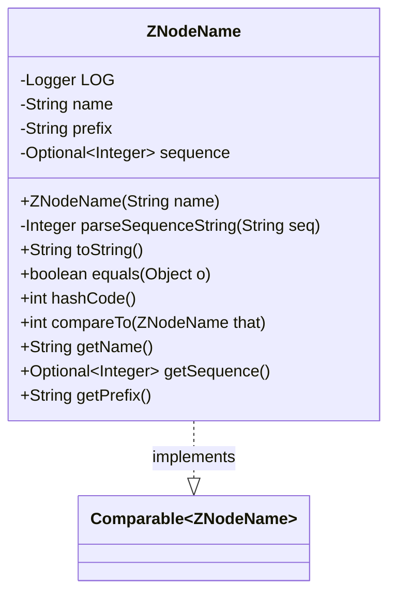
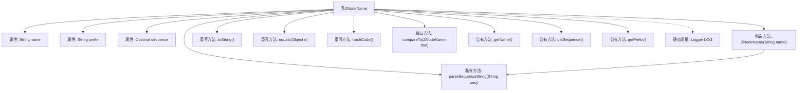

# 基础信息

|      |      |
|------|------|
| 名称 | ZNodeName |
| 编码语言 | .java |
| 代码路径 | zookeeper/zookeeper-recipes/zookeeper-recipes-lock/src/main/java/org/apache/zookeeper/recipes/lock/ZNodeName.java |
| 包名 | org.apache.zookeeper.recipes.lock |
| 依赖项 | ['java.util.Objects', 'java.util.Optional', 'org.slf4j.Logger', 'org.slf4j.LoggerFactory'] |
| 概述说明 | ZNodeName类用于处理带序列号的znode名称，包含名称解析、序列号提取及比较功能，支持equals、hashCode和compareTo方法。 |

# 说明

ZNodeName类实现了Comparable接口，用于处理带序号后缀的ZooKeeper节点名称。该类包含三个核心字段：原始名称name、前缀prefix和可选序号sequence。构造函数解析名称，提取前缀和序号（如"node-1"拆分为"node"和1）。提供序号比较逻辑，优先比较序号，其次比较前缀。重写了equals、hashCode和toString方法，确保基于名称的等价性判断。提供getName、getSequence和getPrefix方法获取各字段值。序号解析失败时会记录警告日志并返回null。

# 类列表 Class Summary

| 名称   | 类型  | 说明 |
|-------|------|-------------|
| ZNodeName | class | ZNodeName类实现Comparable接口，用于处理带序列号的znode名称，包含名称解析、序列号提取及比较功能。 |

## 类 ZNodeName

|      |      |
|------|------|
| 访问范围 | None |
| 类型 | class |
| 名称 | ZNodeName |
| 说明 | ZNodeName类实现Comparable接口，用于处理带序列号的znode名称，包含名称解析、序列号提取及比较功能。 |

### UML类图

类图描述：
ZNodeName类实现了Comparable接口，用于处理ZooKeeper节点名称的解析和比较。该类包含三个主要私有字段：原始名称(name)、前缀(prefix)和可选的序列号(sequence)。核心功能包括解析名称中的序列号(parseSequenceString)、实现Comparable接口的compareTo方法进行节点比较，以及标准的equals/hashCode方法。构造方法会处理名称字符串，将其分解为前缀和序列号两部分，序列号可能不存在(Optional.empty)。该类提供了获取名称、前缀和序列号的公共方法，适用于需要处理有序ZooKeeper节点的场景。

### 内部方法调用关系图

该流程图展示了ZNodeName类的完整结构，包含3个私有属性、1个构造方法和9个成员方法。核心逻辑体现在构造方法中对节点名的解析处理，以及compareTo方法实现的序列号比较逻辑。类实现了Comparable接口，支持基于序列号的排序，同时重写了equals/hashCode确保对象一致性。异常处理体现在parseSequenceString方法中对数字格式的容错机制。

### 字段列表 Field List

| 名称  | 类型  | 说明 |
|-------|-------|------|
| name | String | 私有字符串变量name。 |
| LOG = LoggerFactory.getLogger(ZNodeName.class) | Logger | 私有静态日志常量LOG，用于ZNodeName类的日志记录。 |
| prefix | String | 私有字符串常量prefix。 |
| sequence | Optional<Integer> | 私有不可变整型序列，可选。 |

### 方法列表 Method List

| 名称  | 类型  | 说明 |
|-------|-------|------|
| hashCode | int | 重写hashCode方法，返回对象name属性的哈希值。 |
| getName | String | 这是一个Java方法，返回字符串类型的成员变量name的值。 |
| getSequence | Optional<Integer> | 方法返回可选的整数序列值。 |
| getPrefix | String | 这是一个Java方法，返回字符串变量prefix的值。方法名为getPrefix，访问修饰符为public。 |
| parseSequenceString | Integer | 私有方法parseSequenceString将字符串seq转为整数，失败时记录警告并返回null。 |
| compareTo | int | 比较两个ZNodeName对象：若两者都有序列号，先比较序列号，相同则比较前缀；若仅当前对象有序列号返回-1，仅另一对象有序列号返回1，否则比较前缀。 |
| toString | String | 这是一个Java方法重写，用于格式化输出ZNodeName对象的名称、前缀和序列号。 |
| equals | boolean | 重写equals方法，比较对象引用、类型和name属性是否相同。 |

