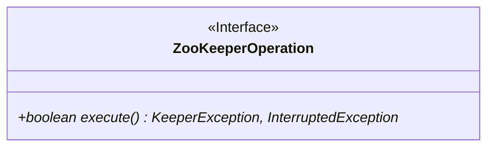
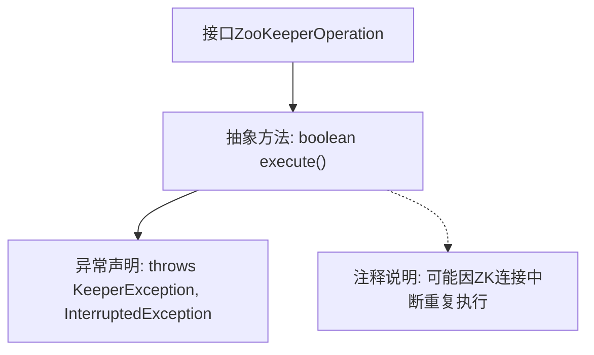

# 基础信息

|      |      |
|------|------|
| 名称 | ZooKeeperOperation |
| 编码语言 | .java |
| 代码路径 | zookeeper/zookeeper-recipes/zookeeper-recipes-lock/src/main/java/org/apache/zookeeper/recipes/lock/ZooKeeperOperation.java |
| 包名 | org.apache.zookeeper.recipes.lock |
| 依赖项 | ['org.apache.zookeeper.KeeperException'] |
| 概述说明 | ZooKeeperOperation接口定义了execute方法，执行可能因连接中断而重复的操作，返回布尔结果或抛出KeeperException和InterruptedException异常。 |

# 说明

这是一个名为ZooKeeperOperation的公共接口，定义了一个execute方法。该方法执行操作，可能在ZooKeeper连接断开时多次执行。方法返回布尔类型结果或null，可能抛出KeeperException和InterruptedException异常。注释说明该方法用于执行可能涉及多次尝试的操作。

# 类列表 Class Summary

| 名称   | 类型  | 说明 |
|-------|------|-------------|
| ZooKeeperOperation | interface | ZooKeeperOperation接口定义了execute方法，执行可能因连接中断而重试的操作，返回布尔结果或抛出KeeperException和InterruptedException异常。 |

## 类 ZooKeeperOperation

|      |      |
|------|------|
| 访问范围 | public |
| 类型 | interface |
| 名称 | ZooKeeperOperation |
| 说明 | ZooKeeperOperation接口定义了execute方法，执行可能因连接中断而重试的操作，返回布尔结果或抛出KeeperException和InterruptedException异常。 |

### UML类图

该图展示了一个ZooKeeper操作接口的设计，其中ZooKeeperOperation作为核心接口定义了分布式协调服务中的原子操作规范。接口包含一个execute()方法，该方法声明可能抛出ZeeperException和InterruptedException异常，体现了在分布式环境下处理网络中断和线程阻塞的典型设计模式。这种接口通常用于实现ZooKeeper客户端的重试机制，当连接中断时会自动重新执行操作。

### 内部方法调用关系图

该流程图描述了ZooKeeperOperation接口的核心结构，主要包含一个可能抛出两种异常的执行方法。接口定义了分布式操作的标准行为，其关键特性是方法执行具备幂等性（可重复执行），适用于ZooKeeper连接不稳定的场景。注释明确说明了当与ZooKeeper的连接中断时，该方法会被自动重试的特性设计。

### 字段列表 Field List

| 名称  | 类型  | 说明 |
|-------|-------|------|

### 方法列表 Method List

| 名称  | 类型  | 说明 |
|-------|-------|------|
| execute | boolean | 方法execute可能抛出KeeperException和InterruptedException，返回布尔值。 |

