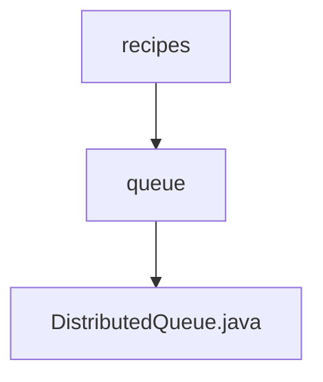

# 基础信息

|      |      |
|------|------|
| 名称 | recipes |
| 编码语言 | .java |
| 代码路径 | zookeeper/zookeeper-recipes/zookeeper-recipes-queue/src/main/java/org/apache/zookeeper/recipes |
| 包名 | zookeeper.docs.zookeeper-recipes.zookeeper-recipes-queue.src.main.java.org.apache.zookeeper.recipes |
| 概述说明 | DistributedQueue是基于ZooKeeper实现的分布式队列，支持offer添加元素，take/remove/poll获取并删除元素，peek/element查看队首元素，通过有序子节点管理队列顺序。 |

# 说明

DistributedQueue是一个基于ZooKeeper实现的分布式队列类，提供线程安全的队列操作。核心功能包括：通过orderedChildren方法获取有序子节点列表，smallestChildName查找最小序号节点。支持标准队列操作：element查看队首元素，remove删除并返回队首，take阻塞式获取队首，offer添加元素，peek非空安全查看队首，poll非空安全移除队首。使用持久顺序节点存储数据，通过重试机制处理并发修改，利用LatchChildWatcher实现阻塞等待。包含日志记录和异常处理，确保在节点不存在时自动创建父目录。

### 包内部结构视图

该流程图展示了Zookeeper Recipes项目中队列模块的层级结构。最上层是recipes目录，包含queue子目录，queue目录下包含DistributedQueue.java实现文件。这是一个典型的三级项目结构，体现了分布式队列功能在Zookeeper中的实现路径。

# 文件列表 File List

| 名称   | 类型  | 说明 |
|-------|------|-------------|
| [queue](queue/_module.md) | package | DistributedQueue是基于ZooKeeper实现的分布式队列，支持offer添加元素，take/remove/poll获取并删除元素，peek/element查看队首元素，通过有序子节点管理队列顺序。 |

