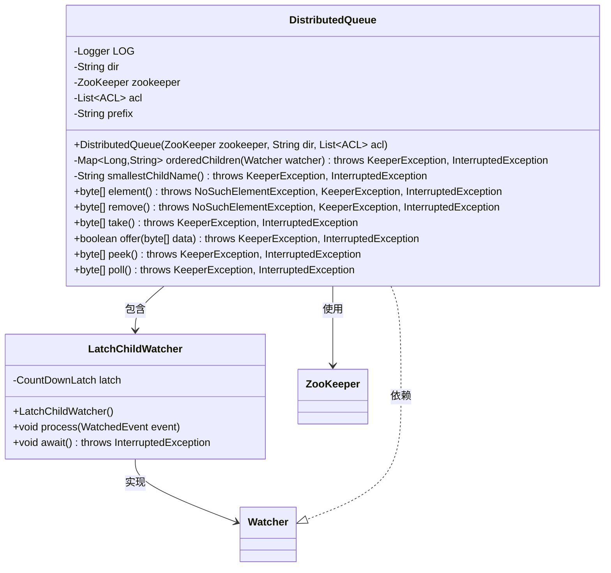
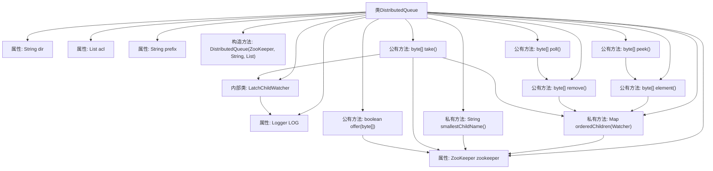
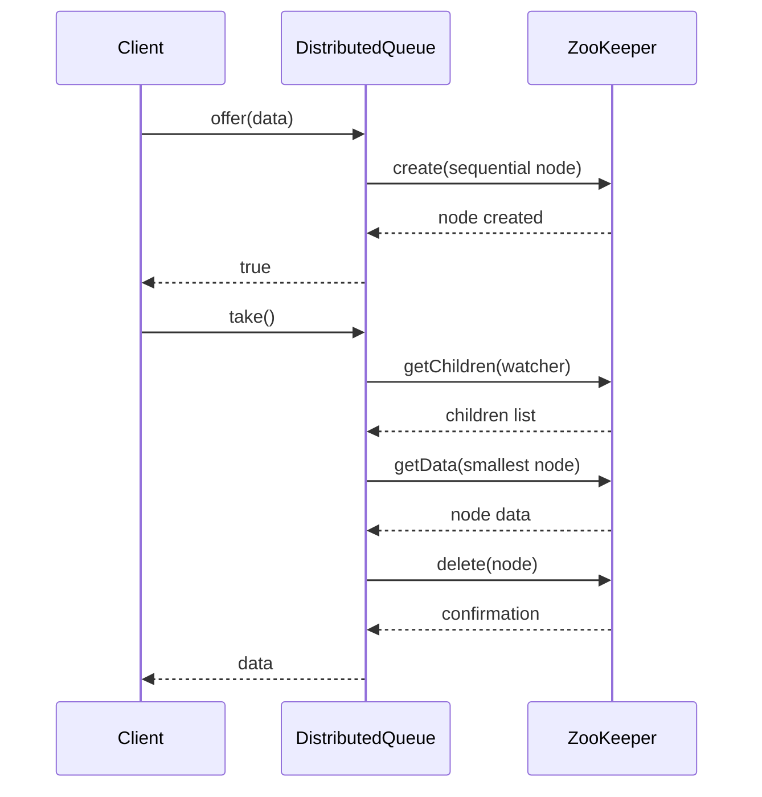

# 基础信息

|      |      |
|------|------|
| 名称 | DistributedQueue |
| 编码语言 | .java |
| 代码路径 | zookeeper/zookeeper-recipes/zookeeper-recipes-queue/src/main/java/org/apache/zookeeper/recipes/queue/DistributedQueue.java |
| 包名 | org.apache.zookeeper.recipes.queue |
| 依赖项 | ['java.util.List', 'java.util.Map', 'java.util.NoSuchElementException', 'java.util.TreeMap', 'java.util.concurrent.CountDownLatch', 'org.apache.zookeeper.CreateMode', 'org.apache.zookeeper.KeeperException', 'org.apache.zookeeper.WatchedEvent', 'org.apache.zookeeper.Watcher', 'org.apache.zookeeper.ZooDefs', 'org.apache.zookeeper.ZooKeeper', 'org.apache.zookeeper.data.ACL', 'org.slf4j.Logger', 'org.slf4j.LoggerFactory'] |
| 概述说明 | DistributedQueue是基于ZooKeeper实现的分布式队列，支持offer添加元素，take/remove/poll获取并删除元素，peek/element查看队首元素，通过有序子节点管理队列顺序。 |

# 说明

DistributedQueue是一个基于ZooKeeper实现的分布式队列类，提供线程安全的队列操作。核心功能包括：通过orderedChildren方法获取有序子节点列表，smallestChildName查找最小序号节点。支持标准队列操作：element查看队首元素，remove删除并返回队首，take阻塞式获取队首，offer添加元素，peek非空安全查看队首，poll非空安全移除队首。使用持久顺序节点存储数据，通过重试机制处理并发修改，利用LatchChildWatcher实现阻塞等待。包含日志记录和异常处理，确保在节点不存在时自动创建父目录。

# 类列表 Class Summary

| 名称   | 类型  | 说明 |
|-------|------|-------------|
| DistributedQueue | class | 分布式队列实现，基于ZooKeeper，支持offer添加元素，take阻塞获取，peek查看队首，poll非阻塞移除，element和remove抛出异常，确保线程安全。 |

## 类 DistributedQueue

|      |      |
|------|------|
| 访问范围 | public |
| 类型 | class |
| 名称 | DistributedQueue |
| 说明 | 分布式队列实现，基于ZooKeeper，支持offer添加元素，take阻塞获取，peek查看队首，poll非阻塞移除，element和remove抛出异常，确保线程安全。 |

### UML类图

类图描述：
该图展示了DistributedQueue类及其内部类LatchChildWatcher的结构。DistributedQueue是一个基于ZooKeeper实现的分布式队列，包含核心队列操作如offer/poll/take等，通过ZooKeeper节点管理队列元素。LatchChildWatcher实现了Watcher接口，用于异步监控子节点变化。类图中清晰地表现了主类与ZooKeeper服务的依赖关系、内部类的实现关系，以及所有关键方法的可见性，包括私有方法orderedChildren和smallestChildName。

### 内部方法调用关系图

该流程图展示了DistributedQueue类的完整结构，包含8个核心方法和4个关键属性。类通过ZooKeeper实现分布式队列功能，核心逻辑围绕有序子节点管理展开。时序图重点描述了offer和take两个典型操作：offer通过创建顺序节点实现入队，take通过获取/删除最小序号节点实现阻塞式出队。所有操作都包含对ZooKeeper异常状态的处理，特别是对节点不存在(NoNodeException)的自动恢复机制。内部类LatchChildWatcher用于实现take操作的阻塞等待功能。

### 字段列表 Field List

| 名称  | 类型  | 说明 |
|-------|-------|------|
| LOG = LoggerFactory.getLogger(DistributedQueue.class) | Logger | 分布式队列类的静态日志常量声明。 |
| acl = ZooDefs.Ids.OPEN_ACL_UNSAFE | List<ACL> | 私有变量acl初始化为ZooDefs.Ids.OPEN_ACL_UNSAFE，表示开放无安全限制的ACL列表。 |
| zookeeper | ZooKeeper | 私有ZooKeeper实例变量zookeeper。 |
| dir | String | 私有不可变字符串变量dir。 |
| prefix = "qn-" | String | 私有字符串常量prefix初始化为"qn-"。 |

### 方法列表 Method List

| 名称  | 类型  | 说明 |
|-------|-------|------|
| element | byte[] | 该方法从ZooKeeper获取最小序列号的子节点数据，若节点不存在或无子节点则抛出异常。循环尝试直到成功或无可尝试节点。 |
| orderedChildren | Map<Long, String> | 方法orderedChildren获取ZooKeeper子节点，过滤并排序。检查节点名前缀，提取后缀数字作为键存入TreeMap，忽略格式错误节点。返回有序子节点映射。 |
| peek | byte[] | 该方法尝试获取元素数据，成功则返回字节数组，若元素不存在则捕获异常并返回null。可能抛出KeeperException或InterruptedException。 |
| offer | boolean | 该方法持续尝试在ZooKeeper指定目录下创建顺序节点，若目录不存在则先创建目录。成功返回true，异常抛出KeeperException或InterruptedException。 |
| smallestChildName | String | 获取ZooKeeper子节点中名称符合前缀且数字后缀最小的节点名，异常时返回null。 |
| remove | byte[] | 该方法从ZooKeeper目录中移除并返回首个子节点的数据。若无子节点则抛出NoSuchElementException。若节点被其他客户端抢先删除则重试。成功时返回节点数据并删除该节点。 |
| take | byte[] | 该方法从ZooKeeper目录中获取并删除第一个有效节点数据。若目录不存在则创建，若无子节点则等待。成功获取数据后删除节点并返回数据，若节点已被其他客户端删除则跳过。 |
| poll | byte[] | 该方法尝试移除并返回字节数组，若失败则返回null。可能抛出KeeperException和InterruptedException异常。 |

