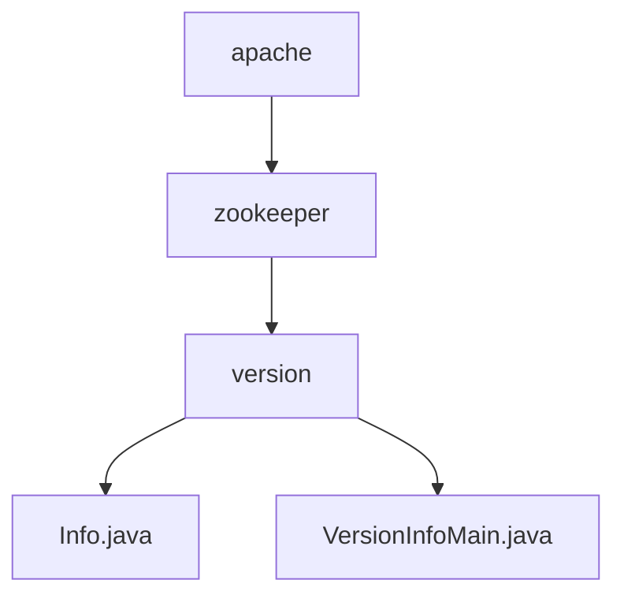

# 基础信息

|      |      |
|------|------|
| 名称 | apache |
| 编码语言 | .java |
| 代码路径 | zookeeper/zookeeper-server/src/main/java-filtered/org/apache |
| 包名 | zookeeper.docs.zookeeper-server.src.main.java-filtered.org.apache |
| 概述说明 | Info接口定义版本号常量（MAJOR、MINOR、MICRO等）和构建信息（REVISION_HASH、BUILD_DATE）。VersionInfoMain类实现该接口，输出ZooKeeper版本和构建时间。 |

# 说明

## 概述  
1.该模块核心职责是管理并输出Apache ZooKeeper的版本元数据，类似软件包的版本标识系统。  
2.主要接口规范为Java公共接口，包含静态常量字段；例如MAJOR/MINOR/MICRO构成三级版本号体系。  
3.关键数据结构包括版本号分段（主/次/增量）、Git提交哈希和构建时间戳；例如REVISION_HASH替代已弃用的REVISION字段。  
4.外部依赖项为Git版本控制系统，通过插值动态注入提交ID；例如BUILD_DATE由构建工具自动生成。  

## 主要业务场景  
1.支持版本信息查询流程，例如命令行调用输出完整版本标识。  
2.典型交互模式为同步调用，例如main方法直接打印${project.version}插值结果。  
3.功能完整性体现在覆盖语义化版本规范，例如QUALIFIER支持预发布标识。  
4.主要使用场景包括CI/CD构建验证，例如通过REVISION_HASH追踪代码快照。  
5.提供静态元数据API，例如IDE插件可读取BUILD_DATE进行依赖分析。  
6.第三方集成案例为构建工具链对接，例如Maven过滤资源文件时注入版本变量。

### 包内部结构视图

该流程图展示了Zookeeper项目中Java源代码的层级结构。从根节点"apache"开始，依次展开到"zookeeper"模块，再到"version"子目录，最后显示该目录下的两个Java文件：Info.java和VersionInfoMain.java。整个结构清晰地呈现了从项目根目录到具体实现文件的完整路径关系，共包含5个节点，准确反映了输入路径的层级信息。

# 文件列表 File List

| 名称   | 类型  | 说明 |
|-------|------|-------------|
| [zookeeper](zookeeper/_module.md) | package | Info接口定义版本号常量（MAJOR、MINOR、MICRO等）和构建信息（REVISION_HASH、BUILD_DATE）。VersionInfoMain类实现该接口，输出ZooKeeper版本和构建时间。 |

