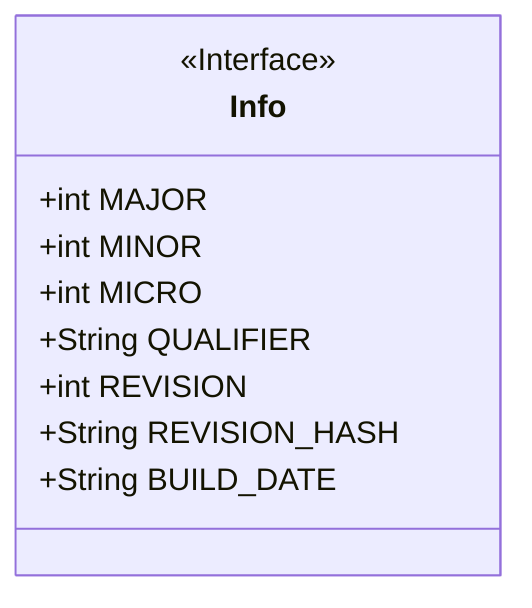
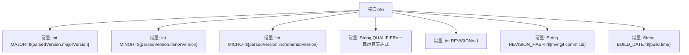

# 基础信息

|      |      |
|------|------|
| 名称 | Info |
| 编码语言 | .java |
| 代码路径 | zookeeper/zookeeper-server/src/main/java-filtered/org/apache/zookeeper/version/Info.java |
| 包名 | org.apache.zookeeper.version |
| 依赖项 | [] |
| 概述说明 | 接口Info定义了版本信息，包含主版本号、次版本号、微版本号、限定符、修订号（已弃用）、修订哈希和构建日期。 |

# 说明

该内容定义了一个名为Info的公共接口，包含多个常量字段：MAJOR、MINOR、MICRO分别表示主版本号、次版本号和增量版本号；QUALIFIER存储版本限定符，若为空则设为null；REVISION标记为已弃用，建议改用REVISION_HASH；REVISION_HASH存储Git提交ID；BUILD_DATE记录构建时间。所有字段值均通过变量插值动态生成。

# 类列表 Class Summary

| 名称   | 类型  | 说明 |
|-------|------|-------------|
| Info | interface | 接口Info定义版本信息，包含主版本号MAJOR、次版本号MINOR、微版本号MICRO、限定符QUALIFIER（空为null）、废弃的REVISION、修订哈希REVISION_HASH和构建日期BUILD_DATE。 |

## 类 Info

|      |      |
|------|------|
| 访问范围 | public |
| 类型 | interface |
| 名称 | Info |
| 说明 | 接口Info定义版本信息，包含主版本号MAJOR、次版本号MINOR、微版本号MICRO、限定符QUALIFIER（空为null）、废弃的REVISION、修订哈希REVISION_HASH和构建日期BUILD_DATE。 |

### UML类图

这段类图描述了一个名为Info的接口，该接口定义了多个公开的静态常量字段，用于存储版本控制相关的信息。其中包含主版本号(MAJOR)、次版本号(MINOR)、微版本号(MICRO)、限定符(QUALIFIER)、已废弃的修订号(REVISION)、修订哈希值(REVISION_HASH)以及构建日期(BUILD_DATE)。这些字段均为公开静态常量，用于在项目中统一管理版本信息。接口通过<<Interface>>标记明确标识其接口特性，所有字段均为大写命名，符合常量命名规范。

### 内部方法调用关系图

这段代码定义了一个名为Info的接口，包含7个常量字段，主要用于存储版本控制信息。其中MAJOR/MINOR/MICRO表示主/次/微版本号，QUALIFIER通过三目运算处理空字符串情况，REVISION_HASH和BUILD_DATE分别记录Git提交哈希和构建时间。所有字段均为静态常量，REVISION字段被标记为@deprecated建议使用REVISION_HASH替代。

### 字段列表 Field List

| 名称  | 类型  | 说明 |
|-------|-------|------|

### 方法列表 Method List

| 名称  | 类型  | 说明 |
|-------|-------|------|

