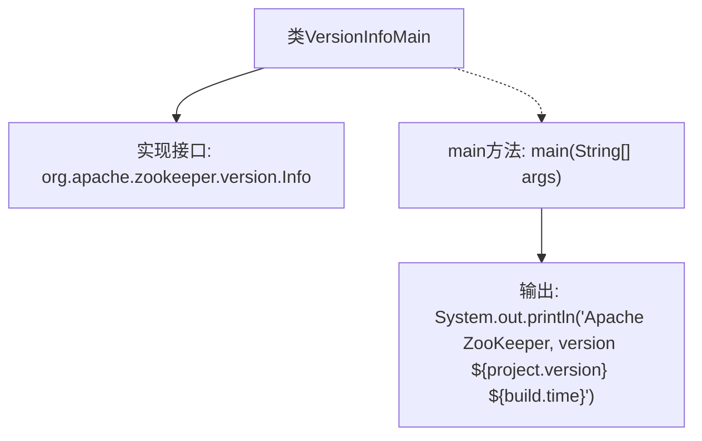

# 基础信息

|      |      |
|------|------|
| 名称 | VersionInfoMain |
| 编码语言 | .java |
| 代码路径 | zookeeper/zookeeper-server/src/main/java-filtered/org/apache/zookeeper/version/VersionInfoMain.java |
| 包名 | org.apache.zookeeper.version |
| 依赖项 | [] |
| 概述说明 | 这是一个Java类，用于输出Apache ZooKeeper的版本信息和构建时间。 |

# 说明

该内容是一个Java类文件，名为VersionInfoMain，实现了org.apache.zookeeper.version.Info接口。类中包含一个main方法，用于输出Apache ZooKeeper的版本信息，包括项目版本号（${project.version}）和构建时间（${build.time}）。该代码主要用于显示ZooKeeper的版本和构建时间。

# 类列表 Class Summary

| 名称   | 类型  | 说明 |
|-------|------|-------------|
| VersionInfoMain | class | 这是一个Java类VersionInfoMain，实现了ZooKeeper版本接口，主方法输出Apache ZooKeeper的版本和构建时间信息。 |


## 类 VersionInfoMain

|      |      |
|------|------|
| 访问范围 | public |
| 类型 | class |
| 名称 | VersionInfoMain |
| 说明 | 这是一个Java类VersionInfoMain，实现了ZooKeeper版本接口，主方法输出Apache ZooKeeper的版本和构建时间信息。 |


### UML类图

```mermaid
classDiagram
    class VersionInfoMain {
        +main(String[] args) void
    }
    class "org.apache.zookeeper.version.Info" {
        <<Interface>>
    }
    VersionInfoMain ..|> "org.apache.zookeeper.version.Info" : 实现

    // VersionInfoMain类实现了Info接口，包含一个静态main方法用于打印版本信息
```

该图展示了VersionInfoMain类与Info接口的关系。VersionInfoMain实现了org.apache.zookeeper.version.Info接口，并包含一个公有的静态main方法，该方法接收字符串数组参数且无返回值。类图清晰地体现了实现关系，其中接口使用<<Interface>>标记，实现类通过虚线空心三角箭头指向接口。这个简单结构用于输出ZooKeeper的版本和构建时间信息。


### 内部方法调用关系图



这段代码定义了一个`VersionInfoMain`类，实现了ZooKeeper的版本信息接口。核心逻辑在`main`方法中，直接输出包含版本号和构建时间的字符串。流程图展示了类结构、接口实现关系以及主方法的执行流程，其中版本号和构建时间通过占位符`${}`动态生成，实际运行时会被替换为具体值。整个流程非常简单，没有复杂的逻辑分支或嵌套调用。

### 字段列表 Field List

| 名称  | 类型  | 说明 |
|-------|-------|------|

### 方法列表 Method List

| 名称  | 类型  | 说明 |
|-------|-------|------|
| main | void | Java主方法输出Apache ZooKeeper版本及构建时间信息。 |


