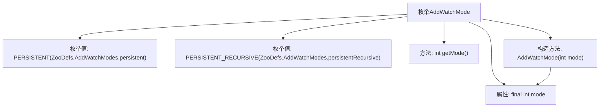

# 基础信息

|      |      |
|------|------|
| 名称 | AddWatchMode |
| 编码语言 | .java |
| 代码路径 | zookeeper/zookeeper-server/src/main/java/org/apache/zookeeper/AddWatchMode.java |
| 包名 | org.apache.zookeeper |
| 依赖项 | [] |
| 概述说明 | AddWatchMode枚举定义两种ZooKeeper监听模式：PERSISTENT持久监听指定路径的数据和子节点事件，需手动移除；PERSISTENT_RECURSIVE递归监听该路径及其所有子节点，同样需手动移除但性能略低。两种模式都通过removeWatches()移除。 |

# 说明

该枚举定义两种ZooKeeper监听模式：PERSISTENT模式设置持久监听器，触发后不自动移除，监控指定路径的数据和子节点事件，需手动调用removeWatches移除；PERSISTENT_RECURSIVE模式除具备持久特性外，还会递归监控所有子路径（包括后续新增子节点），但会带来轻微性能损耗。两种模式均需通过exists()和getData()模拟监听行为，并通过mode字段存储对应整型值。

# 类列表 Class Summary

| 名称   | 类型  | 说明 |
|-------|------|-------------|
| AddWatchMode | enum | AddWatchMode枚举定义两种监听模式：PERSISTENT持久监听路径数据及子节点事件，需手动移除；PERSISTENT_RECURSIVE递归监听路径及其所有子节点事件，性能略有影响。 |


## 类 AddWatchMode

|      |      |
|------|------|
| 访问范围 | public |
| 类型 | enum |
| 名称 | AddWatchMode |
| 说明 | AddWatchMode枚举定义两种监听模式：PERSISTENT持久监听路径数据及子节点事件，需手动移除；PERSISTENT_RECURSIVE递归监听路径及其所有子节点事件，性能略有影响。 |


### UML类图

```mermaid
classDiagram
    class AddWatchMode {
        <<enumeration>>
        -final int mode
        +PERSISTENT
        +PERSISTENT_RECURSIVE
        +AddWatchMode(int mode)
        +int getMode()
    }
    // ZooDefs.AddWatchModes 是外部常量提供者
    AddWatchMode --> ZooDefs.AddWatchModes : 使用常量值
```

这段代码定义了一个枚举类AddWatchMode，包含PERSISTENT和PERSISTENT_RECURSIVE两种监听模式，分别对应持久化和递归持久化监听。枚举通过构造函数接收来自ZooDefs.AddWatchModes的常量值，并提供getMode()方法获取模式值。该设计用于ZNode路径的监听配置，支持不同级别的数据变更监控需求。


### 内部方法调用关系图



这段代码定义了一个枚举类型AddWatchMode，包含PERSISTENT和PERSISTENT_RECURSIVE两个枚举值，分别对应不同的ZooKeeper监视模式。枚举类包含一个final整型属性mode、一个构造方法用于初始化mode，以及一个getMode()方法获取当前枚举值的模式代码。该枚举用于控制ZooKeeper节点监视器的持久性和递归行为特性。

### 字段列表 Field List

| 名称  | 类型  | 说明 |
|-------|-------|------|

### 方法列表 Method List

| 名称  | 类型  | 说明 |
|-------|-------|------|


