# 基础信息

|      |      |
|------|------|
| 名称 | AsyncCallback |
| 编码语言 | .java |
| 代码路径 | zookeeper/zookeeper-server/src/main/java/org/apache/zookeeper/AsyncCallback.java |
| 包名 | org.apache.zookeeper |
| 依赖项 | ['java.util.List', 'org.apache.yetus.audience.InterfaceAudience', 'org.apache.zookeeper.data.ACL', 'org.apache.zookeeper.data.Stat'] |
| 概述说明 | AsyncCallback接口定义了多种异步回调方法，用于处理ZooKeeper节点操作结果，包括状态、数据、ACL、子节点等，支持成功和失败处理。 |

# 说明

AsyncCallback接口定义了多种异步回调类型，用于处理ZooKeeper操作结果。StatCallback处理节点状态，DataCallback处理节点数据和状态，ACLCallback处理ACL和状态，ChildrenCallback和Children2Callback处理子节点列表，Create2Callback和StringCallback处理节点创建结果，VoidCallback用于无返回操作，MultiCallback处理批量操作结果，EphemeralsCallback处理临时节点列表。每种回调均包含返回码、路径、上下文及特定数据，并支持成功和失败场景。

# 类列表 Class Summary

| 名称   | 类型  | 说明 |
|-------|------|-------------|
| AsyncCallback | interface | AsyncCallback接口定义了多种异步回调方法，用于处理ZooKeeper节点的状态、数据、ACL、子节点等操作结果，包括成功和失败情况。 |

## 类 AsyncCallback

|      |      |
|------|------|
| 访问范围 | @InterfaceAudience.Public;public |
| 类型 | interface |
| 名称 | AsyncCallback |
| 说明 | AsyncCallback接口定义了多种异步回调方法，用于处理ZooKeeper节点的状态、数据、ACL、子节点等操作结果，包括成功和失败情况。 |

### UML类图

```mermaid
classDiagram
    class AsyncCallback {
        <<Interface>>
    }
    
    class StatCallback {
        <<Interface>>
        +processResult(int rc, String path, Object ctx, Stat stat) void
    }
    
    class AllChildrenNumberCallback {
        <<Interface>>
        +processResult(int rc, String path, Object ctx, int number) void
    }
    
    class DataCallback {
        <<Interface>>
        +processResult(int rc, String path, Object ctx, byte[] data, Stat stat) void
    }
    
    class ACLCallback {
        <<Interface>>
        +processResult(int rc, String path, Object ctx, List~ACL~ acl, Stat stat) void
    }
    
    class ChildrenCallback {
        <<Interface>>
        +processResult(int rc, String path, Object ctx, List~String~ children) void
    }
    
    class Children2Callback {
        <<Interface>>
        +processResult(int rc, String path, Object ctx, List~String~ children, Stat stat) void
    }
    
    class Create2Callback {
        <<Interface>>
        +processResult(int rc, String path, Object ctx, String name, Stat stat) void
    }
    
    class StringCallback {
        <<Interface>>
        +processResult(int rc, String path, Object ctx, String name) void
    }
    
    class VoidCallback {
        <<Interface>>
        +processResult(int rc, String path, Object ctx) void
    }
    
    class MultiCallback {
        <<Interface>>
        +processResult(int rc, String path, Object ctx, List~OpResult~ opResults) void
    }
    
    class EphemeralsCallback {
        <<Interface>>
        +processResult(int rc, Object ctx, List~String~ paths) void
    }
    
    AsyncCallback <|-- StatCallback
    AsyncCallback <|-- AllChildrenNumberCallback
    AsyncCallback <|-- DataCallback
    AsyncCallback <|-- ACLCallback
    AsyncCallback <|-- ChildrenCallback
    AsyncCallback <|-- Children2Callback
    AsyncCallback <|-- Create2Callback
    AsyncCallback <|-- StringCallback
    AsyncCallback <|-- VoidCallback
    AsyncCallback <|-- MultiCallback
    AsyncCallback <|-- EphemeralsCallback
```

这段代码定义了一个名为AsyncCallback的接口及其多个子接口，用于处理ZooKeeper异步操作的回调结果。每个子接口针对不同类型的操作（如获取节点状态、数据、ACL、子节点等）定义了特定的processResult方法，接收操作结果码、路径、上下文及相应数据。这些接口构成了ZooKeeper异步API的核心回调机制，允许开发者以非阻塞方式处理分布式协调服务的响应。类图清晰地展示了接口间的继承关系和每个回调接口的方法签名。

### 内部方法调用关系图

```mermaid
graph TD
    A["接口AsyncCallback"]
    B["子接口StatCallback"]
    C["子接口AllChildrenNumberCallback"]
    D["子接口DataCallback"]
    E["子接口ACLCallback"]
    F["子接口ChildrenCallback"]
    G["子接口Children2Callback"]
    H["子接口Create2Callback"]
    I["子接口StringCallback"]
    J["子接口VoidCallback"]
    K["子接口MultiCallback"]
    L["子接口EphemeralsCallback"]

    A --> B
    A --> C
    A --> D
    A --> E
    A --> F
    A --> G
    A --> H
    A --> I
    A --> J
    A --> K
    A --> L

    B --> M["方法processResult(int rc, String path, Object ctx, Stat stat)"]
    C --> N["方法processResult(int rc, String path, Object ctx, int number)"]
    D --> O["方法processResult(int rc, String path, Object ctx, byte[] data, Stat stat)"]
    E --> P["方法processResult(int rc, String path, Object ctx, List<ACL> acl, Stat stat)"]
    F --> Q["方法processResult(int rc, String path, Object ctx, List<String> children)"]
    G --> R["方法processResult(int rc, String path, Object ctx, List<String> children, Stat stat)"]
    H --> S["方法processResult(int rc, String path, Object ctx, String name, Stat stat)"]
    I --> T["方法processResult(int rc, String path, Object ctx, String name)"]
    J --> U["方法processResult(int rc, String path, Object ctx)"]
    K --> V["方法processResult(int rc, String path, Object ctx, List<OpResult> opResults)"]
    L --> W["方法processResult(int rc, Object ctx, List<String> paths)"]
```

这段代码定义了一个名为AsyncCallback的接口及其多个子接口，主要用于ZooKeeper异步操作的回调处理。每个子接口都包含特定的processResult方法，用于处理不同类型的异步操作结果，如节点状态、子节点数量、节点数据等。主接口AsyncCallback作为基础接口，所有子接口都继承自它并实现各自特定的回调逻辑，形成了一个完整的异步回调处理体系。

### 字段列表 Field List

| 名称  | 类型  | 说明 |
|-------|-------|------|

### 方法列表 Method List

| 名称  | 类型  | 说明 |
|-------|-------|------|

